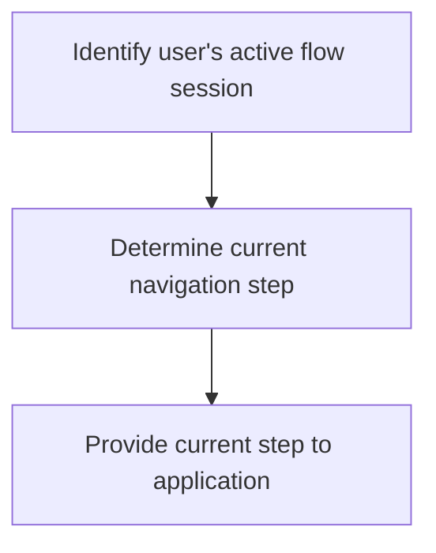
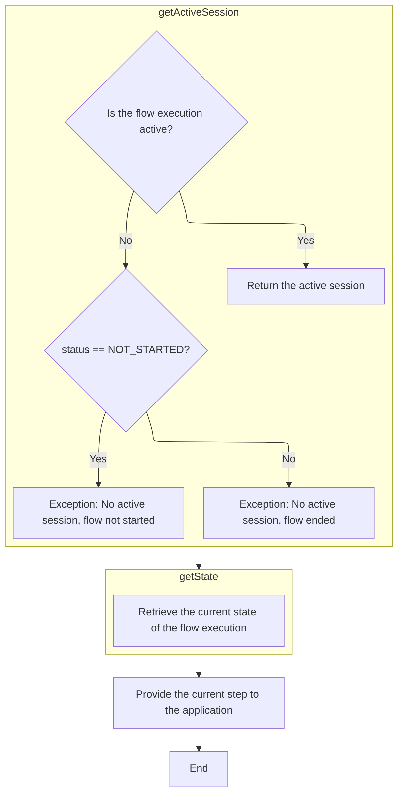
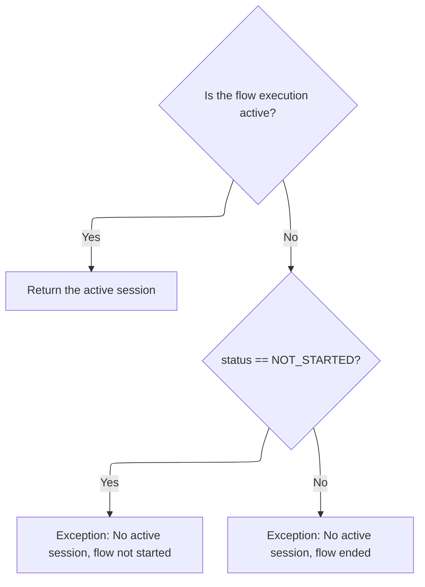

This document describes how the system determines and provides the user's current position within a navigation flow. By identifying the active session and extracting the current step, the application can dynamically guide users and respond to their actions.

The main steps are:

- Identify the user's active flow session
- Determine the current step in the user's navigation
- Provide the current step to the application



# Getting the Current State from the Flow Execution



<SwmSnippet path="/spring-webflow/src/main/java/org/springframework/webflow/engine/impl/RequestControlContextImpl.java" line="109">

---

In `getCurrentState`, we kick off by asking the flow execution for its active session. This is necessary because the session tracks where the user is in the flow, and we need that context before we can figure out the current state. Next, we call getActiveSession to get that session object.

```java
	public StateDefinition getCurrentState() {
		return flowExecution.getActiveSession().getState();
```

---

</SwmSnippet>

## Validating and Fetching the Active Session



<SwmSnippet path="/spring-webflow/src/main/java/org/springframework/webflow/engine/impl/FlowExecutionImpl.java" line="185">

---

In `getActiveSession`, we first check if the flow execution is active. If it's not, we throw an exception, and the message depends on whether the flow hasn't started or has already ended. This makes it clear why there's no session to return. Next, we call isActive to do this check.

```java
	public FlowSession getActiveSession() {
		if (!isActive()) {
			if (status == FlowExecutionStatus.NOT_STARTED) {
				throw new IllegalStateException(
						"No active FlowSession to access; this FlowExecution has not been started");
			} else {
				throw new IllegalStateException("No active FlowSession to access; this FlowExecution has ended");
			}
		}
```

---

</SwmSnippet>

<SwmSnippet path="/spring-webflow/src/main/java/org/springframework/webflow/engine/impl/FlowExecutionImpl.java" line="194">

---

After confirming the flow execution is active in `getActiveSession`, we delegate to getActiveSessionInternal to actually fetch the session. This keeps the error handling and the retrieval logic separate.

```java
		return getActiveSessionInternal();
	}
```

---

</SwmSnippet>

## Locating the Most Recent Session

<SwmSnippet path="/spring-webflow/src/main/java/org/springframework/webflow/engine/impl/FlowExecutionImpl.java" line="555">

---

`getActiveSessionInternal` checks if there are any sessions in flowSessions. If it's empty, we return null. Otherwise, we grab the last session, which is treated as the active one. Next, we use isEmpty to check for the presence of sessions.

```java
	private FlowSessionImpl getActiveSessionInternal() {
		if (flowSessions.isEmpty()) {
			return null;
		}
		return flowSessions.getLast();
	}
```

---

</SwmSnippet>

<SwmSnippet path="/spring-webflow/src/main/java/org/springframework/webflow/core/collection/LocalParameterMap.java" line="102">

---

`isEmpty` just checks if the parameters map has any entries and returns true if it's empty. That's all there is to it.

```java
	public boolean isEmpty() {
		return parameters.isEmpty();
	}
```

---

</SwmSnippet>

## Extracting the State from the Active Session

<SwmSnippet path="/spring-webflow/src/main/java/org/springframework/webflow/engine/impl/RequestControlContextImpl.java" line="110">

---

After getting the active session in `getCurrentState`, we call getState on that session to fetch the current state definition. This tells us where the user is in the flow.

```java
		return flowExecution.getActiveSession().getState();
	}
```

---

</SwmSnippet>

<SwmSnippet path="/spring-webflow/src/main/java/org/springframework/webflow/engine/impl/FlowSessionImpl.java" line="104">

---

`getState` just returns the current StateDefinition for the session. No extra logic, just hands back the state.

```java
	public StateDefinition getState() {
		return state;
	}
```

---

</SwmSnippet>

&nbsp;

*This is an auto-generated document by Swimm 🌊 and has not yet been verified by a human*

<SwmMeta version="3.0.0" repo-id="Z2l0aHViJTNBJTNBc3ByaW5nLXdlYmZsb3ctRGVtb0phdmElM0ElM0F1bWFsaW5nYXN3YW1p" repo-name="spring-webflow-DemoJava"><sup>Powered by [Swimm](https://app.swimm.io/)</sup></SwmMeta>
