This document describes how the system finds the scope that contains a specific attribute by searching through all available scopes in a set order. This allows the application to retrieve data from the most relevant scope during a user's navigation flow.

The main steps are:

- Check if the attribute exists in the request scope
- Check the flash scope
- If in a view state, check the view scope
- Check the flow scope
- Check the conversation scope
- Return null if not found


# Where is this flow used?

This flow is used multiple times in the codebase as represented in the following diagram:

```mermaid
graph TD;
      13750687a5c9117df684c015ce6df708b686124637aed8253362cf9e2258e7d3(spring-webflow/…/spel/ScopeSearchingPropertyAccessor.java::ScopeSearchingPropertyAccessor.canRead) --> 3c0f6eec8b48713ba0c72258e20fa1da3cda947a579dd391808124724c04e8e5(spring-webflow/…/spel/ScopeSearchingPropertyAccessor.java::ScopeSearchingPropertyAccessor.findScopeForAttribute)

e0c0e588c0e51e5e5a96ea5bda93f2cf56f05fbcb377ea9545b93feee217e36d(spring-webflow/…/spel/ScopeSearchingPropertyAccessor.java::ScopeSearchingPropertyAccessor.read) --> 3c0f6eec8b48713ba0c72258e20fa1da3cda947a579dd391808124724c04e8e5(spring-webflow/…/spel/ScopeSearchingPropertyAccessor.java::ScopeSearchingPropertyAccessor.findScopeForAttribute)

5e9700760d01334135ef2a0cd0516142c552987b1f079595a172e1829c3637a7(spring-webflow/…/spel/ScopeSearchingPropertyAccessor.java::ScopeSearchingPropertyAccessor.canWrite) --> 3c0f6eec8b48713ba0c72258e20fa1da3cda947a579dd391808124724c04e8e5(spring-webflow/…/spel/ScopeSearchingPropertyAccessor.java::ScopeSearchingPropertyAccessor.findScopeForAttribute)

8f5af315e293d9be5bd2bd8331f51e9838f95fe8a4705f657c564b02a7306c75(spring-webflow/…/spel/ScopeSearchingPropertyAccessor.java::ScopeSearchingPropertyAccessor.write) --> 3c0f6eec8b48713ba0c72258e20fa1da3cda947a579dd391808124724c04e8e5(spring-webflow/…/spel/ScopeSearchingPropertyAccessor.java::ScopeSearchingPropertyAccessor.findScopeForAttribute)

075ced2c505cc5374c26ddcf225134df1bb64d9b071f7f9e437debfd12466a3b(spring-webflow/…/snapshot/SerializedFlowExecutionSnapshot.java::SerializedFlowExecutionSnapshot.writeExternal) --> 8f5af315e293d9be5bd2bd8331f51e9838f95fe8a4705f657c564b02a7306c75(spring-webflow/…/spel/ScopeSearchingPropertyAccessor.java::ScopeSearchingPropertyAccessor.write)

0656368efac0b0a990f75f3d31c2b651a33495cd462aa544c6c361ec3a9e0f18(spring-webflow/…/snapshot/SerializedFlowExecutionSnapshot.java::SerializedFlowExecutionSnapshot.compress) --> 8f5af315e293d9be5bd2bd8331f51e9838f95fe8a4705f657c564b02a7306c75(spring-webflow/…/spel/ScopeSearchingPropertyAccessor.java::ScopeSearchingPropertyAccessor.write)

24d0c950c3b6b264706080d2f214173c4cf8292668cb375283a0940a0ec6fb0f(spring-webflow/…/snapshot/SerializedFlowExecutionSnapshot.java::SerializedFlowExecutionSnapshot.SerializedFlowExecutionSnapshot) --> 0656368efac0b0a990f75f3d31c2b651a33495cd462aa544c6c361ec3a9e0f18(spring-webflow/…/snapshot/SerializedFlowExecutionSnapshot.java::SerializedFlowExecutionSnapshot.compress)


classDef mainFlowStyle color:#000000,fill:#7CB9F4
classDef rootsStyle color:#000000,fill:#00FFF4
classDef Style1 color:#000000,fill:#00FFAA
classDef Style2 color:#000000,fill:#FFFF00
classDef Style3 color:#000000,fill:#AA7CB9

%% Swimm:
%% graph TD;
%%       13750687a5c9117df684c015ce6df708b686124637aed8253362cf9e2258e7d3(<SwmPath>[spring-webflow/…/spel/ScopeSearchingPropertyAccessor.java](spring-webflow/src/main/java/org/springframework/webflow/expression/spel/ScopeSearchingPropertyAccessor.java)</SwmPath>::ScopeSearchingPropertyAccessor.canRead) --> 3c0f6eec8b48713ba0c72258e20fa1da3cda947a579dd391808124724c04e8e5(<SwmPath>[spring-webflow/…/spel/ScopeSearchingPropertyAccessor.java](spring-webflow/src/main/java/org/springframework/webflow/expression/spel/ScopeSearchingPropertyAccessor.java)</SwmPath>::ScopeSearchingPropertyAccessor.findScopeForAttribute)
%% 
%% e0c0e588c0e51e5e5a96ea5bda93f2cf56f05fbcb377ea9545b93feee217e36d(<SwmPath>[spring-webflow/…/spel/ScopeSearchingPropertyAccessor.java](spring-webflow/src/main/java/org/springframework/webflow/expression/spel/ScopeSearchingPropertyAccessor.java)</SwmPath>::ScopeSearchingPropertyAccessor.read) --> 3c0f6eec8b48713ba0c72258e20fa1da3cda947a579dd391808124724c04e8e5(<SwmPath>[spring-webflow/…/spel/ScopeSearchingPropertyAccessor.java](spring-webflow/src/main/java/org/springframework/webflow/expression/spel/ScopeSearchingPropertyAccessor.java)</SwmPath>::ScopeSearchingPropertyAccessor.findScopeForAttribute)
%% 
%% 5e9700760d01334135ef2a0cd0516142c552987b1f079595a172e1829c3637a7(<SwmPath>[spring-webflow/…/spel/ScopeSearchingPropertyAccessor.java](spring-webflow/src/main/java/org/springframework/webflow/expression/spel/ScopeSearchingPropertyAccessor.java)</SwmPath>::ScopeSearchingPropertyAccessor.canWrite) --> 3c0f6eec8b48713ba0c72258e20fa1da3cda947a579dd391808124724c04e8e5(<SwmPath>[spring-webflow/…/spel/ScopeSearchingPropertyAccessor.java](spring-webflow/src/main/java/org/springframework/webflow/expression/spel/ScopeSearchingPropertyAccessor.java)</SwmPath>::ScopeSearchingPropertyAccessor.findScopeForAttribute)
%% 
%% 8f5af315e293d9be5bd2bd8331f51e9838f95fe8a4705f657c564b02a7306c75(<SwmPath>[spring-webflow/…/spel/ScopeSearchingPropertyAccessor.java](spring-webflow/src/main/java/org/springframework/webflow/expression/spel/ScopeSearchingPropertyAccessor.java)</SwmPath>::ScopeSearchingPropertyAccessor.write) --> 3c0f6eec8b48713ba0c72258e20fa1da3cda947a579dd391808124724c04e8e5(<SwmPath>[spring-webflow/…/spel/ScopeSearchingPropertyAccessor.java](spring-webflow/src/main/java/org/springframework/webflow/expression/spel/ScopeSearchingPropertyAccessor.java)</SwmPath>::ScopeSearchingPropertyAccessor.findScopeForAttribute)
%% 
%% 075ced2c505cc5374c26ddcf225134df1bb64d9b071f7f9e437debfd12466a3b(<SwmPath>[spring-webflow/…/snapshot/SerializedFlowExecutionSnapshot.java](spring-webflow/src/main/java/org/springframework/webflow/execution/repository/snapshot/SerializedFlowExecutionSnapshot.java)</SwmPath>::SerializedFlowExecutionSnapshot.writeExternal) --> 8f5af315e293d9be5bd2bd8331f51e9838f95fe8a4705f657c564b02a7306c75(<SwmPath>[spring-webflow/…/spel/ScopeSearchingPropertyAccessor.java](spring-webflow/src/main/java/org/springframework/webflow/expression/spel/ScopeSearchingPropertyAccessor.java)</SwmPath>::ScopeSearchingPropertyAccessor.write)
%% 
%% 0656368efac0b0a990f75f3d31c2b651a33495cd462aa544c6c361ec3a9e0f18(<SwmPath>[spring-webflow/…/snapshot/SerializedFlowExecutionSnapshot.java](spring-webflow/src/main/java/org/springframework/webflow/execution/repository/snapshot/SerializedFlowExecutionSnapshot.java)</SwmPath>::SerializedFlowExecutionSnapshot.compress) --> 8f5af315e293d9be5bd2bd8331f51e9838f95fe8a4705f657c564b02a7306c75(<SwmPath>[spring-webflow/…/spel/ScopeSearchingPropertyAccessor.java](spring-webflow/src/main/java/org/springframework/webflow/expression/spel/ScopeSearchingPropertyAccessor.java)</SwmPath>::ScopeSearchingPropertyAccessor.write)
%% 
%% 24d0c950c3b6b264706080d2f214173c4cf8292668cb375283a0940a0ec6fb0f(<SwmPath>[spring-webflow/…/snapshot/SerializedFlowExecutionSnapshot.java](spring-webflow/src/main/java/org/springframework/webflow/execution/repository/snapshot/SerializedFlowExecutionSnapshot.java)</SwmPath>::SerializedFlowExecutionSnapshot.SerializedFlowExecutionSnapshot) --> 0656368efac0b0a990f75f3d31c2b651a33495cd462aa544c6c361ec3a9e0f18(<SwmPath>[spring-webflow/…/snapshot/SerializedFlowExecutionSnapshot.java](spring-webflow/src/main/java/org/springframework/webflow/execution/repository/snapshot/SerializedFlowExecutionSnapshot.java)</SwmPath>::SerializedFlowExecutionSnapshot.compress)
%% 
%% 
%% classDef mainFlowStyle color:#000000,fill:#7CB9F4
%% classDef rootsStyle color:#000000,fill:#00FFF4
%% classDef Style1 color:#000000,fill:#00FFAA
%% classDef Style2 color:#000000,fill:#FFFF00
%% classDef Style3 color:#000000,fill:#AA7CB9
```



# Searching for Attribute Scope in Priority Order


<SwmSnippet path="/spring-webflow/src/main/java/org/springframework/webflow/expression/spel/ScopeSearchingPropertyAccessor.java" line="56">

---

In <SwmToken path="spring-webflow/src/main/java/org/springframework/webflow/expression/spel/ScopeSearchingPropertyAccessor.java" pos="56:8:8" line-data="	private MutableAttributeMap&lt;Object&gt; findScopeForAttribute(RequestContext requestContext, String name) {">`findScopeForAttribute`</SwmToken>, we start by checking if the attribute is present in <SwmToken path="spring-webflow/src/main/java/org/springframework/webflow/engine/impl/RequestControlContextImpl.java" pos="67:8:8" line-data="	private LocalAttributeMap&lt;Object&gt; requestScope = new LocalAttributeMap&lt;&gt;();">`requestScope`</SwmToken>, then <SwmToken path="spring-webflow/src/main/java/org/springframework/webflow/engine/impl/FlowExecutionImpl.java" pos="77:14:14" line-data="	private static final String FLASH_SCOPE_ATTRIBUTE = &quot;flashScope&quot;;">`flashScope`</SwmToken>. This sets up the prioritized search. Next, we need to check TransitionSet.contains to determine if the attribute is present in the next relevant scope, following the defined order.

```java
	private MutableAttributeMap<Object> findScopeForAttribute(RequestContext requestContext, String name) {
		if (requestContext.getRequestScope().contains(name)) {
			return requestContext.getRequestScope();
		}
		if (requestContext.getFlashScope().contains(name)) {
			return requestContext.getFlashScope();
		}
```

---

</SwmSnippet>

<SwmSnippet path="/spring-webflow/src/main/java/org/springframework/webflow/engine/TransitionSet.java" line="67">

---

<SwmToken path="spring-webflow/src/main/java/org/springframework/webflow/engine/TransitionSet.java" pos="67:5:5" line-data="	public boolean contains(Transition transition) {">`contains`</SwmToken> just checks if the given Transition is present in the transitions collection using standard equality. This is a direct implementation, no extra logic.

```java
	public boolean contains(Transition transition) {
		return transitions.contains(transition);
	}
```

---

</SwmSnippet>

<SwmSnippet path="/spring-webflow/src/main/java/org/springframework/webflow/expression/spel/ScopeSearchingPropertyAccessor.java" line="63">

---

After checking transitions, we move on in <SwmToken path="spring-webflow/src/main/java/org/springframework/webflow/expression/spel/ScopeSearchingPropertyAccessor.java" pos="56:8:8" line-data="	private MutableAttributeMap&lt;Object&gt; findScopeForAttribute(RequestContext requestContext, String name) {">`findScopeForAttribute`</SwmToken> to see if we're in a view state before looking at <SwmToken path="spring-webflow/src/main/java/org/springframework/webflow/engine/impl/FlowSessionImpl.java" pos="43:14:14" line-data="	private static final String VIEW_SCOPE_ATTRIBUTE = &quot;viewScope&quot;;">`viewScope`</SwmToken>. This makes sure we only consider <SwmToken path="spring-webflow/src/main/java/org/springframework/webflow/engine/impl/FlowSessionImpl.java" pos="43:14:14" line-data="	private static final String VIEW_SCOPE_ATTRIBUTE = &quot;viewScope&quot;;">`viewScope`</SwmToken> when it's actually available.

```java
		if (requestContext.inViewState() && requestContext.getViewScope().contains(name)) {
```

---

</SwmSnippet>

## Determining If the Flow Is in a View State

<SwmSnippet path="/spring-webflow/src/main/java/org/springframework/webflow/engine/impl/RequestControlContextImpl.java" line="125">

---

In <SwmToken path="spring-webflow/src/main/java/org/springframework/webflow/engine/impl/RequestControlContextImpl.java" pos="125:5:5" line-data="	public boolean inViewState() {">`inViewState`</SwmToken>, we check if the flow is active, the current state exists, and it's a view state. Next, we call <SwmToken path="spring-webflow/src/main/java/org/springframework/webflow/engine/impl/RequestControlContextImpl.java" pos="126:5:5" line-data="		return flowExecution.isActive() &amp;&amp; getCurrentState() != null &amp;&amp; getCurrentState().isViewState();">`isActive`</SwmToken> to confirm the flow is running before checking the rest.

```java
	public boolean inViewState() {
		return flowExecution.isActive() && getCurrentState() != null && getCurrentState().isViewState();
```

---

</SwmSnippet>

<SwmSnippet path="/spring-webflow/src/main/java/org/springframework/webflow/engine/impl/FlowExecutionImpl.java" line="173">

---

<SwmToken path="spring-webflow/src/main/java/org/springframework/webflow/engine/impl/FlowExecutionImpl.java" pos="173:5:5" line-data="	public boolean isActive() {">`isActive`</SwmToken> just checks if the flow's status is ACTIVE. No extra logic, just a direct enum comparison.

```java
	public boolean isActive() {
		return status == FlowExecutionStatus.ACTIVE;
	}
```

---

</SwmSnippet>

<SwmSnippet path="/spring-webflow/src/main/java/org/springframework/webflow/engine/impl/RequestControlContextImpl.java" line="126">

---

After confirming the flow is active in <SwmToken path="spring-webflow/src/main/java/org/springframework/webflow/expression/spel/ScopeSearchingPropertyAccessor.java" pos="63:6:6" line-data="		if (requestContext.inViewState() &amp;&amp; requestContext.getViewScope().contains(name)) {">`inViewState`</SwmToken>, we check <SwmToken path="spring-webflow/src/main/java/org/springframework/webflow/engine/impl/RequestControlContextImpl.java" pos="126:11:11" line-data="		return flowExecution.isActive() &amp;&amp; getCurrentState() != null &amp;&amp; getCurrentState().isViewState();">`getCurrentState`</SwmToken> to make sure there's actually a state to work with before moving on.

```java
		return flowExecution.isActive() && getCurrentState() != null && getCurrentState().isViewState();
```

---

</SwmSnippet>

### Getting the Current State of the Flow

See <SwmLink doc-title="Getting the user&#39;s current navigation step">[Getting the user's current navigation step](.swm%5Cgetting-the-users-current-navigation-step.mkwjjb8q.sw.md)</SwmLink>

### Checking If the Current State Is a View State


<SwmSnippet path="/spring-webflow/src/main/java/org/springframework/webflow/engine/impl/RequestControlContextImpl.java" line="126">

---

After confirming the current state exists in <SwmToken path="spring-webflow/src/main/java/org/springframework/webflow/expression/spel/ScopeSearchingPropertyAccessor.java" pos="63:6:6" line-data="		if (requestContext.inViewState() &amp;&amp; requestContext.getViewScope().contains(name)) {">`inViewState`</SwmToken>, we call <SwmToken path="spring-webflow/src/main/java/org/springframework/webflow/engine/impl/RequestControlContextImpl.java" pos="126:25:25" line-data="		return flowExecution.isActive() &amp;&amp; getCurrentState() != null &amp;&amp; getCurrentState().isViewState();">`isViewState`</SwmToken> to make sure the state is actually a view state before returning true.

```java
		return flowExecution.isActive() && getCurrentState() != null && getCurrentState().isViewState();
	}
```

---

</SwmSnippet>

<SwmSnippet path="/spring-webflow/src/main/java/org/springframework/webflow/engine/ViewState.java" line="83">

---

<SwmToken path="spring-webflow/src/main/java/org/springframework/webflow/engine/ViewState.java" pos="83:5:5" line-data="	public boolean isViewState() {">`isViewState`</SwmToken> just returns true, since this class always represents a view state. No logic, just a constant.

```java
	public boolean isViewState() {
		return true;
	}
```

---

</SwmSnippet>

## Checking Attribute Presence in View Scope


<SwmSnippet path="/spring-webflow/src/main/java/org/springframework/webflow/expression/spel/ScopeSearchingPropertyAccessor.java" line="63">

---

After confirming we're in a view state in <SwmToken path="spring-webflow/src/main/java/org/springframework/webflow/expression/spel/ScopeSearchingPropertyAccessor.java" pos="56:8:8" line-data="	private MutableAttributeMap&lt;Object&gt; findScopeForAttribute(RequestContext requestContext, String name) {">`findScopeForAttribute`</SwmToken>, we call <SwmToken path="spring-webflow/src/main/java/org/springframework/webflow/expression/spel/ScopeSearchingPropertyAccessor.java" pos="63:14:14" line-data="		if (requestContext.inViewState() &amp;&amp; requestContext.getViewScope().contains(name)) {">`getViewScope`</SwmToken> to actually fetch the view scope and check for the attribute there.

```java
		if (requestContext.inViewState() && requestContext.getViewScope().contains(name)) {
```

---

</SwmSnippet>

<SwmSnippet path="/spring-webflow/src/main/java/org/springframework/webflow/engine/impl/RequestControlContextImpl.java" line="129">

---

<SwmToken path="spring-webflow/src/main/java/org/springframework/webflow/engine/impl/RequestControlContextImpl.java" pos="129:8:8" line-data="	public MutableAttributeMap&lt;Object&gt; getViewScope() throws IllegalStateException {">`getViewScope`</SwmToken> fetches the view scope from the active session. Next, we call <SwmToken path="spring-webflow/src/main/java/org/springframework/webflow/engine/impl/RequestControlContextImpl.java" pos="130:5:5" line-data="		return flowExecution.getActiveSession().getViewScope();">`getActiveSession`</SwmToken> to make sure we're getting the right scope for the current session.

```java
	public MutableAttributeMap<Object> getViewScope() throws IllegalStateException {
		return flowExecution.getActiveSession().getViewScope();
	}
```

---

</SwmSnippet>

<SwmSnippet path="/spring-webflow/src/main/java/org/springframework/webflow/expression/spel/ScopeSearchingPropertyAccessor.java" line="63">

---

After getting <SwmToken path="spring-webflow/src/main/java/org/springframework/webflow/engine/impl/FlowSessionImpl.java" pos="43:14:14" line-data="	private static final String VIEW_SCOPE_ATTRIBUTE = &quot;viewScope&quot;;">`viewScope`</SwmToken> in <SwmToken path="spring-webflow/src/main/java/org/springframework/webflow/expression/spel/ScopeSearchingPropertyAccessor.java" pos="56:8:8" line-data="	private MutableAttributeMap&lt;Object&gt; findScopeForAttribute(RequestContext requestContext, String name) {">`findScopeForAttribute`</SwmToken>, we check if the attribute is present before deciding to return this scope or keep searching.

```java
		if (requestContext.inViewState() && requestContext.getViewScope().contains(name)) {
```

---

</SwmSnippet>

<SwmSnippet path="/spring-webflow/src/main/java/org/springframework/webflow/expression/spel/ScopeSearchingPropertyAccessor.java" line="64">

---

After confirming the attribute is in <SwmToken path="spring-webflow/src/main/java/org/springframework/webflow/engine/impl/FlowSessionImpl.java" pos="43:14:14" line-data="	private static final String VIEW_SCOPE_ATTRIBUTE = &quot;viewScope&quot;;">`viewScope`</SwmToken> in <SwmToken path="spring-webflow/src/main/java/org/springframework/webflow/expression/spel/ScopeSearchingPropertyAccessor.java" pos="56:8:8" line-data="	private MutableAttributeMap&lt;Object&gt; findScopeForAttribute(RequestContext requestContext, String name) {">`findScopeForAttribute`</SwmToken>, we return that scope immediately since that's where the attribute lives.

```java
			return requestContext.getViewScope();
		}
```

---

</SwmSnippet>

<SwmSnippet path="/spring-webflow/src/main/java/org/springframework/webflow/expression/spel/ScopeSearchingPropertyAccessor.java" line="66">

---

If the attribute isn't found in <SwmToken path="spring-webflow/src/main/java/org/springframework/webflow/engine/impl/FlowSessionImpl.java" pos="43:14:14" line-data="	private static final String VIEW_SCOPE_ATTRIBUTE = &quot;viewScope&quot;;">`viewScope`</SwmToken> in <SwmToken path="spring-webflow/src/main/java/org/springframework/webflow/expression/spel/ScopeSearchingPropertyAccessor.java" pos="56:8:8" line-data="	private MutableAttributeMap&lt;Object&gt; findScopeForAttribute(RequestContext requestContext, String name) {">`findScopeForAttribute`</SwmToken>, we move on to check flowScope next in the search order.

```java
		if (requestContext.getFlowScope().contains(name)) {
```

---

</SwmSnippet>

## Accessing the Flow Scope for the Active Session

<SwmSnippet path="/spring-webflow/src/main/java/org/springframework/webflow/engine/impl/RequestControlContextImpl.java" line="133">

---

In <SwmToken path="spring-webflow/src/main/java/org/springframework/webflow/engine/impl/RequestControlContextImpl.java" pos="133:8:8" line-data="	public MutableAttributeMap&lt;Object&gt; getFlowScope() {">`getFlowScope`</SwmToken>, we grab the flow scope from the active session. Next, we call <SwmToken path="spring-webflow/src/main/java/org/springframework/webflow/engine/impl/RequestControlContextImpl.java" pos="134:5:5" line-data="		return flowExecution.getActiveSession().getScope();">`getActiveSession`</SwmToken> to make sure we're working with the right session's scope.

```java
	public MutableAttributeMap<Object> getFlowScope() {
		return flowExecution.getActiveSession().getScope();
```

---

</SwmSnippet>

<SwmSnippet path="/spring-webflow/src/main/java/org/springframework/webflow/engine/impl/RequestControlContextImpl.java" line="134">

---

After getting the active session in <SwmToken path="spring-webflow/src/main/java/org/springframework/webflow/expression/spel/ScopeSearchingPropertyAccessor.java" pos="66:6:6" line-data="		if (requestContext.getFlowScope().contains(name)) {">`getFlowScope`</SwmToken>, we call <SwmToken path="spring-webflow/src/main/java/org/springframework/webflow/engine/impl/RequestControlContextImpl.java" pos="134:9:9" line-data="		return flowExecution.getActiveSession().getScope();">`getScope`</SwmToken> to fetch the actual attribute map for the session.

```java
		return flowExecution.getActiveSession().getScope();
	}
```

---

</SwmSnippet>

<SwmSnippet path="/spring-webflow/src/main/java/org/springframework/webflow/engine/impl/FlowSessionImpl.java" line="108">

---

<SwmToken path="spring-webflow/src/main/java/org/springframework/webflow/engine/impl/FlowSessionImpl.java" pos="108:8:8" line-data="	public MutableAttributeMap&lt;Object&gt; getScope() {">`getScope`</SwmToken> just returns the session's attribute map. No extra logic, just a getter.

```java
	public MutableAttributeMap<Object> getScope() {
		return scope;
	}
```

---

</SwmSnippet>

## Checking Attribute Presence in Flow Scope


<SwmSnippet path="/spring-webflow/src/main/java/org/springframework/webflow/expression/spel/ScopeSearchingPropertyAccessor.java" line="66">

---

After getting flowScope in <SwmToken path="spring-webflow/src/main/java/org/springframework/webflow/expression/spel/ScopeSearchingPropertyAccessor.java" pos="56:8:8" line-data="	private MutableAttributeMap&lt;Object&gt; findScopeForAttribute(RequestContext requestContext, String name) {">`findScopeForAttribute`</SwmToken>, we check if the attribute is present before deciding to return this scope or keep searching.

```java
		if (requestContext.getFlowScope().contains(name)) {
```

---

</SwmSnippet>

<SwmSnippet path="/spring-webflow/src/main/java/org/springframework/webflow/expression/spel/ScopeSearchingPropertyAccessor.java" line="67">

---

After confirming the attribute is in flowScope in <SwmToken path="spring-webflow/src/main/java/org/springframework/webflow/expression/spel/ScopeSearchingPropertyAccessor.java" pos="56:8:8" line-data="	private MutableAttributeMap&lt;Object&gt; findScopeForAttribute(RequestContext requestContext, String name) {">`findScopeForAttribute`</SwmToken>, we return that scope immediately since that's where the attribute lives.

```java
			return requestContext.getFlowScope();
		}
```

---

</SwmSnippet>

<SwmSnippet path="/spring-webflow/src/main/java/org/springframework/webflow/expression/spel/ScopeSearchingPropertyAccessor.java" line="69">

---

After checking flowScope in <SwmToken path="spring-webflow/src/main/java/org/springframework/webflow/expression/spel/ScopeSearchingPropertyAccessor.java" pos="56:8:8" line-data="	private MutableAttributeMap&lt;Object&gt; findScopeForAttribute(RequestContext requestContext, String name) {">`findScopeForAttribute`</SwmToken>, we look at <SwmToken path="spring-webflow/src/main/java/org/springframework/webflow/engine/impl/FlowExecutionImpl.java" pos="119:10:10" line-data="	private transient MutableAttributeMap&lt;Object&gt; conversationScope;">`conversationScope`</SwmToken> as the last option. If the attribute isn't found anywhere, we return null.

```java
		if (requestContext.getConversationScope().contains(name)) {
			return requestContext.getConversationScope();
		}
		return null;
	}
```

---

</SwmSnippet>

&nbsp;

*This is an auto-generated document by Swimm 🌊 and has not yet been verified by a human*

<SwmMeta version="3.0.0" repo-id="Z2l0aHViJTNBJTNBc3ByaW5nLXdlYmZsb3ctRGVtb0phdmElM0ElM0F1bWFsaW5nYXN3YW1p" repo-name="spring-webflow-DemoJava"><sup>Powered by [Swimm](https://app.swimm.io/)</sup></SwmMeta>
