This document describes how access decisions are made to control user actions in web flows. The flow receives the user's authentication and a security rule, selects the appropriate security manager, prepares the necessary attributes, and makes an authorization decision. The outcome is either allowing or blocking the requested action.

Main steps:

- Retrieve authentication and security rule
- Select security manager for authorization
- Prepare security attributes
- Make authorization decision
- Allow or block action


# Where is this flow used?

This flow is used multiple times in the codebase as represented in the following diagram:

```mermaid
graph TD;
      0b0844fa674a07655bae4440f74df91f11d2bf762e53202e20bae6158c8e2ca3(spring-webflow/…/security/SecurityFlowExecutionListener.java::SecurityFlowExecutionListener.sessionCreating) --> 14f1f94e8d1494cfad816572291b9d32cf2c00b8785aadb39802cdf331477846(spring-webflow/…/security/SecurityFlowExecutionListener.java::SecurityFlowExecutionListener.decide)

fa9431d4c758ef08462d9dc7cd4aa35594944dfa32a3a80a03817f0f110eaaed(spring-webflow/…/impl/FlowExecutionListeners.java::FlowExecutionListeners.fireSessionCreating) --> 0b0844fa674a07655bae4440f74df91f11d2bf762e53202e20bae6158c8e2ca3(spring-webflow/…/security/SecurityFlowExecutionListener.java::SecurityFlowExecutionListener.sessionCreating)

aabafbae9789e7846b53f7789211bbba1c2cc67ed752f2dfdb4d29b61f0179fb(spring-webflow/…/impl/FlowExecutionImpl.java::FlowExecutionImpl.start) --> fa9431d4c758ef08462d9dc7cd4aa35594944dfa32a3a80a03817f0f110eaaed(spring-webflow/…/impl/FlowExecutionListeners.java::FlowExecutionListeners.fireSessionCreating)

93022e9685a762f25440d8082bbfcc93791490d52b2887e47df563f02f1921d6(spring-webflow/…/impl/RequestControlContextImpl.java::RequestControlContextImpl.start) --> aabafbae9789e7846b53f7789211bbba1c2cc67ed752f2dfdb4d29b61f0179fb(spring-webflow/…/impl/FlowExecutionImpl.java::FlowExecutionImpl.start)

0c0efcb4e95dce6da888fb641d7b7668e1b7d1eaf9bdd4fee636e54ed149be4d(spring-webflow/…/security/SecurityFlowExecutionListener.java::SecurityFlowExecutionListener.stateEntering) --> 14f1f94e8d1494cfad816572291b9d32cf2c00b8785aadb39802cdf331477846(spring-webflow/…/security/SecurityFlowExecutionListener.java::SecurityFlowExecutionListener.decide)

9ae47052af2d1622d3057a9d731eeab3d1c40952244e4041aff9d98c733994e5(spring-webflow/…/impl/FlowExecutionListeners.java::FlowExecutionListeners.fireStateEntering) --> 0c0efcb4e95dce6da888fb641d7b7668e1b7d1eaf9bdd4fee636e54ed149be4d(spring-webflow/…/security/SecurityFlowExecutionListener.java::SecurityFlowExecutionListener.stateEntering)

62e3b92445e9c76139e742560324383956570a80db658c25ae1923e10af30b27(spring-webflow/…/impl/FlowExecutionImpl.java::FlowExecutionImpl.setCurrentState) --> 9ae47052af2d1622d3057a9d731eeab3d1c40952244e4041aff9d98c733994e5(spring-webflow/…/impl/FlowExecutionListeners.java::FlowExecutionListeners.fireStateEntering)

1bf3a43595fd9d09cb82abae0f8aa6e4cdbef7d39baca9e73b87e28390c32b22(spring-webflow/…/impl/RequestControlContextImpl.java::RequestControlContextImpl.setCurrentState) --> 62e3b92445e9c76139e742560324383956570a80db658c25ae1923e10af30b27(spring-webflow/…/impl/FlowExecutionImpl.java::FlowExecutionImpl.setCurrentState)

1ed263cfa7e96044ad2c378d320b8cba9d423589c17bfa162129f908bac0ebf1(spring-webflow/…/security/SecurityFlowExecutionListener.java::SecurityFlowExecutionListener.transitionExecuting) --> 14f1f94e8d1494cfad816572291b9d32cf2c00b8785aadb39802cdf331477846(spring-webflow/…/security/SecurityFlowExecutionListener.java::SecurityFlowExecutionListener.decide)

bb0defd237ea9db94ce7bdc78b6f823933cda190616859abcc13d72bc18bfb27(spring-webflow/…/impl/FlowExecutionListeners.java::FlowExecutionListeners.fireTransitionExecuting) --> 1ed263cfa7e96044ad2c378d320b8cba9d423589c17bfa162129f908bac0ebf1(spring-webflow/…/security/SecurityFlowExecutionListener.java::SecurityFlowExecutionListener.transitionExecuting)

442b198157371f9ff06f1d07296dc7eb33d4dcb3298b2e7f84e5a04b19cbc38f(spring-webflow/…/impl/FlowExecutionImpl.java::FlowExecutionImpl.execute) --> bb0defd237ea9db94ce7bdc78b6f823933cda190616859abcc13d72bc18bfb27(spring-webflow/…/impl/FlowExecutionListeners.java::FlowExecutionListeners.fireTransitionExecuting)

0840ad549b1db35b1f78be0ed9d914099338dff2a31d59c137772aed7b70c737(spring-webflow/…/impl/RequestControlContextImpl.java::RequestControlContextImpl.execute) --> 442b198157371f9ff06f1d07296dc7eb33d4dcb3298b2e7f84e5a04b19cbc38f(spring-webflow/…/impl/FlowExecutionImpl.java::FlowExecutionImpl.execute)


classDef mainFlowStyle color:#000000,fill:#7CB9F4
classDef rootsStyle color:#000000,fill:#00FFF4
classDef Style1 color:#000000,fill:#00FFAA
classDef Style2 color:#000000,fill:#FFFF00
classDef Style3 color:#000000,fill:#AA7CB9

%% Swimm:
%% graph TD;
%%       0b0844fa674a07655bae4440f74df91f11d2bf762e53202e20bae6158c8e2ca3(<SwmPath>[spring-webflow/…/security/SecurityFlowExecutionListener.java](spring-webflow/src/main/java/org/springframework/webflow/security/SecurityFlowExecutionListener.java)</SwmPath>::SecurityFlowExecutionListener.sessionCreating) --> 14f1f94e8d1494cfad816572291b9d32cf2c00b8785aadb39802cdf331477846(<SwmPath>[spring-webflow/…/security/SecurityFlowExecutionListener.java](spring-webflow/src/main/java/org/springframework/webflow/security/SecurityFlowExecutionListener.java)</SwmPath>::SecurityFlowExecutionListener.decide)
%% 
%% fa9431d4c758ef08462d9dc7cd4aa35594944dfa32a3a80a03817f0f110eaaed(<SwmPath>[spring-webflow/…/impl/FlowExecutionListeners.java](spring-webflow/src/main/java/org/springframework/webflow/engine/impl/FlowExecutionListeners.java)</SwmPath>::FlowExecutionListeners.fireSessionCreating) --> 0b0844fa674a07655bae4440f74df91f11d2bf762e53202e20bae6158c8e2ca3(<SwmPath>[spring-webflow/…/security/SecurityFlowExecutionListener.java](spring-webflow/src/main/java/org/springframework/webflow/security/SecurityFlowExecutionListener.java)</SwmPath>::SecurityFlowExecutionListener.sessionCreating)
%% 
%% aabafbae9789e7846b53f7789211bbba1c2cc67ed752f2dfdb4d29b61f0179fb(<SwmPath>[spring-webflow/…/impl/FlowExecutionImpl.java](spring-webflow/src/main/java/org/springframework/webflow/engine/impl/FlowExecutionImpl.java)</SwmPath>::FlowExecutionImpl.start) --> fa9431d4c758ef08462d9dc7cd4aa35594944dfa32a3a80a03817f0f110eaaed(<SwmPath>[spring-webflow/…/impl/FlowExecutionListeners.java](spring-webflow/src/main/java/org/springframework/webflow/engine/impl/FlowExecutionListeners.java)</SwmPath>::FlowExecutionListeners.fireSessionCreating)
%% 
%% 93022e9685a762f25440d8082bbfcc93791490d52b2887e47df563f02f1921d6(<SwmPath>[spring-webflow/…/impl/RequestControlContextImpl.java](spring-webflow/src/main/java/org/springframework/webflow/engine/impl/RequestControlContextImpl.java)</SwmPath>::RequestControlContextImpl.start) --> aabafbae9789e7846b53f7789211bbba1c2cc67ed752f2dfdb4d29b61f0179fb(<SwmPath>[spring-webflow/…/impl/FlowExecutionImpl.java](spring-webflow/src/main/java/org/springframework/webflow/engine/impl/FlowExecutionImpl.java)</SwmPath>::FlowExecutionImpl.start)
%% 
%% 0c0efcb4e95dce6da888fb641d7b7668e1b7d1eaf9bdd4fee636e54ed149be4d(<SwmPath>[spring-webflow/…/security/SecurityFlowExecutionListener.java](spring-webflow/src/main/java/org/springframework/webflow/security/SecurityFlowExecutionListener.java)</SwmPath>::SecurityFlowExecutionListener.stateEntering) --> 14f1f94e8d1494cfad816572291b9d32cf2c00b8785aadb39802cdf331477846(<SwmPath>[spring-webflow/…/security/SecurityFlowExecutionListener.java](spring-webflow/src/main/java/org/springframework/webflow/security/SecurityFlowExecutionListener.java)</SwmPath>::SecurityFlowExecutionListener.decide)
%% 
%% 9ae47052af2d1622d3057a9d731eeab3d1c40952244e4041aff9d98c733994e5(<SwmPath>[spring-webflow/…/impl/FlowExecutionListeners.java](spring-webflow/src/main/java/org/springframework/webflow/engine/impl/FlowExecutionListeners.java)</SwmPath>::FlowExecutionListeners.fireStateEntering) --> 0c0efcb4e95dce6da888fb641d7b7668e1b7d1eaf9bdd4fee636e54ed149be4d(<SwmPath>[spring-webflow/…/security/SecurityFlowExecutionListener.java](spring-webflow/src/main/java/org/springframework/webflow/security/SecurityFlowExecutionListener.java)</SwmPath>::SecurityFlowExecutionListener.stateEntering)
%% 
%% 62e3b92445e9c76139e742560324383956570a80db658c25ae1923e10af30b27(<SwmPath>[spring-webflow/…/impl/FlowExecutionImpl.java](spring-webflow/src/main/java/org/springframework/webflow/engine/impl/FlowExecutionImpl.java)</SwmPath>::FlowExecutionImpl.setCurrentState) --> 9ae47052af2d1622d3057a9d731eeab3d1c40952244e4041aff9d98c733994e5(<SwmPath>[spring-webflow/…/impl/FlowExecutionListeners.java](spring-webflow/src/main/java/org/springframework/webflow/engine/impl/FlowExecutionListeners.java)</SwmPath>::FlowExecutionListeners.fireStateEntering)
%% 
%% 1bf3a43595fd9d09cb82abae0f8aa6e4cdbef7d39baca9e73b87e28390c32b22(<SwmPath>[spring-webflow/…/impl/RequestControlContextImpl.java](spring-webflow/src/main/java/org/springframework/webflow/engine/impl/RequestControlContextImpl.java)</SwmPath>::RequestControlContextImpl.setCurrentState) --> 62e3b92445e9c76139e742560324383956570a80db658c25ae1923e10af30b27(<SwmPath>[spring-webflow/…/impl/FlowExecutionImpl.java](spring-webflow/src/main/java/org/springframework/webflow/engine/impl/FlowExecutionImpl.java)</SwmPath>::FlowExecutionImpl.setCurrentState)
%% 
%% 1ed263cfa7e96044ad2c378d320b8cba9d423589c17bfa162129f908bac0ebf1(<SwmPath>[spring-webflow/…/security/SecurityFlowExecutionListener.java](spring-webflow/src/main/java/org/springframework/webflow/security/SecurityFlowExecutionListener.java)</SwmPath>::SecurityFlowExecutionListener.transitionExecuting) --> 14f1f94e8d1494cfad816572291b9d32cf2c00b8785aadb39802cdf331477846(<SwmPath>[spring-webflow/…/security/SecurityFlowExecutionListener.java](spring-webflow/src/main/java/org/springframework/webflow/security/SecurityFlowExecutionListener.java)</SwmPath>::SecurityFlowExecutionListener.decide)
%% 
%% bb0defd237ea9db94ce7bdc78b6f823933cda190616859abcc13d72bc18bfb27(<SwmPath>[spring-webflow/…/impl/FlowExecutionListeners.java](spring-webflow/src/main/java/org/springframework/webflow/engine/impl/FlowExecutionListeners.java)</SwmPath>::FlowExecutionListeners.fireTransitionExecuting) --> 1ed263cfa7e96044ad2c378d320b8cba9d423589c17bfa162129f908bac0ebf1(<SwmPath>[spring-webflow/…/security/SecurityFlowExecutionListener.java](spring-webflow/src/main/java/org/springframework/webflow/security/SecurityFlowExecutionListener.java)</SwmPath>::SecurityFlowExecutionListener.transitionExecuting)
%% 
%% 442b198157371f9ff06f1d07296dc7eb33d4dcb3298b2e7f84e5a04b19cbc38f(<SwmPath>[spring-webflow/…/impl/FlowExecutionImpl.java](spring-webflow/src/main/java/org/springframework/webflow/engine/impl/FlowExecutionImpl.java)</SwmPath>::FlowExecutionImpl.execute) --> bb0defd237ea9db94ce7bdc78b6f823933cda190616859abcc13d72bc18bfb27(<SwmPath>[spring-webflow/…/impl/FlowExecutionListeners.java](spring-webflow/src/main/java/org/springframework/webflow/engine/impl/FlowExecutionListeners.java)</SwmPath>::FlowExecutionListeners.fireTransitionExecuting)
%% 
%% 0840ad549b1db35b1f78be0ed9d914099338dff2a31d59c137772aed7b70c737(<SwmPath>[spring-webflow/…/impl/RequestControlContextImpl.java](spring-webflow/src/main/java/org/springframework/webflow/engine/impl/RequestControlContextImpl.java)</SwmPath>::RequestControlContextImpl.execute) --> 442b198157371f9ff06f1d07296dc7eb33d4dcb3298b2e7f84e5a04b19cbc38f(<SwmPath>[spring-webflow/…/impl/FlowExecutionImpl.java](spring-webflow/src/main/java/org/springframework/webflow/engine/impl/FlowExecutionImpl.java)</SwmPath>::FlowExecutionImpl.execute)
%% 
%% 
%% classDef mainFlowStyle color:#000000,fill:#7CB9F4
%% classDef rootsStyle color:#000000,fill:#00FFF4
%% classDef Style1 color:#000000,fill:#00FFAA
%% classDef Style2 color:#000000,fill:#FFFF00
%% classDef Style3 color:#000000,fill:#AA7CB9
```



# Making Security Access Decisions


<SwmSnippet path="/spring-webflow/src/main/java/org/springframework/webflow/security/SecurityFlowExecutionListener.java" line="114">

---

In <SwmToken path="spring-webflow/src/main/java/org/springframework/webflow/security/SecurityFlowExecutionListener.java" pos="114:5:5" line-data="	protected void decide(SecurityRule rule, Object object) {">`decide`</SwmToken>, we grab the current Authentication from <SwmToken path="spring-webflow/src/main/java/org/springframework/webflow/security/SecurityFlowExecutionListener.java" pos="115:7:7" line-data="		Authentication authentication = SecurityContextHolder.getContext().getAuthentication();">`SecurityContextHolder`</SwmToken>. This gives us the user's identity and roles, which are needed for any security check. Next, we need to call ServletExternalContext.getContext to access the <SwmToken path="spring-webflow/src/main/java/org/springframework/webflow/context/servlet/ServletExternalContext.java" pos="324:3:3" line-data="	protected ServletContext getContext() {">`ServletContext`</SwmToken>, which might be required for context-specific security rules or resource access.

```java
	protected void decide(SecurityRule rule, Object object) {
		Authentication authentication = SecurityContextHolder.getContext().getAuthentication();

```

---

</SwmSnippet>

<SwmSnippet path="/spring-webflow/src/main/java/org/springframework/webflow/context/servlet/ServletExternalContext.java" line="324">

---

<SwmToken path="spring-webflow/src/main/java/org/springframework/webflow/context/servlet/ServletExternalContext.java" pos="324:5:5" line-data="	protected ServletContext getContext() {">`getContext`</SwmToken> just returns the <SwmToken path="spring-webflow/src/main/java/org/springframework/webflow/context/servlet/ServletExternalContext.java" pos="324:3:3" line-data="	protected ServletContext getContext() {">`ServletContext`</SwmToken> instance. No extra logic, just exposes the context for downstream use.

```java
	protected ServletContext getContext() {
		return context;
	}
```

---

</SwmSnippet>

<SwmSnippet path="/spring-webflow/src/main/java/org/springframework/webflow/security/SecurityFlowExecutionListener.java" line="117">

---

Back in <SwmToken path="spring-webflow/src/main/java/org/springframework/webflow/security/SecurityFlowExecutionListener.java" pos="114:5:5" line-data="	protected void decide(SecurityRule rule, Object object) {">`decide`</SwmToken>, after grabbing the context, we check if there's an <SwmToken path="spring-webflow/src/main/java/org/springframework/webflow/security/SecurityFlowExecutionListener.java" pos="117:1:1" line-data="		AccessDecisionManager decisionManager =">`AccessDecisionManager`</SwmToken> set. If not, we try to create one for the current rule. This fallback guarantees we always have something to make the access decision, even if it's not preconfigured.

```java
		AccessDecisionManager decisionManager =
				(this.accessDecisionManager != null ? this.accessDecisionManager : createAccessDecisionManager(rule));

```

---

</SwmSnippet>

<SwmSnippet path="/spring-webflow/src/main/java/org/springframework/webflow/security/SecurityFlowExecutionListener.java" line="139">

---

<SwmToken path="spring-webflow/src/main/java/org/springframework/webflow/security/SecurityFlowExecutionListener.java" pos="139:5:5" line-data="	protected AccessDecisionManager createAccessDecisionManager(SecurityRule rule) {">`createAccessDecisionManager`</SwmToken> just returns null unless a subclass provides a custom implementation. This means the base class doesn't create any decision manager by itself.

```java
	protected AccessDecisionManager createAccessDecisionManager(SecurityRule rule) {
		return null;
	}
```

---

</SwmSnippet>

<SwmSnippet path="/spring-webflow/src/main/java/org/springframework/webflow/security/SecurityFlowExecutionListener.java" line="120">

---

After returning from <SwmToken path="spring-webflow/src/main/java/org/springframework/webflow/security/SecurityFlowExecutionListener.java" pos="118:18:18" line-data="				(this.accessDecisionManager != null ? this.accessDecisionManager : createAccessDecisionManager(rule));">`createAccessDecisionManager`</SwmToken>, in <SwmToken path="spring-webflow/src/main/java/org/springframework/webflow/security/SecurityFlowExecutionListener.java" pos="121:3:3" line-data="			accessDecisionManager.decide(authentication, object, getConfigAttributes(rule));">`decide`</SwmToken> we either use the <SwmToken path="spring-webflow/src/main/java/org/springframework/webflow/security/SecurityFlowExecutionListener.java" pos="117:1:1" line-data="		AccessDecisionManager decisionManager =">`AccessDecisionManager`</SwmToken> or fall back to <SwmToken path="spring-webflow/src/main/java/org/springframework/webflow/security/SecurityFlowExecutionListener.java" pos="123:1:1" line-data="			AuthorizationManager&lt;Object&gt; manager = this.authorizationManagerInitializer.apply(rule);">`AuthorizationManager`</SwmToken>. If we're using <SwmToken path="spring-webflow/src/main/java/org/springframework/webflow/security/SecurityFlowExecutionListener.java" pos="117:1:1" line-data="		AccessDecisionManager decisionManager =">`AccessDecisionManager`</SwmToken>, we need to call <SwmToken path="spring-webflow/src/main/java/org/springframework/webflow/security/SecurityFlowExecutionListener.java" pos="121:11:11" line-data="			accessDecisionManager.decide(authentication, object, getConfigAttributes(rule));">`getConfigAttributes`</SwmToken> to convert the rule's attributes into the format it expects.

```java
		if (decisionManager != null) {
			accessDecisionManager.decide(authentication, object, getConfigAttributes(rule));
		} else {
```

---

</SwmSnippet>

## Preparing Security Rule Attributes

<SwmSnippet path="/spring-webflow/src/main/java/org/springframework/webflow/security/SecurityFlowExecutionListener.java" line="152">

---

<SwmToken path="spring-webflow/src/main/java/org/springframework/webflow/security/SecurityFlowExecutionListener.java" pos="152:8:8" line-data="	protected Collection&lt;ConfigAttribute&gt; getConfigAttributes(SecurityRule rule) {">`getConfigAttributes`</SwmToken> loops through the rule's attribute strings, wraps each one in a <SwmToken path="spring-webflow/src/main/java/org/springframework/webflow/security/SecurityFlowExecutionListener.java" pos="155:7:7" line-data="			configAttributes.add(new SecurityConfig(attribute));">`SecurityConfig`</SwmToken>, and collects them. To do this, it calls <SwmToken path="spring-webflow/src/main/java/org/springframework/webflow/security/SecurityFlowExecutionListener.java" pos="154:12:12" line-data="		for (String attribute : rule.getAttributes()) {">`getAttributes`</SwmToken> on the rule to get the raw strings.

```java
	protected Collection<ConfigAttribute> getConfigAttributes(SecurityRule rule) {
		List<ConfigAttribute> configAttributes = new ArrayList<>();
		for (String attribute : rule.getAttributes()) {
			configAttributes.add(new SecurityConfig(attribute));
		}
		return configAttributes;
	}
```

---

</SwmSnippet>

<SwmSnippet path="/spring-webflow/src/main/java/org/springframework/webflow/security/SecurityRule.java" line="83">

---

<SwmToken path="spring-webflow/src/main/java/org/springframework/webflow/security/SecurityRule.java" pos="83:8:8" line-data="	public Collection&lt;String&gt; getAttributes() {">`getAttributes`</SwmToken> just returns the rule's attribute strings. No extra logic, just exposes what's already stored.

```java
	public Collection<String> getAttributes() {
		return attributes;
	}
```

---

</SwmSnippet>

## Finalizing Security Decision


<SwmSnippet path="/spring-webflow/src/main/java/org/springframework/webflow/security/SecurityFlowExecutionListener.java" line="123">

---

After getting the config attributes, in <SwmToken path="spring-webflow/src/main/java/org/springframework/webflow/security/SecurityFlowExecutionListener.java" pos="114:5:5" line-data="	protected void decide(SecurityRule rule, Object object) {">`decide`</SwmToken> we either call the decision manager or, if that's missing, use the authorization manager created for the rule. This keeps the access check working no matter which manager is available. Next, we move on to the plugin logic for handling optional dependencies.

```java
			AuthorizationManager<Object> manager = this.authorizationManagerInitializer.apply(rule);
			manager.verify(() -> authentication, object);
		}
	}
```

---

</SwmSnippet>

# Configuring Optional Dependencies


<SwmSnippet path="/buildSrc/src/main/java/org/springframework/build/optional/OptionalDependenciesPlugin.java" line="44">

---

In <SwmToken path="buildSrc/src/main/java/org/springframework/build/optional/OptionalDependenciesPlugin.java" pos="44:5:5" line-data="	public void apply(Project project) {">`apply`</SwmToken>, we set up an 'optional' configuration for dependencies that aren't needed by default. Next, we call `ViewVariable.create` to handle view-scoped data creation, which is unrelated to dependency management but part of the overall flow.

```java
	public void apply(Project project) {
		Configuration optional = project.getConfigurations().create("optional");
```

---

</SwmSnippet>

## Creating and Storing View Variables

<SwmSnippet path="/spring-webflow/src/main/java/org/springframework/webflow/engine/ViewVariable.java" line="75">

---

In <SwmToken path="spring-webflow/src/main/java/org/springframework/webflow/engine/ViewVariable.java" pos="75:5:5" line-data="	public void create(RequestContext context) {">`create`</SwmToken>, we use a <SwmToken path="spring-webflow/src/main/java/org/springframework/webflow/engine/ViewVariable.java" pos="76:7:7" line-data="		Object value = valueFactory.createInitialValue(context);">`valueFactory`</SwmToken> to generate the initial value for the view variable. Next, we call <SwmToken path="spring-webflow/src/main/java/org/springframework/webflow/engine/ViewVariable.java" pos="76:9:9" line-data="		Object value = valueFactory.createInitialValue(context);">`createInitialValue`</SwmToken> on the factory, which handles the actual object creation based on the context.

```java
	public void create(RequestContext context) {
		Object value = valueFactory.createInitialValue(context);
```

---

</SwmSnippet>

<SwmSnippet path="/spring-webflow/src/main/java/org/springframework/webflow/engine/support/BeanFactoryVariableValueFactory.java" line="51">

---

<SwmToken path="spring-webflow/src/main/java/org/springframework/webflow/engine/support/BeanFactoryVariableValueFactory.java" pos="51:5:5" line-data="	public Object createInitialValue(RequestContext context) {">`createInitialValue`</SwmToken> hands off object creation to the bean factory, which builds the right type for us. The context isn't used here; it's all about the type and the factory.

```java
	public Object createInitialValue(RequestContext context) {
		return beanFactory.createBean(type);
	}
```

---

</SwmSnippet>

<SwmSnippet path="/spring-webflow/src/main/java/org/springframework/webflow/engine/ViewVariable.java" line="77">

---

After getting the initial value, <SwmToken path="buildSrc/src/main/java/org/springframework/build/optional/OptionalDependenciesPlugin.java" pos="45:13:13" line-data="		Configuration optional = project.getConfigurations().create(&quot;optional&quot;);">`create`</SwmToken> puts it in the view scope under the given name. Next, we call <SwmToken path="spring-webflow/src/main/java/org/springframework/webflow/engine/ViewVariable.java" pos="77:3:3" line-data="		context.getViewScope().put(name, value);">`getViewScope`</SwmToken> to access the scope map for storing the value.

```java
		context.getViewScope().put(name, value);
	}
```

---

</SwmSnippet>

## Accessing View Scope Data

<SwmSnippet path="/spring-webflow/src/main/java/org/springframework/webflow/engine/impl/RequestControlContextImpl.java" line="129">

---

<SwmToken path="spring-webflow/src/main/java/org/springframework/webflow/engine/impl/RequestControlContextImpl.java" pos="129:8:8" line-data="	public MutableAttributeMap&lt;Object&gt; getViewScope() throws IllegalStateException {">`getViewScope`</SwmToken> grabs the view scope map from the active flow session. To do this, it calls <SwmToken path="spring-webflow/src/main/java/org/springframework/webflow/engine/impl/RequestControlContextImpl.java" pos="130:5:5" line-data="		return flowExecution.getActiveSession().getViewScope();">`getActiveSession`</SwmToken> on the flow execution.

```java
	public MutableAttributeMap<Object> getViewScope() throws IllegalStateException {
		return flowExecution.getActiveSession().getViewScope();
	}
```

---

</SwmSnippet>

## Retrieving the Active Flow Session


<SwmSnippet path="/spring-webflow/src/main/java/org/springframework/webflow/engine/impl/FlowExecutionImpl.java" line="185">

---

In <SwmToken path="spring-webflow/src/main/java/org/springframework/webflow/engine/impl/FlowExecutionImpl.java" pos="185:5:5" line-data="	public FlowSession getActiveSession() {">`getActiveSession`</SwmToken>, we check if the flow execution is active. If not, we throw an exception with a message that depends on whether the flow hasn't started or has ended. Next, we call <SwmToken path="spring-webflow/src/main/java/org/springframework/webflow/engine/impl/FlowExecutionImpl.java" pos="186:5:5" line-data="		if (!isActive()) {">`isActive`</SwmToken> to do the actual check.

```java
	public FlowSession getActiveSession() {
		if (!isActive()) {
			if (status == FlowExecutionStatus.NOT_STARTED) {
				throw new IllegalStateException(
						"No active FlowSession to access; this FlowExecution has not been started");
			} else {
				throw new IllegalStateException("No active FlowSession to access; this FlowExecution has ended");
			}
		}
```

---

</SwmSnippet>

<SwmSnippet path="/spring-webflow/src/main/java/org/springframework/webflow/engine/impl/FlowExecutionImpl.java" line="173">

---

<SwmToken path="spring-webflow/src/main/java/org/springframework/webflow/engine/impl/FlowExecutionImpl.java" pos="173:5:5" line-data="	public boolean isActive() {">`isActive`</SwmToken> just checks if the flow execution status is ACTIVE. That's the only time we can access the session.

```java
	public boolean isActive() {
		return status == FlowExecutionStatus.ACTIVE;
	}
```

---

</SwmSnippet>

<SwmSnippet path="/spring-webflow/src/main/java/org/springframework/webflow/engine/impl/FlowExecutionImpl.java" line="194">

---

After checking that the flow is active, <SwmToken path="spring-webflow/src/main/java/org/springframework/webflow/engine/impl/RequestControlContextImpl.java" pos="130:5:5" line-data="		return flowExecution.getActiveSession().getViewScope();">`getActiveSession`</SwmToken> hands off to <SwmToken path="spring-webflow/src/main/java/org/springframework/webflow/engine/impl/FlowExecutionImpl.java" pos="194:3:3" line-data="		return getActiveSessionInternal();">`getActiveSessionInternal`</SwmToken> to actually fetch the session. This keeps the retrieval logic isolated.

```java
		return getActiveSessionInternal();
	}
```

---

</SwmSnippet>

## Getting the Current Flow Session

<SwmSnippet path="/spring-webflow/src/main/java/org/springframework/webflow/engine/impl/FlowExecutionImpl.java" line="555">

---

<SwmToken path="spring-webflow/src/main/java/org/springframework/webflow/engine/impl/FlowExecutionImpl.java" pos="555:5:5" line-data="	private FlowSessionImpl getActiveSessionInternal() {">`getActiveSessionInternal`</SwmToken> checks if there are any sessions. If not, it returns null; otherwise, it grabs the last one. Next, we call <SwmToken path="spring-webflow/src/main/java/org/springframework/webflow/engine/impl/FlowExecutionImpl.java" pos="556:6:6" line-data="		if (flowSessions.isEmpty()) {">`isEmpty`</SwmToken> on the session collection to check for emptiness.

```java
	private FlowSessionImpl getActiveSessionInternal() {
		if (flowSessions.isEmpty()) {
			return null;
		}
		return flowSessions.getLast();
	}
```

---

</SwmSnippet>

<SwmSnippet path="/spring-webflow/src/main/java/org/springframework/webflow/core/collection/LocalParameterMap.java" line="102">

---

<SwmToken path="spring-webflow/src/main/java/org/springframework/webflow/core/collection/LocalParameterMap.java" pos="102:5:5" line-data="	public boolean isEmpty() {">`isEmpty`</SwmToken> just checks if the parameters map has any entries. It's a direct call to the underlying map's method.

```java
	public boolean isEmpty() {
		return parameters.isEmpty();
	}
```

---

</SwmSnippet>

## Extending Classpaths with Optional Dependencies


<SwmSnippet path="/buildSrc/src/main/java/org/springframework/build/optional/OptionalDependenciesPlugin.java" line="46">

---

After creating the view variable, in <SwmToken path="spring-webflow/src/main/java/org/springframework/webflow/security/SecurityFlowExecutionListener.java" pos="123:14:14" line-data="			AuthorizationManager&lt;Object&gt; manager = this.authorizationManagerInitializer.apply(rule);">`apply`</SwmToken> we hook into the Java and Eclipse plugins to add the 'optional' configuration to both compile and runtime classpaths, and to the Eclipse IDE classpath. This makes optional dependencies available everywhere they're needed.

```java
		project.getPlugins().withType(JavaPlugin.class, (javaPlugin) -> {
			SourceSetContainer sourceSets = project.getConvention()
					.getPlugin(JavaPluginConvention.class).getSourceSets();
			sourceSets.all((sourceSet) -> {
				sourceSet.setCompileClasspath(
						sourceSet.getCompileClasspath().plus(optional));
				sourceSet.setRuntimeClasspath(
						sourceSet.getRuntimeClasspath().plus(optional));
			});
		});
		project.getPlugins().withType(EclipsePlugin.class, (eclipePlugin) -> {
			project.getExtensions().getByType(EclipseModel.class)
					.classpath((classpath) -> {
						classpath.getPlusConfigurations().add(optional);
					});
		});
	}
```

---

</SwmSnippet>

&nbsp;

*This is an auto-generated document by Swimm 🌊 and has not yet been verified by a human*

<SwmMeta version="3.0.0" repo-id="Z2l0aHViJTNBJTNBc3ByaW5nLXdlYmZsb3ctRGVtb0phdmElM0ElM0F1bWFsaW5nYXN3YW1p" repo-name="spring-webflow-DemoJava"><sup>Powered by [Swimm](https://app.swimm.io/)</sup></SwmMeta>
