Mapping transfers values from a source object to corresponding properties on a target object. This flow is used throughout the application to update objects during flow execution and state transitions.

The main steps are:

- Retrieve value from the source object
- Check if the value is required and present
- Convert the value to the target type if needed
- Assign the value to the target property
- Record the result of the mapping


# Where is this flow used?

This flow is used multiple times in the codebase as represented in the following diagram:

(Note - these are only some of the entry points of this flow)

```mermaid
graph TD;
      0d24624810614a3e923e439b30424e097ba274ad34e82578c4cb3757b51390db(spring-webflow/…/view/AbstractMvcView.java::AbstractMvcView.processUserEvent) --> d50c54fca967d0e9b2d2b82c7720b56ead205745018f8da110ce8c89eb9ca1ba(spring-webflow/…/view/AbstractMvcView.java::AbstractMvcView.bind)

d50c54fca967d0e9b2d2b82c7720b56ead205745018f8da110ce8c89eb9ca1ba(spring-webflow/…/view/AbstractMvcView.java::AbstractMvcView.bind) --> 5dce278d4382e0c910105a9f45332b1055897fcb2b6719985208d696737c343f(spring-binding/…/impl/DefaultMapper.java::DefaultMapper.map)

5dce278d4382e0c910105a9f45332b1055897fcb2b6719985208d696737c343f(spring-binding/…/impl/DefaultMapper.java::DefaultMapper.map) --> 01e233c8524eee8ab2b5dfc598666cfecf440f075718d459e79bbbd59ae44f13(spring-binding/…/impl/DefaultMapping.java::DefaultMapping.map)

560a1c366c539b8374883b2b6b200acaf9d6629082539fe15b319599bac8d6f2(spring-webflow/…/engine/EndState.java::EndState.doEnter) --> 22dba9fb2a1da90db9adf9d463bd63d9eb5fbcdff5e4b438f643923ef4a5c7ba(spring-webflow/…/engine/EndState.java::EndState.createSessionOutput)

560a1c366c539b8374883b2b6b200acaf9d6629082539fe15b319599bac8d6f2(spring-webflow/…/engine/EndState.java::EndState.doEnter) --> d82cecef7cedaadfdc79a4605e5ea55d94394f711d466ea1b4b3bdfdfdf78d93(spring-webflow/…/impl/RequestControlContextImpl.java::RequestControlContextImpl.endActiveFlowSession)

22dba9fb2a1da90db9adf9d463bd63d9eb5fbcdff5e4b438f643923ef4a5c7ba(spring-webflow/…/engine/EndState.java::EndState.createSessionOutput) --> 5dce278d4382e0c910105a9f45332b1055897fcb2b6719985208d696737c343f(spring-binding/…/impl/DefaultMapper.java::DefaultMapper.map)

d82cecef7cedaadfdc79a4605e5ea55d94394f711d466ea1b4b3bdfdfdf78d93(spring-webflow/…/impl/RequestControlContextImpl.java::RequestControlContextImpl.endActiveFlowSession) --> 9d96b0ac410e89c4a802103857136743ebd27deac97b1cd40c3e5d9e94f7aeea(spring-webflow/…/impl/FlowExecutionImpl.java::FlowExecutionImpl.endActiveFlowSession)

9d96b0ac410e89c4a802103857136743ebd27deac97b1cd40c3e5d9e94f7aeea(spring-webflow/…/impl/FlowExecutionImpl.java::FlowExecutionImpl.endActiveFlowSession) --> 2a3628c6622c2c6ad22d8136899005db98786ef5e713ad50c202e673711dfb19(spring-webflow/…/engine/Flow.java::Flow.end)

2a3628c6622c2c6ad22d8136899005db98786ef5e713ad50c202e673711dfb19(spring-webflow/…/engine/Flow.java::Flow.end) --> 5dce278d4382e0c910105a9f45332b1055897fcb2b6719985208d696737c343f(spring-binding/…/impl/DefaultMapper.java::DefaultMapper.map)

1c73c78761d3132d1edc497003ffb291e63e8bb1112185fb1e661d8364317fa9(spring-webflow/…/executor/FlowExecutorImpl.java::FlowExecutorImpl.launchExecution) --> ad0940814496327d2fe7cfd15b2ce41c4ff52d3db2055593b31ea36c78389802(spring-webflow/…/engine/Flow.java::Flow.start)

ad0940814496327d2fe7cfd15b2ce41c4ff52d3db2055593b31ea36c78389802(spring-webflow/…/engine/Flow.java::Flow.start) --> 5dce278d4382e0c910105a9f45332b1055897fcb2b6719985208d696737c343f(spring-binding/…/impl/DefaultMapper.java::DefaultMapper.map)

93022e9685a762f25440d8082bbfcc93791490d52b2887e47df563f02f1921d6(spring-webflow/…/impl/RequestControlContextImpl.java::RequestControlContextImpl.start) --> aabafbae9789e7846b53f7789211bbba1c2cc67ed752f2dfdb4d29b61f0179fb(spring-webflow/…/impl/FlowExecutionImpl.java::FlowExecutionImpl.start)

aabafbae9789e7846b53f7789211bbba1c2cc67ed752f2dfdb4d29b61f0179fb(spring-webflow/…/impl/FlowExecutionImpl.java::FlowExecutionImpl.start) --> ad0940814496327d2fe7cfd15b2ce41c4ff52d3db2055593b31ea36c78389802(spring-webflow/…/engine/Flow.java::Flow.start)

9ad61adf845b722b228f10f49b164afdc5110e518dd954506fc9c70bd8c3fa92(spring-webflow/…/engine/SubflowState.java::SubflowState.doEnter) --> ad0940814496327d2fe7cfd15b2ce41c4ff52d3db2055593b31ea36c78389802(spring-webflow/…/engine/Flow.java::Flow.start)

9ad61adf845b722b228f10f49b164afdc5110e518dd954506fc9c70bd8c3fa92(spring-webflow/…/engine/SubflowState.java::SubflowState.doEnter) --> b9e29f5bc98be990f6c2a2b3b0a62ff321103127e9cf5634d9e15a71f06d1fb4(spring-webflow/…/support/GenericSubflowAttributeMapper.java::GenericSubflowAttributeMapper.createSubflowInput)

b9e29f5bc98be990f6c2a2b3b0a62ff321103127e9cf5634d9e15a71f06d1fb4(spring-webflow/…/support/GenericSubflowAttributeMapper.java::GenericSubflowAttributeMapper.createSubflowInput) --> 5dce278d4382e0c910105a9f45332b1055897fcb2b6719985208d696737c343f(spring-binding/…/impl/DefaultMapper.java::DefaultMapper.map)


classDef mainFlowStyle color:#000000,fill:#7CB9F4
classDef rootsStyle color:#000000,fill:#00FFF4
classDef Style1 color:#000000,fill:#00FFAA
classDef Style2 color:#000000,fill:#FFFF00
classDef Style3 color:#000000,fill:#AA7CB9

%% Swimm:
%% graph TD;
%%       0d24624810614a3e923e439b30424e097ba274ad34e82578c4cb3757b51390db(<SwmPath>[spring-webflow/…/view/AbstractMvcView.java](spring-webflow/src/main/java/org/springframework/webflow/mvc/view/AbstractMvcView.java)</SwmPath>::AbstractMvcView.processUserEvent) --> d50c54fca967d0e9b2d2b82c7720b56ead205745018f8da110ce8c89eb9ca1ba(<SwmPath>[spring-webflow/…/view/AbstractMvcView.java](spring-webflow/src/main/java/org/springframework/webflow/mvc/view/AbstractMvcView.java)</SwmPath>::AbstractMvcView.bind)
%% 
%% d50c54fca967d0e9b2d2b82c7720b56ead205745018f8da110ce8c89eb9ca1ba(<SwmPath>[spring-webflow/…/view/AbstractMvcView.java](spring-webflow/src/main/java/org/springframework/webflow/mvc/view/AbstractMvcView.java)</SwmPath>::AbstractMvcView.bind) --> 5dce278d4382e0c910105a9f45332b1055897fcb2b6719985208d696737c343f(<SwmPath>[spring-binding/…/impl/DefaultMapper.java](spring-binding/src/main/java/org/springframework/binding/mapping/impl/DefaultMapper.java)</SwmPath>::DefaultMapper.map)
%% 
%% 5dce278d4382e0c910105a9f45332b1055897fcb2b6719985208d696737c343f(<SwmPath>[spring-binding/…/impl/DefaultMapper.java](spring-binding/src/main/java/org/springframework/binding/mapping/impl/DefaultMapper.java)</SwmPath>::DefaultMapper.map) --> 01e233c8524eee8ab2b5dfc598666cfecf440f075718d459e79bbbd59ae44f13(<SwmPath>[spring-binding/…/impl/DefaultMapping.java](spring-binding/src/main/java/org/springframework/binding/mapping/impl/DefaultMapping.java)</SwmPath>::DefaultMapping.map)
%% 
%% 560a1c366c539b8374883b2b6b200acaf9d6629082539fe15b319599bac8d6f2(<SwmPath>[spring-webflow/…/engine/EndState.java](spring-webflow/src/main/java/org/springframework/webflow/engine/EndState.java)</SwmPath>::EndState.doEnter) --> 22dba9fb2a1da90db9adf9d463bd63d9eb5fbcdff5e4b438f643923ef4a5c7ba(<SwmPath>[spring-webflow/…/engine/EndState.java](spring-webflow/src/main/java/org/springframework/webflow/engine/EndState.java)</SwmPath>::EndState.createSessionOutput)
%% 
%% 560a1c366c539b8374883b2b6b200acaf9d6629082539fe15b319599bac8d6f2(<SwmPath>[spring-webflow/…/engine/EndState.java](spring-webflow/src/main/java/org/springframework/webflow/engine/EndState.java)</SwmPath>::EndState.doEnter) --> d82cecef7cedaadfdc79a4605e5ea55d94394f711d466ea1b4b3bdfdfdf78d93(<SwmPath>[spring-webflow/…/impl/RequestControlContextImpl.java](spring-webflow/src/main/java/org/springframework/webflow/engine/impl/RequestControlContextImpl.java)</SwmPath>::RequestControlContextImpl.endActiveFlowSession)
%% 
%% 22dba9fb2a1da90db9adf9d463bd63d9eb5fbcdff5e4b438f643923ef4a5c7ba(<SwmPath>[spring-webflow/…/engine/EndState.java](spring-webflow/src/main/java/org/springframework/webflow/engine/EndState.java)</SwmPath>::EndState.createSessionOutput) --> 5dce278d4382e0c910105a9f45332b1055897fcb2b6719985208d696737c343f(<SwmPath>[spring-binding/…/impl/DefaultMapper.java](spring-binding/src/main/java/org/springframework/binding/mapping/impl/DefaultMapper.java)</SwmPath>::DefaultMapper.map)
%% 
%% d82cecef7cedaadfdc79a4605e5ea55d94394f711d466ea1b4b3bdfdfdf78d93(<SwmPath>[spring-webflow/…/impl/RequestControlContextImpl.java](spring-webflow/src/main/java/org/springframework/webflow/engine/impl/RequestControlContextImpl.java)</SwmPath>::RequestControlContextImpl.endActiveFlowSession) --> 9d96b0ac410e89c4a802103857136743ebd27deac97b1cd40c3e5d9e94f7aeea(<SwmPath>[spring-webflow/…/impl/FlowExecutionImpl.java](spring-webflow/src/main/java/org/springframework/webflow/engine/impl/FlowExecutionImpl.java)</SwmPath>::FlowExecutionImpl.endActiveFlowSession)
%% 
%% 9d96b0ac410e89c4a802103857136743ebd27deac97b1cd40c3e5d9e94f7aeea(<SwmPath>[spring-webflow/…/impl/FlowExecutionImpl.java](spring-webflow/src/main/java/org/springframework/webflow/engine/impl/FlowExecutionImpl.java)</SwmPath>::FlowExecutionImpl.endActiveFlowSession) --> 2a3628c6622c2c6ad22d8136899005db98786ef5e713ad50c202e673711dfb19(<SwmPath>[spring-webflow/…/engine/Flow.java](spring-webflow/src/main/java/org/springframework/webflow/engine/Flow.java)</SwmPath>::Flow.end)
%% 
%% 2a3628c6622c2c6ad22d8136899005db98786ef5e713ad50c202e673711dfb19(<SwmPath>[spring-webflow/…/engine/Flow.java](spring-webflow/src/main/java/org/springframework/webflow/engine/Flow.java)</SwmPath>::Flow.end) --> 5dce278d4382e0c910105a9f45332b1055897fcb2b6719985208d696737c343f(<SwmPath>[spring-binding/…/impl/DefaultMapper.java](spring-binding/src/main/java/org/springframework/binding/mapping/impl/DefaultMapper.java)</SwmPath>::DefaultMapper.map)
%% 
%% 1c73c78761d3132d1edc497003ffb291e63e8bb1112185fb1e661d8364317fa9(<SwmPath>[spring-webflow/…/executor/FlowExecutorImpl.java](spring-webflow/src/main/java/org/springframework/webflow/executor/FlowExecutorImpl.java)</SwmPath>::FlowExecutorImpl.launchExecution) --> ad0940814496327d2fe7cfd15b2ce41c4ff52d3db2055593b31ea36c78389802(<SwmPath>[spring-webflow/…/engine/Flow.java](spring-webflow/src/main/java/org/springframework/webflow/engine/Flow.java)</SwmPath>::Flow.start)
%% 
%% ad0940814496327d2fe7cfd15b2ce41c4ff52d3db2055593b31ea36c78389802(<SwmPath>[spring-webflow/…/engine/Flow.java](spring-webflow/src/main/java/org/springframework/webflow/engine/Flow.java)</SwmPath>::Flow.start) --> 5dce278d4382e0c910105a9f45332b1055897fcb2b6719985208d696737c343f(<SwmPath>[spring-binding/…/impl/DefaultMapper.java](spring-binding/src/main/java/org/springframework/binding/mapping/impl/DefaultMapper.java)</SwmPath>::DefaultMapper.map)
%% 
%% 93022e9685a762f25440d8082bbfcc93791490d52b2887e47df563f02f1921d6(<SwmPath>[spring-webflow/…/impl/RequestControlContextImpl.java](spring-webflow/src/main/java/org/springframework/webflow/engine/impl/RequestControlContextImpl.java)</SwmPath>::RequestControlContextImpl.start) --> aabafbae9789e7846b53f7789211bbba1c2cc67ed752f2dfdb4d29b61f0179fb(<SwmPath>[spring-webflow/…/impl/FlowExecutionImpl.java](spring-webflow/src/main/java/org/springframework/webflow/engine/impl/FlowExecutionImpl.java)</SwmPath>::FlowExecutionImpl.start)
%% 
%% aabafbae9789e7846b53f7789211bbba1c2cc67ed752f2dfdb4d29b61f0179fb(<SwmPath>[spring-webflow/…/impl/FlowExecutionImpl.java](spring-webflow/src/main/java/org/springframework/webflow/engine/impl/FlowExecutionImpl.java)</SwmPath>::FlowExecutionImpl.start) --> ad0940814496327d2fe7cfd15b2ce41c4ff52d3db2055593b31ea36c78389802(<SwmPath>[spring-webflow/…/engine/Flow.java](spring-webflow/src/main/java/org/springframework/webflow/engine/Flow.java)</SwmPath>::Flow.start)
%% 
%% 9ad61adf845b722b228f10f49b164afdc5110e518dd954506fc9c70bd8c3fa92(<SwmPath>[spring-webflow/…/engine/SubflowState.java](spring-webflow/src/main/java/org/springframework/webflow/engine/SubflowState.java)</SwmPath>::SubflowState.doEnter) --> ad0940814496327d2fe7cfd15b2ce41c4ff52d3db2055593b31ea36c78389802(<SwmPath>[spring-webflow/…/engine/Flow.java](spring-webflow/src/main/java/org/springframework/webflow/engine/Flow.java)</SwmPath>::Flow.start)
%% 
%% 9ad61adf845b722b228f10f49b164afdc5110e518dd954506fc9c70bd8c3fa92(<SwmPath>[spring-webflow/…/engine/SubflowState.java](spring-webflow/src/main/java/org/springframework/webflow/engine/SubflowState.java)</SwmPath>::SubflowState.doEnter) --> b9e29f5bc98be990f6c2a2b3b0a62ff321103127e9cf5634d9e15a71f06d1fb4(<SwmPath>[spring-webflow/…/support/GenericSubflowAttributeMapper.java](spring-webflow/src/main/java/org/springframework/webflow/engine/support/GenericSubflowAttributeMapper.java)</SwmPath>::GenericSubflowAttributeMapper.createSubflowInput)
%% 
%% b9e29f5bc98be990f6c2a2b3b0a62ff321103127e9cf5634d9e15a71f06d1fb4(<SwmPath>[spring-webflow/…/support/GenericSubflowAttributeMapper.java](spring-webflow/src/main/java/org/springframework/webflow/engine/support/GenericSubflowAttributeMapper.java)</SwmPath>::GenericSubflowAttributeMapper.createSubflowInput) --> 5dce278d4382e0c910105a9f45332b1055897fcb2b6719985208d696737c343f(<SwmPath>[spring-binding/…/impl/DefaultMapper.java](spring-binding/src/main/java/org/springframework/binding/mapping/impl/DefaultMapper.java)</SwmPath>::DefaultMapper.map)
%% 
%% 
%% classDef mainFlowStyle color:#000000,fill:#7CB9F4
%% classDef rootsStyle color:#000000,fill:#00FFF4
%% classDef Style1 color:#000000,fill:#00FFAA
%% classDef Style2 color:#000000,fill:#FFFF00
%% classDef Style3 color:#000000,fill:#AA7CB9
```



# Mapping values from source to target bean properties


<SwmSnippet path="/spring-binding/src/main/java/org/springframework/binding/mapping/impl/DefaultMapping.java" line="109">

---

DefaultMapping.map kicks off the mapping process by extracting the value from the source, handling errors and type conversion if needed, and then delegates to BeanWrapperExpression.setValue to push the value into the target bean property. Calling <SwmToken path="spring-binding/src/main/java/org/springframework/binding/mapping/impl/DefaultMapping.java" pos="134:3:3" line-data="			targetExpression.setValue(context.getTarget(), targetValue);">`setValue`</SwmToken> is what actually updates the target object, making the mapping effective.

```java
	public void map(DefaultMappingContext context) {
		context.setCurrentMapping(this);
		Object sourceValue;
		try {
			sourceValue = sourceExpression.getValue(context.getSource());
		} catch (EvaluationException e) {
			context.setSourceAccessError(e);
			return;
		}
		if (required && (sourceValue == null || isEmptyString(sourceValue))) {
			context.setRequiredErrorResult(sourceValue);
			return;
		}
		Object targetValue = sourceValue;
		if (sourceValue != null) {
			if (typeConverter != null) {
				try {
					targetValue = typeConverter.execute(sourceValue);
				} catch (ConversionExecutionException e) {
					context.setTypeConversionErrorResult(sourceValue, e);
					return;
				}
			}
		}
		try {
			targetExpression.setValue(context.getTarget(), targetValue);
			context.setSuccessResult(sourceValue, targetValue);
		} catch (EvaluationException e) {
			context.setTargetAccessError(sourceValue, e);
		}
	}
```

---

</SwmSnippet>

<SwmSnippet path="/spring-binding/src/main/java/org/springframework/binding/expression/beanwrapper/BeanWrapperExpression.java" line="115">

---

SetValue uses <SwmToken path="spring-binding/src/main/java/org/springframework/binding/expression/beanwrapper/BeanWrapperExpression.java" pos="117:1:1" line-data="			BeanWrapperImpl beanWrapper = new BeanWrapperImpl(context);">`BeanWrapperImpl`</SwmToken> to set a property on the target bean using the given expression. It configures <SwmToken path="spring-binding/src/main/java/org/springframework/binding/expression/beanwrapper/BeanWrapperExpression.java" pos="118:5:5" line-data="			beanWrapper.setAutoGrowNestedPaths(autoGrowNestedPaths);">`autoGrowNestedPaths`</SwmToken> and <SwmToken path="spring-binding/src/main/java/org/springframework/binding/expression/beanwrapper/BeanWrapperExpression.java" pos="119:5:5" line-data="			beanWrapper.setAutoGrowCollectionLimit(autoGrowCollectionLimit);">`autoGrowCollectionLimit`</SwmToken> so nested properties and collections are created or expanded as needed, and uses a conversion service to handle type conversion. This lets us update complex bean structures dynamically and safely.

```java
	public void setValue(Object context, Object value) {
		try {
			BeanWrapperImpl beanWrapper = new BeanWrapperImpl(context);
			beanWrapper.setAutoGrowNestedPaths(autoGrowNestedPaths);
			beanWrapper.setAutoGrowCollectionLimit(autoGrowCollectionLimit);
			beanWrapper.setConversionService(conversionService.getDelegateConversionService());
			beanWrapper.setPropertyValue(expression, value);
		} catch (NotWritablePropertyException e) {
			throw new PropertyNotFoundException(context.getClass(), expression, e);
		} catch (TypeMismatchException e) {
			throw new ValueCoercionException(context.getClass(), expression, value, e.getRequiredType(), e);
		} catch (BeansException e) {
			throw new EvaluationException(context.getClass(), getExpressionString(),
					"A BeansException occurred setting the value of expression '" + getExpressionString()
							+ "' on context [" + context.getClass() + "] to [" + value + "]", e);
		}
	}
```

---

</SwmSnippet>

&nbsp;

*This is an auto-generated document by Swimm 🌊 and has not yet been verified by a human*

<SwmMeta version="3.0.0" repo-id="Z2l0aHViJTNBJTNBc3ByaW5nLXdlYmZsb3ctRGVtb0phdmElM0ElM0F1bWFsaW5nYXN3YW1p" repo-name="spring-webflow-DemoJava"><sup>Powered by [Swimm](https://app.swimm.io/)</sup></SwmMeta>
