This document describes how the system responds to a user's navigation request by either displaying the appropriate page or redirecting them to the next step. The flow ensures seamless navigation and proper handling of temporary data.

Main steps:

- Track the navigation
- Check if a response is already complete
- Decide on redirection or view rendering
- Prepare and render the view
- Finalize the response

```mermaid
flowchart TD
  A[Track navigation] --> B{Is response complete?}
  B -- Yes --> C{Was it a redirect?}
  C -- No --> D[Clear temporary data]
  C -- Yes --> G[User remains on current page]
  B -- No --> E{Should redirect user?}
  E -- Yes --> F[Redirect user (optionally in popup)]
  E -- No --> H[Prepare and render view]
  H --> G
  F --> G
```

# Entering the View State

```mermaid
%%{init: {"flowchart": {"defaultRenderer": "elk"}} }%%
flowchart TD
    node1["Track flow execution"] --> node2{"Is response already complete?"}
    click node1 openCode "spring-webflow/src/main/java/org/springframework/webflow/engine/ViewState.java:170:170"
    node2 -->|"Yes"| node3{"Was it a flow execution redirect?"}
    click node2 openCode "spring-webflow/src/main/java/org/springframework/webflow/engine/ViewState.java:172:172"
    node3 -->|"No"| node4["Clear temporary data"]
    click node3 openCode "spring-webflow/src/main/java/org/springframework/webflow/engine/ViewState.java:173:175"
    node3 -->|"Yes"| node11["User remains on current view"]
    click node11 openCode "spring-webflow/src/main/java/org/springframework/webflow/engine/ViewState.java:176:176"
    node2 -->|"No"| node5{"Should redirect user?"}
    click node5 openCode "spring-webflow/src/main/java/org/springframework/webflow/engine/ViewState.java:177:177"
    node5 -->|"Yes"| node6["Redirect user to next step"]
    click node6 openCode "spring-webflow/src/main/java/org/springframework/webflow/engine/ViewState.java:178:178"
    node6 --> node7{"Popup window required?"}
    click node7 openCode "spring-webflow/src/main/java/org/springframework/webflow/engine/ViewState.java:179:180"
    node7 -->|"Yes"| node8["Redirect in popup window"]
    click node8 openCode "spring-webflow/src/main/java/org/springframework/webflow/engine/ViewState.java:180:181"
    node7 -->|"No"| node11
    node5 -->|"No"| node9["Prepare and show view to user"]
    click node9 openCode "spring-webflow/src/main/java/org/springframework/webflow/engine/ViewState.java:183:185"
    node9 --> node11

%% Swimm:
%% %%{init: {"flowchart": {"defaultRenderer": "elk"}} }%%
%% flowchart TD
%%     node1["Track flow execution"] --> node2{"Is response already complete?"}
%%     click node1 openCode "<SwmPath>[spring-webflow/…/engine/ViewState.java](spring-webflow/src/main/java/org/springframework/webflow/engine/ViewState.java)</SwmPath>:170:170"
%%     node2 -->|"Yes"| node3{"Was it a flow execution redirect?"}
%%     click node2 openCode "<SwmPath>[spring-webflow/…/engine/ViewState.java](spring-webflow/src/main/java/org/springframework/webflow/engine/ViewState.java)</SwmPath>:172:172"
%%     node3 -->|"No"| node4["Clear temporary data"]
%%     click node3 openCode "<SwmPath>[spring-webflow/…/engine/ViewState.java](spring-webflow/src/main/java/org/springframework/webflow/engine/ViewState.java)</SwmPath>:173:175"
%%     node3 -->|"Yes"| node11["User remains on current view"]
%%     click node11 openCode "<SwmPath>[spring-webflow/…/engine/ViewState.java](spring-webflow/src/main/java/org/springframework/webflow/engine/ViewState.java)</SwmPath>:176:176"
%%     node2 -->|"No"| node5{"Should redirect user?"}
%%     click node5 openCode "<SwmPath>[spring-webflow/…/engine/ViewState.java](spring-webflow/src/main/java/org/springframework/webflow/engine/ViewState.java)</SwmPath>:177:177"
%%     node5 -->|"Yes"| node6["Redirect user to next step"]
%%     click node6 openCode "<SwmPath>[spring-webflow/…/engine/ViewState.java](spring-webflow/src/main/java/org/springframework/webflow/engine/ViewState.java)</SwmPath>:178:178"
%%     node6 --> node7{"Popup window required?"}
%%     click node7 openCode "<SwmPath>[spring-webflow/…/engine/ViewState.java](spring-webflow/src/main/java/org/springframework/webflow/engine/ViewState.java)</SwmPath>:179:180"
%%     node7 -->|"Yes"| node8["Redirect in popup window"]
%%     click node8 openCode "<SwmPath>[spring-webflow/…/engine/ViewState.java](spring-webflow/src/main/java/org/springframework/webflow/engine/ViewState.java)</SwmPath>:180:181"
%%     node7 -->|"No"| node11
%%     node5 -->|"No"| node9["Prepare and show view to user"]
%%     click node9 openCode "<SwmPath>[spring-webflow/…/engine/ViewState.java](spring-webflow/src/main/java/org/springframework/webflow/engine/ViewState.java)</SwmPath>:183:185"
%%     node9 --> node11
```



<SwmSnippet path="/spring-webflow/src/main/java/org/springframework/webflow/engine/ViewState.java" line="169">

---

<SwmToken path="spring-webflow/src/main/java/org/springframework/webflow/engine/ViewState.java" pos="169:5:5" line-data="	protected void doEnter(RequestControlContext context) throws FlowExecutionException {">`doEnter`</SwmToken> kicks off the flow by setting up the flow execution key and checking if the response is already handled. If not, it decides whether to redirect or move forward to rendering the view. Calling <SwmToken path="spring-webflow/src/main/java/org/springframework/webflow/engine/ViewState.java" pos="185:1:1" line-data="				render(context, view);">`render`</SwmToken> next is necessary because that's where the actual view gets created and displayed to the user.

```java
	protected void doEnter(RequestControlContext context) throws FlowExecutionException {
		context.assignFlowExecutionKey();
		ExternalContext externalContext = context.getExternalContext();
		if (externalContext.isResponseComplete()) {
			if (!externalContext.isResponseCompleteFlowExecutionRedirect()) {
				clearFlash(context);
			}
		} else {
			if (shouldRedirect(context)) {
				context.getExternalContext().requestFlowExecutionRedirect();
				if (popup) {
					context.getExternalContext().requestRedirectInPopup();
				}
			} else {
				View view = viewFactory.getView(context);
				context.setCurrentView(view);
				render(context, view);
			}
		}
	}
```

---

</SwmSnippet>

# Rendering the View

```mermaid
%%{init: {"flowchart": {"defaultRenderer": "elk"}} }%%
flowchart TD
    node1["Prepare flow context and execute pre-render actions for the view"]
    click node1 openCode "spring-webflow/src/main/java/org/springframework/webflow/engine/ViewState.java:284:296"
    node1 --> node2["Render the view to the user"]
    click node2 openCode "spring-webflow/src/main/java/org/springframework/webflow/engine/support/ActionExecutingViewFactory.java:70:71"
    node2 --> node3["Cleanup flow context and notify that rendering is complete"]
    click node3 openCode "spring-webflow/src/main/java/org/springframework/webflow/engine/ViewState.java:297:300"


subgraph node2 [render]
  sgmain_1_node0["Start view rendering"] --> sgmain_1_node1{"Is there an action to execute?"}
  click sgmain_1_node0 openCode "spring-webflow/src/main/java/org/springframework/webflow/engine/support/ActionExecutingViewFactory.java:70:74"
  sgmain_1_node1 -->|"Yes"| sgmain_1_node2["Execute action in current request context"]
  click sgmain_1_node1 openCode "spring-webflow/src/main/java/org/springframework/webflow/engine/support/ActionExecutingViewFactory.java:71:73"
  click sgmain_1_node2 openCode "spring-webflow/src/main/java/org/springframework/webflow/execution/ActionExecutor.java:46:64"
  sgmain_1_node1 -->|"No"| sgmain_1_node3["Finish rendering"]
  click sgmain_1_node3 openCode "spring-webflow/src/main/java/org/springframework/webflow/engine/support/ActionExecutingViewFactory.java:74:74"
  sgmain_1_node2 --> sgmain_1_node3
end

%% Swimm:
%% %%{init: {"flowchart": {"defaultRenderer": "elk"}} }%%
%% flowchart TD
%%     node1["Prepare flow context and execute pre-render actions for the view"]
%%     click node1 openCode "<SwmPath>[spring-webflow/…/engine/ViewState.java](spring-webflow/src/main/java/org/springframework/webflow/engine/ViewState.java)</SwmPath>:284:296"
%%     node1 --> node2["Render the view to the user"]
%%     click node2 openCode "<SwmPath>[spring-webflow/…/support/ActionExecutingViewFactory.java](spring-webflow/src/main/java/org/springframework/webflow/engine/support/ActionExecutingViewFactory.java)</SwmPath>:70:71"
%%     node2 --> node3["Cleanup flow context and notify that rendering is complete"]
%%     click node3 openCode "<SwmPath>[spring-webflow/…/engine/ViewState.java](spring-webflow/src/main/java/org/springframework/webflow/engine/ViewState.java)</SwmPath>:297:300"
%% 
%% 
%% subgraph node2 [render]
%%   sgmain_1_node0["Start view rendering"] --> sgmain_1_node1{"Is there an action to execute?"}
%%   click sgmain_1_node0 openCode "<SwmPath>[spring-webflow/…/support/ActionExecutingViewFactory.java](spring-webflow/src/main/java/org/springframework/webflow/engine/support/ActionExecutingViewFactory.java)</SwmPath>:70:74"
%%   sgmain_1_node1 -->|"Yes"| sgmain_1_node2["Execute action in current request context"]
%%   click sgmain_1_node1 openCode "<SwmPath>[spring-webflow/…/support/ActionExecutingViewFactory.java](spring-webflow/src/main/java/org/springframework/webflow/engine/support/ActionExecutingViewFactory.java)</SwmPath>:71:73"
%%   click sgmain_1_node2 openCode "<SwmPath>[spring-webflow/…/execution/ActionExecutor.java](spring-webflow/src/main/java/org/springframework/webflow/execution/ActionExecutor.java)</SwmPath>:46:64"
%%   sgmain_1_node1 -->|"No"| sgmain_1_node3["Finish rendering"]
%%   click sgmain_1_node3 openCode "<SwmPath>[spring-webflow/…/support/ActionExecutingViewFactory.java](spring-webflow/src/main/java/org/springframework/webflow/engine/support/ActionExecutingViewFactory.java)</SwmPath>:74:74"
%%   sgmain_1_node2 --> sgmain_1_node3
%% end
```



<SwmSnippet path="/spring-webflow/src/main/java/org/springframework/webflow/engine/ViewState.java" line="284">

---

In <SwmToken path="spring-webflow/src/main/java/org/springframework/webflow/engine/ViewState.java" pos="284:5:5" line-data="	private void render(RequestControlContext context, View view) throws ViewRenderingException {">`render`</SwmToken>, we prep for view rendering by logging debug info, marking the view as rendering, and running any pre-render actions. We then call <SwmToken path="spring-webflow/src/main/java/org/springframework/webflow/engine/ViewState.java" pos="293:1:3" line-data="			view.render();">`view.render`</SwmToken> to actually display the view, which may trigger further logic if the view is action-based.

```java
	private void render(RequestControlContext context, View view) throws ViewRenderingException {
		if (logger.isDebugEnabled()) {
			logger.debug("Rendering + " + view);
			logger.debug("  Flash scope = " + context.getFlashScope());
			logger.debug("  Messages = " + context.getMessageContext());
		}
		context.viewRendering(view);
		renderActionList.execute(context);
		try {
			view.render();
		} catch (IOException e) {
			throw new ViewRenderingException(getOwner().getId(), getId(), view, e);
		}
```

---

</SwmSnippet>

## Executing View Actions

<SwmSnippet path="/spring-webflow/src/main/java/org/springframework/webflow/engine/support/ActionExecutingViewFactory.java" line="70">

---

<SwmToken path="spring-webflow/src/main/java/org/springframework/webflow/engine/support/ActionExecutingViewFactory.java" pos="70:5:5" line-data="		public void render() {">`render`</SwmToken> in <SwmToken path="spring-webflow/src/main/java/org/springframework/webflow/engine/support/ActionExecutingViewFactory.java" pos="52:5:5" line-data="		return new ActionExecutingView(action, context);">`ActionExecutingView`</SwmToken> checks for an action and, if present, runs it using <SwmToken path="spring-webflow/src/main/java/org/springframework/webflow/engine/support/ActionExecutingViewFactory.java" pos="72:1:1" line-data="				ActionExecutor.execute(action, requestContext);">`ActionExecutor`</SwmToken>. This lets us update the flow or context right before the view is shown.

```java
		public void render() {
			if (action != null) {
				ActionExecutor.execute(action, requestContext);
			}
		}
```

---

</SwmSnippet>

<SwmSnippet path="/spring-webflow/src/main/java/org/springframework/webflow/execution/ActionExecutor.java" line="46">

---

<SwmToken path="spring-webflow/src/main/java/org/springframework/webflow/execution/ActionExecutor.java" pos="46:7:7" line-data="	public static Event execute(Action action, RequestContext context) throws ActionExecutionException {">`execute`</SwmToken> runs the action and returns an Event. If something goes wrong, it wraps the error with flow and state info, making debugging way easier.

```java
	public static Event execute(Action action, RequestContext context) throws ActionExecutionException {
		try {
			if (logger.isDebugEnabled()) {
				logger.debug("Executing " + getTargetAction(action));
			}
			Event event = action.execute(context);
			if (logger.isDebugEnabled()) {
				logger.debug("Finished executing " + getTargetAction(action) + "; result = " + event);
			}
			return event;
		} catch (ActionExecutionException e) {
			throw e;
		} catch (Exception e) {
			// wrap the exception as an ActionExecutionException
			throw new ActionExecutionException(context.getActiveFlow().getId(),
					context.getCurrentState() != null ? context.getCurrentState().getId() : null, action,
					context.getAttributes(), e);
		}
	}
```

---

</SwmSnippet>

## Finalizing View Rendering

<SwmSnippet path="/spring-webflow/src/main/java/org/springframework/webflow/engine/ViewState.java" line="297">

---

We just got back from ActionExecutingView.render in ViewState.render, so now we clean up by clearing flash data, marking the response as complete, and signaling that the view was rendered.

```java
		clearFlash(context);
		context.getExternalContext().recordResponseComplete();
		context.viewRendered(view);
	}
```

---

</SwmSnippet>

&nbsp;

*This is an auto-generated document by Swimm 🌊 and has not yet been verified by a human*

<SwmMeta version="3.0.0" repo-id="Z2l0aHViJTNBJTNBc3ByaW5nLXdlYmZsb3ctRGVtb0phdmElM0ElM0F1bWFsaW5nYXN3YW1p" repo-name="spring-webflow-DemoJava"><sup>Powered by [Swimm](https://app.swimm.io/)</sup></SwmMeta>
