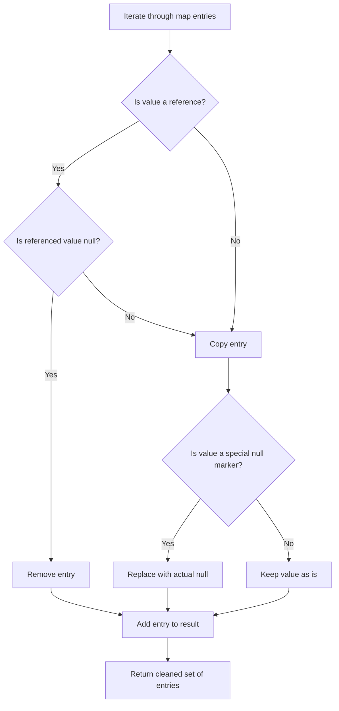

This document describes how a consistent snapshot of map entries is produced for use in various parts of the system, such as URL building and view rendering. The flow ensures that only live, normalized data is exposed by handling references and null values appropriately.

The main steps are:

- Iterate through all entries in the map
- Dereference values wrapped in references
- Remove entries with null values
- Replace special null markers with actual nulls
- Return the cleaned set of entries



# Where is this flow used?

This flow is used multiple times in the codebase as represented in the following diagram:

(Note - these are only some of the entry points of this flow)

```mermaid
graph TD;
      d622d0d89996d09f9ea5920841d868d1d4daf94d36b868296ae0656016cb3a0c(spring-webflow/…/servlet/FlowController.java::FlowController.handleRequest) --> ba8bb96f325863428b63563cdf7c3ae6d1a50f3c1f91a68263946b3e474a2c19(spring-webflow/…/servlet/FlowHandlerAdapter.java::FlowHandlerAdapter.handle)

ba8bb96f325863428b63563cdf7c3ae6d1a50f3c1f91a68263946b3e474a2c19(spring-webflow/…/servlet/FlowHandlerAdapter.java::FlowHandlerAdapter.handle) --> 46b2b7bc8d3d51a1665865e92b25805e777d509309ccf53700628413b8a7f4b5(spring-webflow/…/servlet/FlowHandlerAdapter.java::FlowHandlerAdapter.handleFlowExecutionResult)

ba8bb96f325863428b63563cdf7c3ae6d1a50f3c1f91a68263946b3e474a2c19(spring-webflow/…/servlet/FlowHandlerAdapter.java::FlowHandlerAdapter.handle) --> ea97985d7749b08bc02da6974aefad34becf200d9c523f9e4a4cf539a8c39446(spring-webflow/…/servlet/FlowHandlerAdapter.java::FlowHandlerAdapter.handleFlowException)

ba8bb96f325863428b63563cdf7c3ae6d1a50f3c1f91a68263946b3e474a2c19(spring-webflow/…/servlet/FlowHandlerAdapter.java::FlowHandlerAdapter.handle) --> 46b933fbfb7d8567d99adf8d831aa104876c3f463cbd4a2a0f16e45ff2ab3494(spring-webflow/…/servlet/FlowHandlerAdapter.java::FlowHandlerAdapter.getInputMap)

46b2b7bc8d3d51a1665865e92b25805e777d509309ccf53700628413b8a7f4b5(spring-webflow/…/servlet/FlowHandlerAdapter.java::FlowHandlerAdapter.handleFlowExecutionResult) --> 004a9e8ae89c7b47aefc7a75edd3a4841276794243201f6f5563fdc4c0091e42(spring-webflow/…/servlet/FlowHandlerAdapter.java::FlowHandlerAdapter.defaultHandleExecutionOutcome)

46b2b7bc8d3d51a1665865e92b25805e777d509309ccf53700628413b8a7f4b5(spring-webflow/…/servlet/FlowHandlerAdapter.java::FlowHandlerAdapter.handleFlowExecutionResult) --> 9813660db4d889007621d60ee154e315ebf4f199123d47ffbb0c897e0c9c8701(spring-webflow/…/servlet/FlowHandlerAdapter.java::FlowHandlerAdapter.sendFlowDefinitionRedirect)

004a9e8ae89c7b47aefc7a75edd3a4841276794243201f6f5563fdc4c0091e42(spring-webflow/…/servlet/FlowHandlerAdapter.java::FlowHandlerAdapter.defaultHandleExecutionOutcome) --> 162e8ca7af40c269c12a39196d69a080a5c3942a0a669ef398d460afe755d7df(spring-webflow/…/servlet/WebFlow1FlowUrlHandler.java::WebFlow1FlowUrlHandler.createFlowDefinitionUrl)

162e8ca7af40c269c12a39196d69a080a5c3942a0a669ef398d460afe755d7df(spring-webflow/…/servlet/WebFlow1FlowUrlHandler.java::WebFlow1FlowUrlHandler.createFlowDefinitionUrl) --> f191d10481d19b60f98c249929a5c49f4eaa885ad06265b2a5f27d06abe29291(spring-webflow/…/servlet/WebFlow1FlowUrlHandler.java::WebFlow1FlowUrlHandler.appendQueryParameters)

f191d10481d19b60f98c249929a5c49f4eaa885ad06265b2a5f27d06abe29291(spring-webflow/…/servlet/WebFlow1FlowUrlHandler.java::WebFlow1FlowUrlHandler.appendQueryParameters) --> d878cd94a7431484aedc084318339a6af781c65031f1caca1216b9cc122890c5(spring-binding/…/collection/AbstractCachingMapDecorator.java::AbstractCachingMapDecorator.entrySet)

9813660db4d889007621d60ee154e315ebf4f199123d47ffbb0c897e0c9c8701(spring-webflow/…/servlet/FlowHandlerAdapter.java::FlowHandlerAdapter.sendFlowDefinitionRedirect) --> 162e8ca7af40c269c12a39196d69a080a5c3942a0a669ef398d460afe755d7df(spring-webflow/…/servlet/WebFlow1FlowUrlHandler.java::WebFlow1FlowUrlHandler.createFlowDefinitionUrl)

ea97985d7749b08bc02da6974aefad34becf200d9c523f9e4a4cf539a8c39446(spring-webflow/…/servlet/FlowHandlerAdapter.java::FlowHandlerAdapter.handleFlowException) --> c2c60070ceb7cb240860d215291026abfe88b7bf204ecc6aed03de85935b5ab9(spring-webflow/…/servlet/FlowHandlerAdapter.java::FlowHandlerAdapter.defaultHandleException)

c2c60070ceb7cb240860d215291026abfe88b7bf204ecc6aed03de85935b5ab9(spring-webflow/…/servlet/FlowHandlerAdapter.java::FlowHandlerAdapter.defaultHandleException) --> 162e8ca7af40c269c12a39196d69a080a5c3942a0a669ef398d460afe755d7df(spring-webflow/…/servlet/WebFlow1FlowUrlHandler.java::WebFlow1FlowUrlHandler.createFlowDefinitionUrl)

46b933fbfb7d8567d99adf8d831aa104876c3f463cbd4a2a0f16e45ff2ab3494(spring-webflow/…/servlet/FlowHandlerAdapter.java::FlowHandlerAdapter.getInputMap) --> 2cdb252648988415731c4aafec7472561db98ac9865d2b71a5c49cba017d1255(spring-webflow/…/servlet/FlowHandlerAdapter.java::FlowHandlerAdapter.defaultCreateFlowExecutionInputMap)

2cdb252648988415731c4aafec7472561db98ac9865d2b71a5c49cba017d1255(spring-webflow/…/servlet/FlowHandlerAdapter.java::FlowHandlerAdapter.defaultCreateFlowExecutionInputMap) --> d878cd94a7431484aedc084318339a6af781c65031f1caca1216b9cc122890c5(spring-binding/…/collection/AbstractCachingMapDecorator.java::AbstractCachingMapDecorator.entrySet)

8a6f7d0a3efa5f90f9b8ea242016cd22d8560867b8cbabe2e4b969ac8d5459ab(spring-faces/…/mvc/JsfView.java::JsfView.renderMergedOutputModel) --> 28aa8639758bceae076449a4ff52c8faa32ae5be7815a4b15907296f929696b9(spring-faces/…/mvc/JsfView.java::JsfView.populateRequestMap)

28aa8639758bceae076449a4ff52c8faa32ae5be7815a4b15907296f929696b9(spring-faces/…/mvc/JsfView.java::JsfView.populateRequestMap) --> d878cd94a7431484aedc084318339a6af781c65031f1caca1216b9cc122890c5(spring-binding/…/collection/AbstractCachingMapDecorator.java::AbstractCachingMapDecorator.entrySet)

02dcca76bba77bd5992f02edaaf86699469546e6b1dba73d043690252915a225(spring-binding/…/spel/StandardEvaluationContextFactory.java::StandardEvaluationContextFactory.createContext) --> 2f01a67bd8dacf06af8f479fbc9c68da944a2980891d3f794be29a6dc0c27833(spring-binding/…/spel/StandardEvaluationContextFactory.java::StandardEvaluationContextFactory.getVariableValues)

2f01a67bd8dacf06af8f479fbc9c68da944a2980891d3f794be29a6dc0c27833(spring-binding/…/spel/StandardEvaluationContextFactory.java::StandardEvaluationContextFactory.getVariableValues) --> d878cd94a7431484aedc084318339a6af781c65031f1caca1216b9cc122890c5(spring-binding/…/collection/AbstractCachingMapDecorator.java::AbstractCachingMapDecorator.entrySet)

337489031cbf6f5d75498278ea4370fbad7a41270bb18c72e2a238d92b20caa5(spring-webflow/…/servlet/FilenameFlowUrlHandler.java::FilenameFlowUrlHandler.createFlowDefinitionUrl) --> a12eeaf0ff717e5ec03f18a9e6bd344ec32547e6ba1ba00958b01a70bb5cb396(spring-webflow/…/servlet/DefaultFlowUrlHandler.java::DefaultFlowUrlHandler.appendQueryParameters)

a12eeaf0ff717e5ec03f18a9e6bd344ec32547e6ba1ba00958b01a70bb5cb396(spring-webflow/…/servlet/DefaultFlowUrlHandler.java::DefaultFlowUrlHandler.appendQueryParameters) --> d878cd94a7431484aedc084318339a6af781c65031f1caca1216b9cc122890c5(spring-binding/…/collection/AbstractCachingMapDecorator.java::AbstractCachingMapDecorator.entrySet)

9a9c0e4cf688e7aae8e0d1d243f7b8ee0ef08d9e5690c5ac183819dc9fbd8688(spring-webflow/…/servlet/DefaultFlowUrlHandler.java::DefaultFlowUrlHandler.createFlowDefinitionUrl) --> a12eeaf0ff717e5ec03f18a9e6bd344ec32547e6ba1ba00958b01a70bb5cb396(spring-webflow/…/servlet/DefaultFlowUrlHandler.java::DefaultFlowUrlHandler.appendQueryParameters)


classDef mainFlowStyle color:#000000,fill:#7CB9F4
classDef rootsStyle color:#000000,fill:#00FFF4
classDef Style1 color:#000000,fill:#00FFAA
classDef Style2 color:#000000,fill:#FFFF00
classDef Style3 color:#000000,fill:#AA7CB9

%% Swimm:
%% graph TD;
%%       d622d0d89996d09f9ea5920841d868d1d4daf94d36b868296ae0656016cb3a0c(<SwmPath>[spring-webflow/…/servlet/FlowController.java](spring-webflow/src/main/java/org/springframework/webflow/mvc/servlet/FlowController.java)</SwmPath>::FlowController.handleRequest) --> ba8bb96f325863428b63563cdf7c3ae6d1a50f3c1f91a68263946b3e474a2c19(<SwmPath>[spring-webflow/…/servlet/FlowHandlerAdapter.java](spring-webflow/src/main/java/org/springframework/webflow/mvc/servlet/FlowHandlerAdapter.java)</SwmPath>::FlowHandlerAdapter.handle)
%% 
%% ba8bb96f325863428b63563cdf7c3ae6d1a50f3c1f91a68263946b3e474a2c19(<SwmPath>[spring-webflow/…/servlet/FlowHandlerAdapter.java](spring-webflow/src/main/java/org/springframework/webflow/mvc/servlet/FlowHandlerAdapter.java)</SwmPath>::FlowHandlerAdapter.handle) --> 46b2b7bc8d3d51a1665865e92b25805e777d509309ccf53700628413b8a7f4b5(<SwmPath>[spring-webflow/…/servlet/FlowHandlerAdapter.java](spring-webflow/src/main/java/org/springframework/webflow/mvc/servlet/FlowHandlerAdapter.java)</SwmPath>::FlowHandlerAdapter.handleFlowExecutionResult)
%% 
%% ba8bb96f325863428b63563cdf7c3ae6d1a50f3c1f91a68263946b3e474a2c19(<SwmPath>[spring-webflow/…/servlet/FlowHandlerAdapter.java](spring-webflow/src/main/java/org/springframework/webflow/mvc/servlet/FlowHandlerAdapter.java)</SwmPath>::FlowHandlerAdapter.handle) --> ea97985d7749b08bc02da6974aefad34becf200d9c523f9e4a4cf539a8c39446(<SwmPath>[spring-webflow/…/servlet/FlowHandlerAdapter.java](spring-webflow/src/main/java/org/springframework/webflow/mvc/servlet/FlowHandlerAdapter.java)</SwmPath>::FlowHandlerAdapter.handleFlowException)
%% 
%% ba8bb96f325863428b63563cdf7c3ae6d1a50f3c1f91a68263946b3e474a2c19(<SwmPath>[spring-webflow/…/servlet/FlowHandlerAdapter.java](spring-webflow/src/main/java/org/springframework/webflow/mvc/servlet/FlowHandlerAdapter.java)</SwmPath>::FlowHandlerAdapter.handle) --> 46b933fbfb7d8567d99adf8d831aa104876c3f463cbd4a2a0f16e45ff2ab3494(<SwmPath>[spring-webflow/…/servlet/FlowHandlerAdapter.java](spring-webflow/src/main/java/org/springframework/webflow/mvc/servlet/FlowHandlerAdapter.java)</SwmPath>::FlowHandlerAdapter.getInputMap)
%% 
%% 46b2b7bc8d3d51a1665865e92b25805e777d509309ccf53700628413b8a7f4b5(<SwmPath>[spring-webflow/…/servlet/FlowHandlerAdapter.java](spring-webflow/src/main/java/org/springframework/webflow/mvc/servlet/FlowHandlerAdapter.java)</SwmPath>::FlowHandlerAdapter.handleFlowExecutionResult) --> 004a9e8ae89c7b47aefc7a75edd3a4841276794243201f6f5563fdc4c0091e42(<SwmPath>[spring-webflow/…/servlet/FlowHandlerAdapter.java](spring-webflow/src/main/java/org/springframework/webflow/mvc/servlet/FlowHandlerAdapter.java)</SwmPath>::FlowHandlerAdapter.defaultHandleExecutionOutcome)
%% 
%% 46b2b7bc8d3d51a1665865e92b25805e777d509309ccf53700628413b8a7f4b5(<SwmPath>[spring-webflow/…/servlet/FlowHandlerAdapter.java](spring-webflow/src/main/java/org/springframework/webflow/mvc/servlet/FlowHandlerAdapter.java)</SwmPath>::FlowHandlerAdapter.handleFlowExecutionResult) --> 9813660db4d889007621d60ee154e315ebf4f199123d47ffbb0c897e0c9c8701(<SwmPath>[spring-webflow/…/servlet/FlowHandlerAdapter.java](spring-webflow/src/main/java/org/springframework/webflow/mvc/servlet/FlowHandlerAdapter.java)</SwmPath>::FlowHandlerAdapter.sendFlowDefinitionRedirect)
%% 
%% 004a9e8ae89c7b47aefc7a75edd3a4841276794243201f6f5563fdc4c0091e42(<SwmPath>[spring-webflow/…/servlet/FlowHandlerAdapter.java](spring-webflow/src/main/java/org/springframework/webflow/mvc/servlet/FlowHandlerAdapter.java)</SwmPath>::FlowHandlerAdapter.defaultHandleExecutionOutcome) --> 162e8ca7af40c269c12a39196d69a080a5c3942a0a669ef398d460afe755d7df(<SwmPath>[spring-webflow/…/servlet/WebFlow1FlowUrlHandler.java](spring-webflow/src/main/java/org/springframework/webflow/context/servlet/WebFlow1FlowUrlHandler.java)</SwmPath>::WebFlow1FlowUrlHandler.createFlowDefinitionUrl)
%% 
%% 162e8ca7af40c269c12a39196d69a080a5c3942a0a669ef398d460afe755d7df(<SwmPath>[spring-webflow/…/servlet/WebFlow1FlowUrlHandler.java](spring-webflow/src/main/java/org/springframework/webflow/context/servlet/WebFlow1FlowUrlHandler.java)</SwmPath>::WebFlow1FlowUrlHandler.createFlowDefinitionUrl) --> f191d10481d19b60f98c249929a5c49f4eaa885ad06265b2a5f27d06abe29291(<SwmPath>[spring-webflow/…/servlet/WebFlow1FlowUrlHandler.java](spring-webflow/src/main/java/org/springframework/webflow/context/servlet/WebFlow1FlowUrlHandler.java)</SwmPath>::WebFlow1FlowUrlHandler.appendQueryParameters)
%% 
%% f191d10481d19b60f98c249929a5c49f4eaa885ad06265b2a5f27d06abe29291(<SwmPath>[spring-webflow/…/servlet/WebFlow1FlowUrlHandler.java](spring-webflow/src/main/java/org/springframework/webflow/context/servlet/WebFlow1FlowUrlHandler.java)</SwmPath>::WebFlow1FlowUrlHandler.appendQueryParameters) --> d878cd94a7431484aedc084318339a6af781c65031f1caca1216b9cc122890c5(<SwmPath>[spring-binding/…/collection/AbstractCachingMapDecorator.java](spring-binding/src/main/java/org/springframework/binding/collection/AbstractCachingMapDecorator.java)</SwmPath>::AbstractCachingMapDecorator.entrySet)
%% 
%% 9813660db4d889007621d60ee154e315ebf4f199123d47ffbb0c897e0c9c8701(<SwmPath>[spring-webflow/…/servlet/FlowHandlerAdapter.java](spring-webflow/src/main/java/org/springframework/webflow/mvc/servlet/FlowHandlerAdapter.java)</SwmPath>::FlowHandlerAdapter.sendFlowDefinitionRedirect) --> 162e8ca7af40c269c12a39196d69a080a5c3942a0a669ef398d460afe755d7df(<SwmPath>[spring-webflow/…/servlet/WebFlow1FlowUrlHandler.java](spring-webflow/src/main/java/org/springframework/webflow/context/servlet/WebFlow1FlowUrlHandler.java)</SwmPath>::WebFlow1FlowUrlHandler.createFlowDefinitionUrl)
%% 
%% ea97985d7749b08bc02da6974aefad34becf200d9c523f9e4a4cf539a8c39446(<SwmPath>[spring-webflow/…/servlet/FlowHandlerAdapter.java](spring-webflow/src/main/java/org/springframework/webflow/mvc/servlet/FlowHandlerAdapter.java)</SwmPath>::FlowHandlerAdapter.handleFlowException) --> c2c60070ceb7cb240860d215291026abfe88b7bf204ecc6aed03de85935b5ab9(<SwmPath>[spring-webflow/…/servlet/FlowHandlerAdapter.java](spring-webflow/src/main/java/org/springframework/webflow/mvc/servlet/FlowHandlerAdapter.java)</SwmPath>::FlowHandlerAdapter.defaultHandleException)
%% 
%% c2c60070ceb7cb240860d215291026abfe88b7bf204ecc6aed03de85935b5ab9(<SwmPath>[spring-webflow/…/servlet/FlowHandlerAdapter.java](spring-webflow/src/main/java/org/springframework/webflow/mvc/servlet/FlowHandlerAdapter.java)</SwmPath>::FlowHandlerAdapter.defaultHandleException) --> 162e8ca7af40c269c12a39196d69a080a5c3942a0a669ef398d460afe755d7df(<SwmPath>[spring-webflow/…/servlet/WebFlow1FlowUrlHandler.java](spring-webflow/src/main/java/org/springframework/webflow/context/servlet/WebFlow1FlowUrlHandler.java)</SwmPath>::WebFlow1FlowUrlHandler.createFlowDefinitionUrl)
%% 
%% 46b933fbfb7d8567d99adf8d831aa104876c3f463cbd4a2a0f16e45ff2ab3494(<SwmPath>[spring-webflow/…/servlet/FlowHandlerAdapter.java](spring-webflow/src/main/java/org/springframework/webflow/mvc/servlet/FlowHandlerAdapter.java)</SwmPath>::FlowHandlerAdapter.getInputMap) --> 2cdb252648988415731c4aafec7472561db98ac9865d2b71a5c49cba017d1255(<SwmPath>[spring-webflow/…/servlet/FlowHandlerAdapter.java](spring-webflow/src/main/java/org/springframework/webflow/mvc/servlet/FlowHandlerAdapter.java)</SwmPath>::FlowHandlerAdapter.defaultCreateFlowExecutionInputMap)
%% 
%% 2cdb252648988415731c4aafec7472561db98ac9865d2b71a5c49cba017d1255(<SwmPath>[spring-webflow/…/servlet/FlowHandlerAdapter.java](spring-webflow/src/main/java/org/springframework/webflow/mvc/servlet/FlowHandlerAdapter.java)</SwmPath>::FlowHandlerAdapter.defaultCreateFlowExecutionInputMap) --> d878cd94a7431484aedc084318339a6af781c65031f1caca1216b9cc122890c5(<SwmPath>[spring-binding/…/collection/AbstractCachingMapDecorator.java](spring-binding/src/main/java/org/springframework/binding/collection/AbstractCachingMapDecorator.java)</SwmPath>::AbstractCachingMapDecorator.entrySet)
%% 
%% 8a6f7d0a3efa5f90f9b8ea242016cd22d8560867b8cbabe2e4b969ac8d5459ab(<SwmPath>[spring-faces/…/mvc/JsfView.java](spring-faces/src/main/java/org/springframework/faces/mvc/JsfView.java)</SwmPath>::JsfView.renderMergedOutputModel) --> 28aa8639758bceae076449a4ff52c8faa32ae5be7815a4b15907296f929696b9(<SwmPath>[spring-faces/…/mvc/JsfView.java](spring-faces/src/main/java/org/springframework/faces/mvc/JsfView.java)</SwmPath>::JsfView.populateRequestMap)
%% 
%% 28aa8639758bceae076449a4ff52c8faa32ae5be7815a4b15907296f929696b9(<SwmPath>[spring-faces/…/mvc/JsfView.java](spring-faces/src/main/java/org/springframework/faces/mvc/JsfView.java)</SwmPath>::JsfView.populateRequestMap) --> d878cd94a7431484aedc084318339a6af781c65031f1caca1216b9cc122890c5(<SwmPath>[spring-binding/…/collection/AbstractCachingMapDecorator.java](spring-binding/src/main/java/org/springframework/binding/collection/AbstractCachingMapDecorator.java)</SwmPath>::AbstractCachingMapDecorator.entrySet)
%% 
%% 02dcca76bba77bd5992f02edaaf86699469546e6b1dba73d043690252915a225(<SwmPath>[spring-binding/…/spel/StandardEvaluationContextFactory.java](spring-binding/src/main/java/org/springframework/binding/expression/spel/StandardEvaluationContextFactory.java)</SwmPath>::StandardEvaluationContextFactory.createContext) --> 2f01a67bd8dacf06af8f479fbc9c68da944a2980891d3f794be29a6dc0c27833(<SwmPath>[spring-binding/…/spel/StandardEvaluationContextFactory.java](spring-binding/src/main/java/org/springframework/binding/expression/spel/StandardEvaluationContextFactory.java)</SwmPath>::StandardEvaluationContextFactory.getVariableValues)
%% 
%% 2f01a67bd8dacf06af8f479fbc9c68da944a2980891d3f794be29a6dc0c27833(<SwmPath>[spring-binding/…/spel/StandardEvaluationContextFactory.java](spring-binding/src/main/java/org/springframework/binding/expression/spel/StandardEvaluationContextFactory.java)</SwmPath>::StandardEvaluationContextFactory.getVariableValues) --> d878cd94a7431484aedc084318339a6af781c65031f1caca1216b9cc122890c5(<SwmPath>[spring-binding/…/collection/AbstractCachingMapDecorator.java](spring-binding/src/main/java/org/springframework/binding/collection/AbstractCachingMapDecorator.java)</SwmPath>::AbstractCachingMapDecorator.entrySet)
%% 
%% 337489031cbf6f5d75498278ea4370fbad7a41270bb18c72e2a238d92b20caa5(<SwmPath>[spring-webflow/…/servlet/FilenameFlowUrlHandler.java](spring-webflow/src/main/java/org/springframework/webflow/context/servlet/FilenameFlowUrlHandler.java)</SwmPath>::FilenameFlowUrlHandler.createFlowDefinitionUrl) --> a12eeaf0ff717e5ec03f18a9e6bd344ec32547e6ba1ba00958b01a70bb5cb396(<SwmPath>[spring-webflow/…/servlet/DefaultFlowUrlHandler.java](spring-webflow/src/main/java/org/springframework/webflow/context/servlet/DefaultFlowUrlHandler.java)</SwmPath>::DefaultFlowUrlHandler.appendQueryParameters)
%% 
%% a12eeaf0ff717e5ec03f18a9e6bd344ec32547e6ba1ba00958b01a70bb5cb396(<SwmPath>[spring-webflow/…/servlet/DefaultFlowUrlHandler.java](spring-webflow/src/main/java/org/springframework/webflow/context/servlet/DefaultFlowUrlHandler.java)</SwmPath>::DefaultFlowUrlHandler.appendQueryParameters) --> d878cd94a7431484aedc084318339a6af781c65031f1caca1216b9cc122890c5(<SwmPath>[spring-binding/…/collection/AbstractCachingMapDecorator.java](spring-binding/src/main/java/org/springframework/binding/collection/AbstractCachingMapDecorator.java)</SwmPath>::AbstractCachingMapDecorator.entrySet)
%% 
%% 9a9c0e4cf688e7aae8e0d1d243f7b8ee0ef08d9e5690c5ac183819dc9fbd8688(<SwmPath>[spring-webflow/…/servlet/DefaultFlowUrlHandler.java](spring-webflow/src/main/java/org/springframework/webflow/context/servlet/DefaultFlowUrlHandler.java)</SwmPath>::DefaultFlowUrlHandler.createFlowDefinitionUrl) --> a12eeaf0ff717e5ec03f18a9e6bd344ec32547e6ba1ba00958b01a70bb5cb396(<SwmPath>[spring-webflow/…/servlet/DefaultFlowUrlHandler.java](spring-webflow/src/main/java/org/springframework/webflow/context/servlet/DefaultFlowUrlHandler.java)</SwmPath>::DefaultFlowUrlHandler.appendQueryParameters)
%% 
%% 
%% classDef mainFlowStyle color:#000000,fill:#7CB9F4
%% classDef rootsStyle color:#000000,fill:#00FFF4
%% classDef Style1 color:#000000,fill:#00FFAA
%% classDef Style2 color:#000000,fill:#FFFF00
%% classDef Style3 color:#000000,fill:#AA7CB9
```

# Getting a Consistent Snapshot of Map Entries

<SwmSnippet path="/spring-binding/src/main/java/org/springframework/binding/collection/AbstractCachingMapDecorator.java" line="215">

---

EntrySet kicks off the flow by deciding whether to synchronize on <SwmToken path="spring-binding/src/main/java/org/springframework/binding/collection/AbstractCachingMapDecorator.java" pos="217:6:6" line-data="			synchronized (this.targetMap) {">`targetMap`</SwmToken> before copying entries. It always delegates to <SwmToken path="spring-binding/src/main/java/org/springframework/binding/collection/AbstractCachingMapDecorator.java" pos="218:3:3" line-data="				return entryCopy();">`entryCopy`</SwmToken>, which actually builds the snapshot. Calling <SwmToken path="spring-binding/src/main/java/org/springframework/binding/collection/AbstractCachingMapDecorator.java" pos="218:3:3" line-data="				return entryCopy();">`entryCopy`</SwmToken> is necessary because it handles reference dereferencing and null value normalization, not just a raw <SwmToken path="spring-binding/src/main/java/org/springframework/binding/collection/AbstractCachingMapDecorator.java" pos="215:15:15" line-data="	public Set&lt;Map.Entry&lt;K, V&gt;&gt; entrySet() {">`entrySet`</SwmToken>.

```java
	public Set<Map.Entry<K, V>> entrySet() {
		if (this.synchronize) {
			synchronized (this.targetMap) {
				return entryCopy();
			}
		}
		else {
			return entryCopy();
		}
	}
```

---

</SwmSnippet>

# Building a Clean Entry Snapshot with Reference Handling

```mermaid
%%{init: {"flowchart": {"defaultRenderer": "elk"}} }%%
flowchart TD
    node1["Start copying map entries"]
    click node1 openCode "spring-binding/src/main/java/org/springframework/binding/collection/AbstractCachingMapDecorator.java:227:229"
    subgraph loop1["For each entry in the map"]
        node1 --> node2{"Is value a reference?"}
        click node2 openCode "spring-binding/src/main/java/org/springframework/binding/collection/AbstractCachingMapDecorator.java:232:233"
        node2 -->|"Yes"| node3{"Is referenced value null?"}
        click node3 openCode "spring-binding/src/main/java/org/springframework/binding/collection/AbstractCachingMapDecorator.java:234:237"
        node3 -->|"Yes"| node4["Remove entry"]
        click node4 openCode "spring-binding/src/main/java/org/springframework/binding/collection/AbstractCachingMapDecorator.java:235:236"
        node3 -->|"No"| node5["Copy entry"]
        click node5 openCode "spring-binding/src/main/java/org/springframework/binding/collection/AbstractCachingMapDecorator.java:239:240"
        node2 -->|"No"| node5
    end
    node5 --> node6["Return cleaned set of entries"]
    click node6 openCode "spring-binding/src/main/java/org/springframework/binding/collection/AbstractCachingMapDecorator.java:241:242"

%% Swimm:
%% %%{init: {"flowchart": {"defaultRenderer": "elk"}} }%%
%% flowchart TD
%%     node1["Start copying map entries"]
%%     click node1 openCode "<SwmPath>[spring-binding/…/collection/AbstractCachingMapDecorator.java](spring-binding/src/main/java/org/springframework/binding/collection/AbstractCachingMapDecorator.java)</SwmPath>:227:229"
%%     subgraph loop1["For each entry in the map"]
%%         node1 --> node2{"Is value a reference?"}
%%         click node2 openCode "<SwmPath>[spring-binding/…/collection/AbstractCachingMapDecorator.java](spring-binding/src/main/java/org/springframework/binding/collection/AbstractCachingMapDecorator.java)</SwmPath>:232:233"
%%         node2 -->|"Yes"| node3{"Is referenced value null?"}
%%         click node3 openCode "<SwmPath>[spring-binding/…/collection/AbstractCachingMapDecorator.java](spring-binding/src/main/java/org/springframework/binding/collection/AbstractCachingMapDecorator.java)</SwmPath>:234:237"
%%         node3 -->|"Yes"| node4["Remove entry"]
%%         click node4 openCode "<SwmPath>[spring-binding/…/collection/AbstractCachingMapDecorator.java](spring-binding/src/main/java/org/springframework/binding/collection/AbstractCachingMapDecorator.java)</SwmPath>:235:236"
%%         node3 -->|"No"| node5["Copy entry"]
%%         click node5 openCode "<SwmPath>[spring-binding/…/collection/AbstractCachingMapDecorator.java](spring-binding/src/main/java/org/springframework/binding/collection/AbstractCachingMapDecorator.java)</SwmPath>:239:240"
%%         node2 -->|"No"| node5
%%     end
%%     node5 --> node6["Return cleaned set of entries"]
%%     click node6 openCode "<SwmPath>[spring-binding/…/collection/AbstractCachingMapDecorator.java](spring-binding/src/main/java/org/springframework/binding/collection/AbstractCachingMapDecorator.java)</SwmPath>:241:242"
```



<SwmSnippet path="/spring-binding/src/main/java/org/springframework/binding/collection/AbstractCachingMapDecorator.java" line="227">

---

In <SwmToken path="spring-binding/src/main/java/org/springframework/binding/collection/AbstractCachingMapDecorator.java" pos="227:15:15" line-data="	private Set&lt;Map.Entry&lt;K, V&gt;&gt; entryCopy() {">`entryCopy`</SwmToken>, we start by setting up a <SwmToken path="spring-binding/src/main/java/org/springframework/binding/collection/AbstractCachingMapDecorator.java" pos="228:14:14" line-data="		Map&lt;K,V&gt; entries = new LinkedHashMap&lt;&gt;();">`LinkedHashMap`</SwmToken> to hold cleaned entries. The flow here is about iterating through <SwmToken path="spring-binding/src/main/java/org/springframework/binding/collection/AbstractCachingMapDecorator.java" pos="229:20:20" line-data="		for (Iterator&lt;Entry&lt;K, Object&gt;&gt; it = this.targetMap.entrySet().iterator(); it.hasNext();) {">`targetMap`</SwmToken>, prepping for reference and null handling. We need to call <SwmToken path="spring-binding/src/main/java/org/springframework/binding/collection/AbstractCachingMapDecorator.java" pos="229:22:22" line-data="		for (Iterator&lt;Entry&lt;K, Object&gt;&gt; it = this.targetMap.entrySet().iterator(); it.hasNext();) {">`entrySet`</SwmToken> at the end to expose the cleaned-up entries as a set, matching the Map API.

```java
	private Set<Map.Entry<K, V>> entryCopy() {
		Map<K,V> entries = new LinkedHashMap<>();
		for (Iterator<Entry<K, Object>> it = this.targetMap.entrySet().iterator(); it.hasNext();) {
```

---

</SwmSnippet>

<SwmSnippet path="/spring-binding/src/main/java/org/springframework/binding/collection/AbstractCachingMapDecorator.java" line="230">

---

After coming back from <SwmToken path="spring-binding/src/main/java/org/springframework/binding/collection/AbstractCachingMapDecorator.java" pos="215:15:15" line-data="	public Set&lt;Map.Entry&lt;K, V&gt;&gt; entrySet() {">`entrySet`</SwmToken>, <SwmToken path="spring-binding/src/main/java/org/springframework/binding/collection/AbstractCachingMapDecorator.java" pos="218:3:3" line-data="				return entryCopy();">`entryCopy`</SwmToken> starts iterating through <SwmToken path="spring-binding/src/main/java/org/springframework/binding/collection/AbstractCachingMapDecorator.java" pos="156:7:7" line-data="		return unwrapReturnValue(this.targetMap.remove(key));">`targetMap`</SwmToken> entries. If a value is a Reference, it gets dereferenced. If the dereferenced value is null, the entry is removed, so only live data makes it into the snapshot. Next up, we need get to handle dereferencing and lazy loading for individual values.

```java
			Entry<K, Object> entry = it.next();
			Object value = entry.getValue();
			if (value instanceof Reference) {
				value = ((Reference) value).get();
```

---

</SwmSnippet>

## Retrieving and Caching Map Values with Lazy Initialization

```mermaid
%%{init: {"flowchart": {"defaultRenderer": "elk"}} }%%
flowchart TD
  node1["Retrieve value for key from map"]
  click node1 openCode "spring-binding/src/main/java/org/springframework/binding/collection/AbstractCachingMapDecorator.java:284:284"
  node1 --> node2{"Is value a reference?"}
  click node2 openCode "spring-binding/src/main/java/org/springframework/binding/collection/AbstractCachingMapDecorator.java:285:287"
  node2 -->|"Yes"| node3["Unwrap reference"]
  click node3 openCode "spring-binding/src/main/java/org/springframework/binding/collection/AbstractCachingMapDecorator.java:286:287"
  node2 -->|"No"| node4["Continue"]
  click node4 openCode "spring-binding/src/main/java/org/springframework/binding/collection/AbstractCachingMapDecorator.java:287:287"
  node3 --> node5{"Is value missing (null)?"}
  node4 --> node5
  click node5 openCode "spring-binding/src/main/java/org/springframework/binding/collection/AbstractCachingMapDecorator.java:288:288"
  node5 -->|"Yes"| node6["Create new value for key"]
  click node6 openCode "spring-binding/src/main/java/org/springframework/binding/collection/AbstractCachingMapDecorator.java:289:289"
  node6 --> node7["Store new value in map"]
  click node7 openCode "spring-binding/src/main/java/org/springframework/binding/collection/AbstractCachingMapDecorator.java:290:290"
  node7 --> node8["Return new value"]
  click node8 openCode "spring-binding/src/main/java/org/springframework/binding/collection/AbstractCachingMapDecorator.java:291:291"
  node5 -->|"No"| node9{"Is value a NULL_VALUE marker?"}
  click node9 openCode "spring-binding/src/main/java/org/springframework/binding/collection/AbstractCachingMapDecorator.java:293:293"
  node9 -->|"Yes"| node10["Return null"]
  click node10 openCode "spring-binding/src/main/java/org/springframework/binding/collection/AbstractCachingMapDecorator.java:293:293"
  node9 -->|"No"| node11["Return value"]
  click node11 openCode "spring-binding/src/main/java/org/springframework/binding/collection/AbstractCachingMapDecorator.java:293:293"

%% Swimm:
%% %%{init: {"flowchart": {"defaultRenderer": "elk"}} }%%
%% flowchart TD
%%   node1["Retrieve value for key from map"]
%%   click node1 openCode "<SwmPath>[spring-binding/…/collection/AbstractCachingMapDecorator.java](spring-binding/src/main/java/org/springframework/binding/collection/AbstractCachingMapDecorator.java)</SwmPath>:284:284"
%%   node1 --> node2{"Is value a reference?"}
%%   click node2 openCode "<SwmPath>[spring-binding/…/collection/AbstractCachingMapDecorator.java](spring-binding/src/main/java/org/springframework/binding/collection/AbstractCachingMapDecorator.java)</SwmPath>:285:287"
%%   node2 -->|"Yes"| node3["Unwrap reference"]
%%   click node3 openCode "<SwmPath>[spring-binding/…/collection/AbstractCachingMapDecorator.java](spring-binding/src/main/java/org/springframework/binding/collection/AbstractCachingMapDecorator.java)</SwmPath>:286:287"
%%   node2 -->|"No"| node4["Continue"]
%%   click node4 openCode "<SwmPath>[spring-binding/…/collection/AbstractCachingMapDecorator.java](spring-binding/src/main/java/org/springframework/binding/collection/AbstractCachingMapDecorator.java)</SwmPath>:287:287"
%%   node3 --> node5{"Is value missing (null)?"}
%%   node4 --> node5
%%   click node5 openCode "<SwmPath>[spring-binding/…/collection/AbstractCachingMapDecorator.java](spring-binding/src/main/java/org/springframework/binding/collection/AbstractCachingMapDecorator.java)</SwmPath>:288:288"
%%   node5 -->|"Yes"| node6["Create new value for key"]
%%   click node6 openCode "<SwmPath>[spring-binding/…/collection/AbstractCachingMapDecorator.java](spring-binding/src/main/java/org/springframework/binding/collection/AbstractCachingMapDecorator.java)</SwmPath>:289:289"
%%   node6 --> node7["Store new value in map"]
%%   click node7 openCode "<SwmPath>[spring-binding/…/collection/AbstractCachingMapDecorator.java](spring-binding/src/main/java/org/springframework/binding/collection/AbstractCachingMapDecorator.java)</SwmPath>:290:290"
%%   node7 --> node8["Return new value"]
%%   click node8 openCode "<SwmPath>[spring-binding/…/collection/AbstractCachingMapDecorator.java](spring-binding/src/main/java/org/springframework/binding/collection/AbstractCachingMapDecorator.java)</SwmPath>:291:291"
%%   node5 -->|"No"| node9{"Is value a <SwmToken path="spring-binding/src/main/java/org/springframework/binding/collection/AbstractCachingMapDecorator.java" pos="165:8:8" line-data="		return (returnValue == NULL_VALUE ? null : (V) returnValue);">`NULL_VALUE`</SwmToken> marker?"}
%%   click node9 openCode "<SwmPath>[spring-binding/…/collection/AbstractCachingMapDecorator.java](spring-binding/src/main/java/org/springframework/binding/collection/AbstractCachingMapDecorator.java)</SwmPath>:293:293"
%%   node9 -->|"Yes"| node10["Return null"]
%%   click node10 openCode "<SwmPath>[spring-binding/…/collection/AbstractCachingMapDecorator.java](spring-binding/src/main/java/org/springframework/binding/collection/AbstractCachingMapDecorator.java)</SwmPath>:293:293"
%%   node9 -->|"No"| node11["Return value"]
%%   click node11 openCode "<SwmPath>[spring-binding/…/collection/AbstractCachingMapDecorator.java](spring-binding/src/main/java/org/springframework/binding/collection/AbstractCachingMapDecorator.java)</SwmPath>:293:293"
```



<SwmSnippet path="/spring-binding/src/main/java/org/springframework/binding/collection/AbstractCachingMapDecorator.java" line="283">

---

Get handles value retrieval, dereferencing Reference wrappers, and lazy creation if the value is missing. If a value isn't present, it creates and caches a new one using put, so the map always stays populated. Next, put handles storing the new value, including reference and null handling.

```java
	public V get(Object key) {
		Object value = this.targetMap.get(key);
		if (value instanceof Reference) {
			value = ((Reference) value).get();
		}
		if (value == null) {
			V newValue = create((K) key);
			put((K) key, newValue);
			return newValue;
		}
		return (value == NULL_VALUE ? null : (V) value);
	}
```

---

</SwmSnippet>

## Storing Values with Weak Reference and Null Handling

```mermaid
%%{init: {"flowchart": {"defaultRenderer": "elk"}} }%%
flowchart TD
  node1["Receive key and value"] --> node2{"Is value null?"}
  click node1 openCode "spring-binding/src/main/java/org/springframework/binding/collection/AbstractCachingMapDecorator.java:250:251"
  node2 -->|"Yes"| node3["Replace value with special null marker"]
  click node2 openCode "spring-binding/src/main/java/org/springframework/binding/collection/AbstractCachingMapDecorator.java:252:254"
  node2 -->|"No"| node4{"Should use weak reference?"}
  click node3 openCode "spring-binding/src/main/java/org/springframework/binding/collection/AbstractCachingMapDecorator.java:253:254"
  click node4 openCode "spring-binding/src/main/java/org/springframework/binding/collection/AbstractCachingMapDecorator.java:255:257"
  node4 -->|"Yes"| node5["Store value as weak reference"]
  node4 -->|"No"| node6["Store value as is"]
  click node5 openCode "spring-binding/src/main/java/org/springframework/binding/collection/AbstractCachingMapDecorator.java:256:257"
  click node6 openCode "spring-binding/src/main/java/org/springframework/binding/collection/AbstractCachingMapDecorator.java:255:257"
  node3 --> node7["Store in map and unwrap return value"]
  node5 --> node7
  node6 --> node7
  click node7 openCode "spring-binding/src/main/java/org/springframework/binding/collection/AbstractCachingMapDecorator.java:258:258"

%% Swimm:
%% %%{init: {"flowchart": {"defaultRenderer": "elk"}} }%%
%% flowchart TD
%%   node1["Receive key and value"] --> node2{"Is value null?"}
%%   click node1 openCode "<SwmPath>[spring-binding/…/collection/AbstractCachingMapDecorator.java](spring-binding/src/main/java/org/springframework/binding/collection/AbstractCachingMapDecorator.java)</SwmPath>:250:251"
%%   node2 -->|"Yes"| node3["Replace value with special null marker"]
%%   click node2 openCode "<SwmPath>[spring-binding/…/collection/AbstractCachingMapDecorator.java](spring-binding/src/main/java/org/springframework/binding/collection/AbstractCachingMapDecorator.java)</SwmPath>:252:254"
%%   node2 -->|"No"| node4{"Should use weak reference?"}
%%   click node3 openCode "<SwmPath>[spring-binding/…/collection/AbstractCachingMapDecorator.java](spring-binding/src/main/java/org/springframework/binding/collection/AbstractCachingMapDecorator.java)</SwmPath>:253:254"
%%   click node4 openCode "<SwmPath>[spring-binding/…/collection/AbstractCachingMapDecorator.java](spring-binding/src/main/java/org/springframework/binding/collection/AbstractCachingMapDecorator.java)</SwmPath>:255:257"
%%   node4 -->|"Yes"| node5["Store value as weak reference"]
%%   node4 -->|"No"| node6["Store value as is"]
%%   click node5 openCode "<SwmPath>[spring-binding/…/collection/AbstractCachingMapDecorator.java](spring-binding/src/main/java/org/springframework/binding/collection/AbstractCachingMapDecorator.java)</SwmPath>:256:257"
%%   click node6 openCode "<SwmPath>[spring-binding/…/collection/AbstractCachingMapDecorator.java](spring-binding/src/main/java/org/springframework/binding/collection/AbstractCachingMapDecorator.java)</SwmPath>:255:257"
%%   node3 --> node7["Store in map and unwrap return value"]
%%   node5 --> node7
%%   node6 --> node7
%%   click node7 openCode "<SwmPath>[spring-binding/…/collection/AbstractCachingMapDecorator.java](spring-binding/src/main/java/org/springframework/binding/collection/AbstractCachingMapDecorator.java)</SwmPath>:258:258"
```



<SwmSnippet path="/spring-binding/src/main/java/org/springframework/binding/collection/AbstractCachingMapDecorator.java" line="250">

---

In put, we handle nulls by swapping them for <SwmToken path="spring-binding/src/main/java/org/springframework/binding/collection/AbstractCachingMapDecorator.java" pos="253:5:5" line-data="			newValue = NULL_VALUE;">`NULL_VALUE`</SwmToken> and check if we need to wrap the value in a <SwmToken path="spring-binding/src/main/java/org/springframework/binding/collection/AbstractCachingMapDecorator.java" pos="256:7:7" line-data="			newValue = new WeakReference&lt;&gt;(newValue);">`WeakReference`</SwmToken> using <SwmToken path="spring-binding/src/main/java/org/springframework/binding/collection/AbstractCachingMapDecorator.java" pos="255:6:6" line-data="		else if (useWeakValue(key, value)) {">`useWeakValue`</SwmToken>. Next, <SwmToken path="spring-binding/src/main/java/org/springframework/binding/collection/AbstractCachingMapDecorator.java" pos="255:6:6" line-data="		else if (useWeakValue(key, value)) {">`useWeakValue`</SwmToken> decides if weak referencing is needed for this key/value pair.

```java
	public V put(K key, V value) {
		Object newValue = value;
		if (value == null) {
			newValue = NULL_VALUE;
		}
		else if (useWeakValue(key, value)) {
			newValue = new WeakReference<>(newValue);
		}
```

---

</SwmSnippet>

<SwmSnippet path="/spring-binding/src/main/java/org/springframework/binding/collection/AbstractCachingMapDecorator.java" line="269">

---

UseWeakValue just checks the instance's weak flag and ignores the key and value, so weak referencing is a global setting for the whole map.

```java
	protected boolean useWeakValue(K key, V value) {
		return this.weak;
	}
```

---

</SwmSnippet>

<SwmSnippet path="/spring-binding/src/main/java/org/springframework/binding/collection/AbstractCachingMapDecorator.java" line="258">

---

After <SwmToken path="spring-binding/src/main/java/org/springframework/binding/collection/AbstractCachingMapDecorator.java" pos="255:6:6" line-data="		else if (useWeakValue(key, value)) {">`useWeakValue`</SwmToken>, put stores the value and then unwraps the previous value before returning it, so callers never see Reference wrappers or <SwmToken path="spring-binding/src/main/java/org/springframework/binding/collection/AbstractCachingMapDecorator.java" pos="165:8:8" line-data="		return (returnValue == NULL_VALUE ? null : (V) returnValue);">`NULL_VALUE`</SwmToken> sentinels.

```java
		return unwrapReturnValue(this.targetMap.put(key, newValue));
	}
```

---

</SwmSnippet>

<SwmSnippet path="/spring-binding/src/main/java/org/springframework/binding/collection/AbstractCachingMapDecorator.java" line="160">

---

UnwrapReturnValue strips out wrappers and sentinels so callers get plain values.

```java
	private V unwrapReturnValue(Object value) {
		Object returnValue = value;
		if (returnValue instanceof Reference) {
			returnValue = ((Reference) returnValue).get();
		}
		return (returnValue == NULL_VALUE ? null : (V) returnValue);
	}
```

---

</SwmSnippet>

## Cleaning Up Stale Entries During Snapshot Creation

```mermaid
%%{init: {"flowchart": {"defaultRenderer": "elk"}} }%%
flowchart TD
    subgraph loop1["For each entry in the map"]
        node1["Process entry"]
        node1 --> node2{"Is entry value null?"}
        click node2 openCode "spring-binding/src/main/java/org/springframework/binding/collection/AbstractCachingMapDecorator.java:234:237"
        node2 -->|"Yes"| node3["Remove entry"]
        click node3 openCode "spring-binding/src/main/java/org/springframework/binding/collection/AbstractCachingMapDecorator.java:235:236"
        node2 -->|"No"| node4{"Is entry value a placeholder for null?"}
        click node4 openCode "spring-binding/src/main/java/org/springframework/binding/collection/AbstractCachingMapDecorator.java:239:240"
        node4 -->|"Yes"| node5["Replace with actual null"]
        click node5 openCode "spring-binding/src/main/java/org/springframework/binding/collection/AbstractCachingMapDecorator.java:239:240"
        node4 -->|"No"| node6["Keep value as is"]
        click node6 openCode "spring-binding/src/main/java/org/springframework/binding/collection/AbstractCachingMapDecorator.java:239:240"
        node5 --> node7["Add entry to result"]
        click node7 openCode "spring-binding/src/main/java/org/springframework/binding/collection/AbstractCachingMapDecorator.java:239:240"
        node6 --> node7
    end
    loop1 --> node8["Return filtered and transformed entries"]
    click node8 openCode "spring-binding/src/main/java/org/springframework/binding/collection/AbstractCachingMapDecorator.java:241:242"

%% Swimm:
%% %%{init: {"flowchart": {"defaultRenderer": "elk"}} }%%
%% flowchart TD
%%     subgraph loop1["For each entry in the map"]
%%         node1["Process entry"]
%%         node1 --> node2{"Is entry value null?"}
%%         click node2 openCode "<SwmPath>[spring-binding/…/collection/AbstractCachingMapDecorator.java](spring-binding/src/main/java/org/springframework/binding/collection/AbstractCachingMapDecorator.java)</SwmPath>:234:237"
%%         node2 -->|"Yes"| node3["Remove entry"]
%%         click node3 openCode "<SwmPath>[spring-binding/…/collection/AbstractCachingMapDecorator.java](spring-binding/src/main/java/org/springframework/binding/collection/AbstractCachingMapDecorator.java)</SwmPath>:235:236"
%%         node2 -->|"No"| node4{"Is entry value a placeholder for null?"}
%%         click node4 openCode "<SwmPath>[spring-binding/…/collection/AbstractCachingMapDecorator.java](spring-binding/src/main/java/org/springframework/binding/collection/AbstractCachingMapDecorator.java)</SwmPath>:239:240"
%%         node4 -->|"Yes"| node5["Replace with actual null"]
%%         click node5 openCode "<SwmPath>[spring-binding/…/collection/AbstractCachingMapDecorator.java](spring-binding/src/main/java/org/springframework/binding/collection/AbstractCachingMapDecorator.java)</SwmPath>:239:240"
%%         node4 -->|"No"| node6["Keep value as is"]
%%         click node6 openCode "<SwmPath>[spring-binding/…/collection/AbstractCachingMapDecorator.java](spring-binding/src/main/java/org/springframework/binding/collection/AbstractCachingMapDecorator.java)</SwmPath>:239:240"
%%         node5 --> node7["Add entry to result"]
%%         click node7 openCode "<SwmPath>[spring-binding/…/collection/AbstractCachingMapDecorator.java](spring-binding/src/main/java/org/springframework/binding/collection/AbstractCachingMapDecorator.java)</SwmPath>:239:240"
%%         node6 --> node7
%%     end
%%     loop1 --> node8["Return filtered and transformed entries"]
%%     click node8 openCode "<SwmPath>[spring-binding/…/collection/AbstractCachingMapDecorator.java](spring-binding/src/main/java/org/springframework/binding/collection/AbstractCachingMapDecorator.java)</SwmPath>:241:242"
```



<SwmSnippet path="/spring-binding/src/main/java/org/springframework/binding/collection/AbstractCachingMapDecorator.java" line="234">

---

After get, <SwmToken path="spring-binding/src/main/java/org/springframework/binding/collection/AbstractCachingMapDecorator.java" pos="218:3:3" line-data="				return entryCopy();">`entryCopy`</SwmToken> checks if the dereferenced value is null and removes the entry if so. This keeps the snapshot free of garbage-collected entries. Next, remove handles the actual removal and value unwrapping.

```java
				if (value == null) {
					it.remove();
					continue;
				}
			}
```

---

</SwmSnippet>

<SwmSnippet path="/spring-binding/src/main/java/org/springframework/binding/collection/AbstractCachingMapDecorator.java" line="155">

---

Remove deletes the entry and unwraps the removed value, so callers get the real value or null, not internal wrappers.

```java
	public V remove(Object key) {
		return unwrapReturnValue(this.targetMap.remove(key));
	}
```

---

</SwmSnippet>

<SwmSnippet path="/spring-binding/src/main/java/org/springframework/binding/collection/AbstractCachingMapDecorator.java" line="239">

---

After remove, <SwmToken path="spring-binding/src/main/java/org/springframework/binding/collection/AbstractCachingMapDecorator.java" pos="218:3:3" line-data="				return entryCopy();">`entryCopy`</SwmToken> checks if the value is <SwmToken path="spring-binding/src/main/java/org/springframework/binding/collection/AbstractCachingMapDecorator.java" pos="239:16:16" line-data="			entries.put(entry.getKey(), value == NULL_VALUE ? null : (V) value);">`NULL_VALUE`</SwmToken> and converts it to null before adding it to the entries map. This keeps the snapshot clean for callers. Next, put handles storing values with proper reference and null handling.

```java
			entries.put(entry.getKey(), value == NULL_VALUE ? null : (V) value);
		}
```

---

</SwmSnippet>

<SwmSnippet path="/spring-binding/src/main/java/org/springframework/binding/collection/AbstractCachingMapDecorator.java" line="241">

---

After put, <SwmToken path="spring-binding/src/main/java/org/springframework/binding/collection/AbstractCachingMapDecorator.java" pos="218:3:3" line-data="				return entryCopy();">`entryCopy`</SwmToken> wraps up by returning the entry set from the cleaned-up entries map. This exposes a safe, normalized snapshot to callers. Next, <SwmToken path="spring-binding/src/main/java/org/springframework/binding/collection/AbstractCachingMapDecorator.java" pos="241:5:5" line-data="		return entries.entrySet();">`entrySet`</SwmToken> uses this to provide the public API.

```java
		return entries.entrySet();
	}
```

---

</SwmSnippet>

&nbsp;

*This is an auto-generated document by Swimm 🌊 and has not yet been verified by a human*

<SwmMeta version="3.0.0" repo-id="Z2l0aHViJTNBJTNBc3ByaW5nLXdlYmZsb3ctRGVtb0phdmElM0ElM0F1bWFsaW5nYXN3YW1p" repo-name="spring-webflow-DemoJava"><sup>Powered by [Swimm](https://app.swimm.io/)</sup></SwmMeta>
