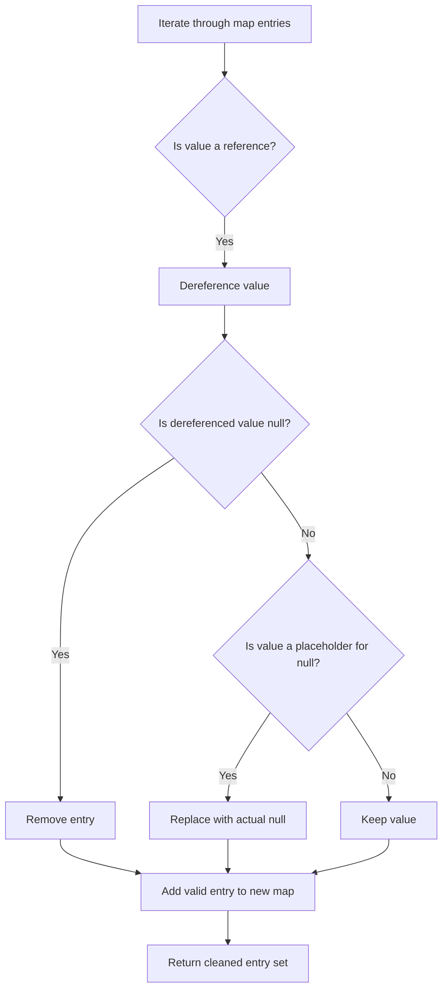
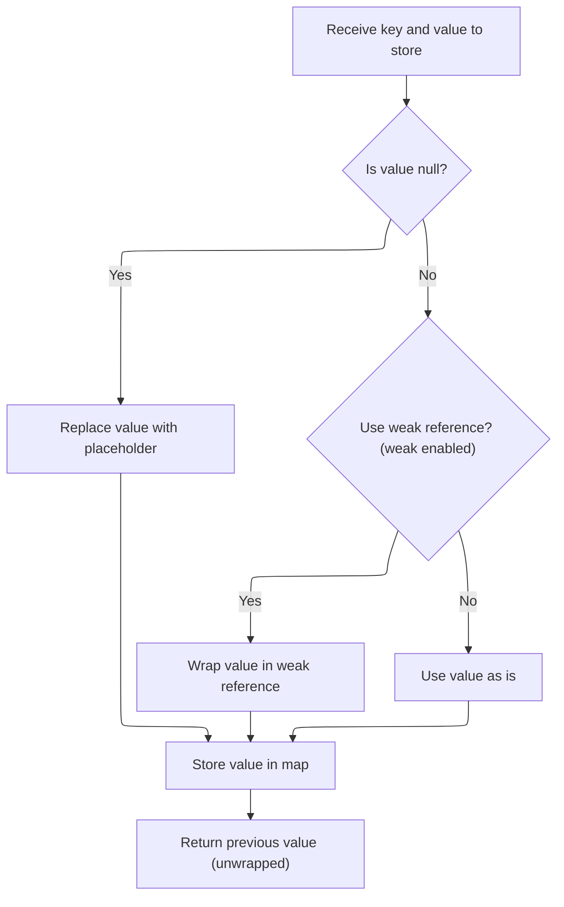
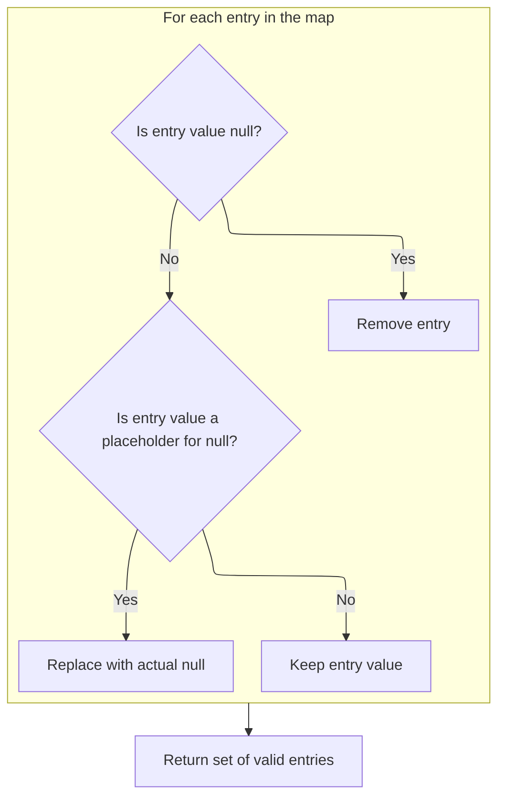

This document describes how a cleaned snapshot of map entries is produced for use by other components. When a component needs to inspect or iterate over the contents of a caching map, this flow ensures that only valid entries are included, with nulls restored and stale data removed.

The main steps are:

- Iterate through all entries in the map
- Remove entries with missing or stale values
- Restore nulls from placeholders
- Collect valid entries
- Return the cleaned entry set



# Where is this flow used?

This flow is used multiple times in the codebase as represented in the following diagram:

(Note - these are only some of the entry points of this flow)

```mermaid
graph TD;
      d622d0d89996d09f9ea5920841d868d1d4daf94d36b868296ae0656016cb3a0c(spring-webflow/…/servlet/FlowController.java::FlowController.handleRequest) --> ba8bb96f325863428b63563cdf7c3ae6d1a50f3c1f91a68263946b3e474a2c19(spring-webflow/…/servlet/FlowHandlerAdapter.java::FlowHandlerAdapter.handle)

ba8bb96f325863428b63563cdf7c3ae6d1a50f3c1f91a68263946b3e474a2c19(spring-webflow/…/servlet/FlowHandlerAdapter.java::FlowHandlerAdapter.handle) --> 46b2b7bc8d3d51a1665865e92b25805e777d509309ccf53700628413b8a7f4b5(spring-webflow/…/servlet/FlowHandlerAdapter.java::FlowHandlerAdapter.handleFlowExecutionResult)

ba8bb96f325863428b63563cdf7c3ae6d1a50f3c1f91a68263946b3e474a2c19(spring-webflow/…/servlet/FlowHandlerAdapter.java::FlowHandlerAdapter.handle) --> ea97985d7749b08bc02da6974aefad34becf200d9c523f9e4a4cf539a8c39446(spring-webflow/…/servlet/FlowHandlerAdapter.java::FlowHandlerAdapter.handleFlowException)

ba8bb96f325863428b63563cdf7c3ae6d1a50f3c1f91a68263946b3e474a2c19(spring-webflow/…/servlet/FlowHandlerAdapter.java::FlowHandlerAdapter.handle) --> 46b933fbfb7d8567d99adf8d831aa104876c3f463cbd4a2a0f16e45ff2ab3494(spring-webflow/…/servlet/FlowHandlerAdapter.java::FlowHandlerAdapter.getInputMap)

46b2b7bc8d3d51a1665865e92b25805e777d509309ccf53700628413b8a7f4b5(spring-webflow/…/servlet/FlowHandlerAdapter.java::FlowHandlerAdapter.handleFlowExecutionResult) --> 004a9e8ae89c7b47aefc7a75edd3a4841276794243201f6f5563fdc4c0091e42(spring-webflow/…/servlet/FlowHandlerAdapter.java::FlowHandlerAdapter.defaultHandleExecutionOutcome)

46b2b7bc8d3d51a1665865e92b25805e777d509309ccf53700628413b8a7f4b5(spring-webflow/…/servlet/FlowHandlerAdapter.java::FlowHandlerAdapter.handleFlowExecutionResult) --> 9813660db4d889007621d60ee154e315ebf4f199123d47ffbb0c897e0c9c8701(spring-webflow/…/servlet/FlowHandlerAdapter.java::FlowHandlerAdapter.sendFlowDefinitionRedirect)

004a9e8ae89c7b47aefc7a75edd3a4841276794243201f6f5563fdc4c0091e42(spring-webflow/…/servlet/FlowHandlerAdapter.java::FlowHandlerAdapter.defaultHandleExecutionOutcome) --> 162e8ca7af40c269c12a39196d69a080a5c3942a0a669ef398d460afe755d7df(spring-webflow/…/servlet/WebFlow1FlowUrlHandler.java::WebFlow1FlowUrlHandler.createFlowDefinitionUrl)

162e8ca7af40c269c12a39196d69a080a5c3942a0a669ef398d460afe755d7df(spring-webflow/…/servlet/WebFlow1FlowUrlHandler.java::WebFlow1FlowUrlHandler.createFlowDefinitionUrl) --> f191d10481d19b60f98c249929a5c49f4eaa885ad06265b2a5f27d06abe29291(spring-webflow/…/servlet/WebFlow1FlowUrlHandler.java::WebFlow1FlowUrlHandler.appendQueryParameters)

f191d10481d19b60f98c249929a5c49f4eaa885ad06265b2a5f27d06abe29291(spring-webflow/…/servlet/WebFlow1FlowUrlHandler.java::WebFlow1FlowUrlHandler.appendQueryParameters) --> d878cd94a7431484aedc084318339a6af781c65031f1caca1216b9cc122890c5(spring-binding/…/collection/AbstractCachingMapDecorator.java::AbstractCachingMapDecorator.entrySet)

9813660db4d889007621d60ee154e315ebf4f199123d47ffbb0c897e0c9c8701(spring-webflow/…/servlet/FlowHandlerAdapter.java::FlowHandlerAdapter.sendFlowDefinitionRedirect) --> 162e8ca7af40c269c12a39196d69a080a5c3942a0a669ef398d460afe755d7df(spring-webflow/…/servlet/WebFlow1FlowUrlHandler.java::WebFlow1FlowUrlHandler.createFlowDefinitionUrl)

ea97985d7749b08bc02da6974aefad34becf200d9c523f9e4a4cf539a8c39446(spring-webflow/…/servlet/FlowHandlerAdapter.java::FlowHandlerAdapter.handleFlowException) --> c2c60070ceb7cb240860d215291026abfe88b7bf204ecc6aed03de85935b5ab9(spring-webflow/…/servlet/FlowHandlerAdapter.java::FlowHandlerAdapter.defaultHandleException)

c2c60070ceb7cb240860d215291026abfe88b7bf204ecc6aed03de85935b5ab9(spring-webflow/…/servlet/FlowHandlerAdapter.java::FlowHandlerAdapter.defaultHandleException) --> 162e8ca7af40c269c12a39196d69a080a5c3942a0a669ef398d460afe755d7df(spring-webflow/…/servlet/WebFlow1FlowUrlHandler.java::WebFlow1FlowUrlHandler.createFlowDefinitionUrl)

46b933fbfb7d8567d99adf8d831aa104876c3f463cbd4a2a0f16e45ff2ab3494(spring-webflow/…/servlet/FlowHandlerAdapter.java::FlowHandlerAdapter.getInputMap) --> 2cdb252648988415731c4aafec7472561db98ac9865d2b71a5c49cba017d1255(spring-webflow/…/servlet/FlowHandlerAdapter.java::FlowHandlerAdapter.defaultCreateFlowExecutionInputMap)

2cdb252648988415731c4aafec7472561db98ac9865d2b71a5c49cba017d1255(spring-webflow/…/servlet/FlowHandlerAdapter.java::FlowHandlerAdapter.defaultCreateFlowExecutionInputMap) --> d878cd94a7431484aedc084318339a6af781c65031f1caca1216b9cc122890c5(spring-binding/…/collection/AbstractCachingMapDecorator.java::AbstractCachingMapDecorator.entrySet)

8a6f7d0a3efa5f90f9b8ea242016cd22d8560867b8cbabe2e4b969ac8d5459ab(spring-faces/…/mvc/JsfView.java::JsfView.renderMergedOutputModel) --> 28aa8639758bceae076449a4ff52c8faa32ae5be7815a4b15907296f929696b9(spring-faces/…/mvc/JsfView.java::JsfView.populateRequestMap)

28aa8639758bceae076449a4ff52c8faa32ae5be7815a4b15907296f929696b9(spring-faces/…/mvc/JsfView.java::JsfView.populateRequestMap) --> d878cd94a7431484aedc084318339a6af781c65031f1caca1216b9cc122890c5(spring-binding/…/collection/AbstractCachingMapDecorator.java::AbstractCachingMapDecorator.entrySet)

02dcca76bba77bd5992f02edaaf86699469546e6b1dba73d043690252915a225(spring-binding/…/spel/StandardEvaluationContextFactory.java::StandardEvaluationContextFactory.createContext) --> 2f01a67bd8dacf06af8f479fbc9c68da944a2980891d3f794be29a6dc0c27833(spring-binding/…/spel/StandardEvaluationContextFactory.java::StandardEvaluationContextFactory.getVariableValues)

2f01a67bd8dacf06af8f479fbc9c68da944a2980891d3f794be29a6dc0c27833(spring-binding/…/spel/StandardEvaluationContextFactory.java::StandardEvaluationContextFactory.getVariableValues) --> d878cd94a7431484aedc084318339a6af781c65031f1caca1216b9cc122890c5(spring-binding/…/collection/AbstractCachingMapDecorator.java::AbstractCachingMapDecorator.entrySet)

337489031cbf6f5d75498278ea4370fbad7a41270bb18c72e2a238d92b20caa5(spring-webflow/…/servlet/FilenameFlowUrlHandler.java::FilenameFlowUrlHandler.createFlowDefinitionUrl) --> a12eeaf0ff717e5ec03f18a9e6bd344ec32547e6ba1ba00958b01a70bb5cb396(spring-webflow/…/servlet/DefaultFlowUrlHandler.java::DefaultFlowUrlHandler.appendQueryParameters)

a12eeaf0ff717e5ec03f18a9e6bd344ec32547e6ba1ba00958b01a70bb5cb396(spring-webflow/…/servlet/DefaultFlowUrlHandler.java::DefaultFlowUrlHandler.appendQueryParameters) --> d878cd94a7431484aedc084318339a6af781c65031f1caca1216b9cc122890c5(spring-binding/…/collection/AbstractCachingMapDecorator.java::AbstractCachingMapDecorator.entrySet)

9a9c0e4cf688e7aae8e0d1d243f7b8ee0ef08d9e5690c5ac183819dc9fbd8688(spring-webflow/…/servlet/DefaultFlowUrlHandler.java::DefaultFlowUrlHandler.createFlowDefinitionUrl) --> a12eeaf0ff717e5ec03f18a9e6bd344ec32547e6ba1ba00958b01a70bb5cb396(spring-webflow/…/servlet/DefaultFlowUrlHandler.java::DefaultFlowUrlHandler.appendQueryParameters)


classDef mainFlowStyle color:#000000,fill:#7CB9F4
classDef rootsStyle color:#000000,fill:#00FFF4
classDef Style1 color:#000000,fill:#00FFAA
classDef Style2 color:#000000,fill:#FFFF00
classDef Style3 color:#000000,fill:#AA7CB9

%% Swimm:
%% graph TD;
%%       d622d0d89996d09f9ea5920841d868d1d4daf94d36b868296ae0656016cb3a0c(<SwmPath>[spring-webflow/…/servlet/FlowController.java](spring-webflow/src/main/java/org/springframework/webflow/mvc/servlet/FlowController.java)</SwmPath>::FlowController.handleRequest) --> ba8bb96f325863428b63563cdf7c3ae6d1a50f3c1f91a68263946b3e474a2c19(<SwmPath>[spring-webflow/…/servlet/FlowHandlerAdapter.java](spring-webflow/src/main/java/org/springframework/webflow/mvc/servlet/FlowHandlerAdapter.java)</SwmPath>::FlowHandlerAdapter.handle)
%% 
%% ba8bb96f325863428b63563cdf7c3ae6d1a50f3c1f91a68263946b3e474a2c19(<SwmPath>[spring-webflow/…/servlet/FlowHandlerAdapter.java](spring-webflow/src/main/java/org/springframework/webflow/mvc/servlet/FlowHandlerAdapter.java)</SwmPath>::FlowHandlerAdapter.handle) --> 46b2b7bc8d3d51a1665865e92b25805e777d509309ccf53700628413b8a7f4b5(<SwmPath>[spring-webflow/…/servlet/FlowHandlerAdapter.java](spring-webflow/src/main/java/org/springframework/webflow/mvc/servlet/FlowHandlerAdapter.java)</SwmPath>::FlowHandlerAdapter.handleFlowExecutionResult)
%% 
%% ba8bb96f325863428b63563cdf7c3ae6d1a50f3c1f91a68263946b3e474a2c19(<SwmPath>[spring-webflow/…/servlet/FlowHandlerAdapter.java](spring-webflow/src/main/java/org/springframework/webflow/mvc/servlet/FlowHandlerAdapter.java)</SwmPath>::FlowHandlerAdapter.handle) --> ea97985d7749b08bc02da6974aefad34becf200d9c523f9e4a4cf539a8c39446(<SwmPath>[spring-webflow/…/servlet/FlowHandlerAdapter.java](spring-webflow/src/main/java/org/springframework/webflow/mvc/servlet/FlowHandlerAdapter.java)</SwmPath>::FlowHandlerAdapter.handleFlowException)
%% 
%% ba8bb96f325863428b63563cdf7c3ae6d1a50f3c1f91a68263946b3e474a2c19(<SwmPath>[spring-webflow/…/servlet/FlowHandlerAdapter.java](spring-webflow/src/main/java/org/springframework/webflow/mvc/servlet/FlowHandlerAdapter.java)</SwmPath>::FlowHandlerAdapter.handle) --> 46b933fbfb7d8567d99adf8d831aa104876c3f463cbd4a2a0f16e45ff2ab3494(<SwmPath>[spring-webflow/…/servlet/FlowHandlerAdapter.java](spring-webflow/src/main/java/org/springframework/webflow/mvc/servlet/FlowHandlerAdapter.java)</SwmPath>::FlowHandlerAdapter.getInputMap)
%% 
%% 46b2b7bc8d3d51a1665865e92b25805e777d509309ccf53700628413b8a7f4b5(<SwmPath>[spring-webflow/…/servlet/FlowHandlerAdapter.java](spring-webflow/src/main/java/org/springframework/webflow/mvc/servlet/FlowHandlerAdapter.java)</SwmPath>::FlowHandlerAdapter.handleFlowExecutionResult) --> 004a9e8ae89c7b47aefc7a75edd3a4841276794243201f6f5563fdc4c0091e42(<SwmPath>[spring-webflow/…/servlet/FlowHandlerAdapter.java](spring-webflow/src/main/java/org/springframework/webflow/mvc/servlet/FlowHandlerAdapter.java)</SwmPath>::FlowHandlerAdapter.defaultHandleExecutionOutcome)
%% 
%% 46b2b7bc8d3d51a1665865e92b25805e777d509309ccf53700628413b8a7f4b5(<SwmPath>[spring-webflow/…/servlet/FlowHandlerAdapter.java](spring-webflow/src/main/java/org/springframework/webflow/mvc/servlet/FlowHandlerAdapter.java)</SwmPath>::FlowHandlerAdapter.handleFlowExecutionResult) --> 9813660db4d889007621d60ee154e315ebf4f199123d47ffbb0c897e0c9c8701(<SwmPath>[spring-webflow/…/servlet/FlowHandlerAdapter.java](spring-webflow/src/main/java/org/springframework/webflow/mvc/servlet/FlowHandlerAdapter.java)</SwmPath>::FlowHandlerAdapter.sendFlowDefinitionRedirect)
%% 
%% 004a9e8ae89c7b47aefc7a75edd3a4841276794243201f6f5563fdc4c0091e42(<SwmPath>[spring-webflow/…/servlet/FlowHandlerAdapter.java](spring-webflow/src/main/java/org/springframework/webflow/mvc/servlet/FlowHandlerAdapter.java)</SwmPath>::FlowHandlerAdapter.defaultHandleExecutionOutcome) --> 162e8ca7af40c269c12a39196d69a080a5c3942a0a669ef398d460afe755d7df(<SwmPath>[spring-webflow/…/servlet/WebFlow1FlowUrlHandler.java](spring-webflow/src/main/java/org/springframework/webflow/context/servlet/WebFlow1FlowUrlHandler.java)</SwmPath>::WebFlow1FlowUrlHandler.createFlowDefinitionUrl)
%% 
%% 162e8ca7af40c269c12a39196d69a080a5c3942a0a669ef398d460afe755d7df(<SwmPath>[spring-webflow/…/servlet/WebFlow1FlowUrlHandler.java](spring-webflow/src/main/java/org/springframework/webflow/context/servlet/WebFlow1FlowUrlHandler.java)</SwmPath>::WebFlow1FlowUrlHandler.createFlowDefinitionUrl) --> f191d10481d19b60f98c249929a5c49f4eaa885ad06265b2a5f27d06abe29291(<SwmPath>[spring-webflow/…/servlet/WebFlow1FlowUrlHandler.java](spring-webflow/src/main/java/org/springframework/webflow/context/servlet/WebFlow1FlowUrlHandler.java)</SwmPath>::WebFlow1FlowUrlHandler.appendQueryParameters)
%% 
%% f191d10481d19b60f98c249929a5c49f4eaa885ad06265b2a5f27d06abe29291(<SwmPath>[spring-webflow/…/servlet/WebFlow1FlowUrlHandler.java](spring-webflow/src/main/java/org/springframework/webflow/context/servlet/WebFlow1FlowUrlHandler.java)</SwmPath>::WebFlow1FlowUrlHandler.appendQueryParameters) --> d878cd94a7431484aedc084318339a6af781c65031f1caca1216b9cc122890c5(<SwmPath>[spring-binding/…/collection/AbstractCachingMapDecorator.java](spring-binding/src/main/java/org/springframework/binding/collection/AbstractCachingMapDecorator.java)</SwmPath>::AbstractCachingMapDecorator.entrySet)
%% 
%% 9813660db4d889007621d60ee154e315ebf4f199123d47ffbb0c897e0c9c8701(<SwmPath>[spring-webflow/…/servlet/FlowHandlerAdapter.java](spring-webflow/src/main/java/org/springframework/webflow/mvc/servlet/FlowHandlerAdapter.java)</SwmPath>::FlowHandlerAdapter.sendFlowDefinitionRedirect) --> 162e8ca7af40c269c12a39196d69a080a5c3942a0a669ef398d460afe755d7df(<SwmPath>[spring-webflow/…/servlet/WebFlow1FlowUrlHandler.java](spring-webflow/src/main/java/org/springframework/webflow/context/servlet/WebFlow1FlowUrlHandler.java)</SwmPath>::WebFlow1FlowUrlHandler.createFlowDefinitionUrl)
%% 
%% ea97985d7749b08bc02da6974aefad34becf200d9c523f9e4a4cf539a8c39446(<SwmPath>[spring-webflow/…/servlet/FlowHandlerAdapter.java](spring-webflow/src/main/java/org/springframework/webflow/mvc/servlet/FlowHandlerAdapter.java)</SwmPath>::FlowHandlerAdapter.handleFlowException) --> c2c60070ceb7cb240860d215291026abfe88b7bf204ecc6aed03de85935b5ab9(<SwmPath>[spring-webflow/…/servlet/FlowHandlerAdapter.java](spring-webflow/src/main/java/org/springframework/webflow/mvc/servlet/FlowHandlerAdapter.java)</SwmPath>::FlowHandlerAdapter.defaultHandleException)
%% 
%% c2c60070ceb7cb240860d215291026abfe88b7bf204ecc6aed03de85935b5ab9(<SwmPath>[spring-webflow/…/servlet/FlowHandlerAdapter.java](spring-webflow/src/main/java/org/springframework/webflow/mvc/servlet/FlowHandlerAdapter.java)</SwmPath>::FlowHandlerAdapter.defaultHandleException) --> 162e8ca7af40c269c12a39196d69a080a5c3942a0a669ef398d460afe755d7df(<SwmPath>[spring-webflow/…/servlet/WebFlow1FlowUrlHandler.java](spring-webflow/src/main/java/org/springframework/webflow/context/servlet/WebFlow1FlowUrlHandler.java)</SwmPath>::WebFlow1FlowUrlHandler.createFlowDefinitionUrl)
%% 
%% 46b933fbfb7d8567d99adf8d831aa104876c3f463cbd4a2a0f16e45ff2ab3494(<SwmPath>[spring-webflow/…/servlet/FlowHandlerAdapter.java](spring-webflow/src/main/java/org/springframework/webflow/mvc/servlet/FlowHandlerAdapter.java)</SwmPath>::FlowHandlerAdapter.getInputMap) --> 2cdb252648988415731c4aafec7472561db98ac9865d2b71a5c49cba017d1255(<SwmPath>[spring-webflow/…/servlet/FlowHandlerAdapter.java](spring-webflow/src/main/java/org/springframework/webflow/mvc/servlet/FlowHandlerAdapter.java)</SwmPath>::FlowHandlerAdapter.defaultCreateFlowExecutionInputMap)
%% 
%% 2cdb252648988415731c4aafec7472561db98ac9865d2b71a5c49cba017d1255(<SwmPath>[spring-webflow/…/servlet/FlowHandlerAdapter.java](spring-webflow/src/main/java/org/springframework/webflow/mvc/servlet/FlowHandlerAdapter.java)</SwmPath>::FlowHandlerAdapter.defaultCreateFlowExecutionInputMap) --> d878cd94a7431484aedc084318339a6af781c65031f1caca1216b9cc122890c5(<SwmPath>[spring-binding/…/collection/AbstractCachingMapDecorator.java](spring-binding/src/main/java/org/springframework/binding/collection/AbstractCachingMapDecorator.java)</SwmPath>::AbstractCachingMapDecorator.entrySet)
%% 
%% 8a6f7d0a3efa5f90f9b8ea242016cd22d8560867b8cbabe2e4b969ac8d5459ab(<SwmPath>[spring-faces/…/mvc/JsfView.java](spring-faces/src/main/java/org/springframework/faces/mvc/JsfView.java)</SwmPath>::JsfView.renderMergedOutputModel) --> 28aa8639758bceae076449a4ff52c8faa32ae5be7815a4b15907296f929696b9(<SwmPath>[spring-faces/…/mvc/JsfView.java](spring-faces/src/main/java/org/springframework/faces/mvc/JsfView.java)</SwmPath>::JsfView.populateRequestMap)
%% 
%% 28aa8639758bceae076449a4ff52c8faa32ae5be7815a4b15907296f929696b9(<SwmPath>[spring-faces/…/mvc/JsfView.java](spring-faces/src/main/java/org/springframework/faces/mvc/JsfView.java)</SwmPath>::JsfView.populateRequestMap) --> d878cd94a7431484aedc084318339a6af781c65031f1caca1216b9cc122890c5(<SwmPath>[spring-binding/…/collection/AbstractCachingMapDecorator.java](spring-binding/src/main/java/org/springframework/binding/collection/AbstractCachingMapDecorator.java)</SwmPath>::AbstractCachingMapDecorator.entrySet)
%% 
%% 02dcca76bba77bd5992f02edaaf86699469546e6b1dba73d043690252915a225(<SwmPath>[spring-binding/…/spel/StandardEvaluationContextFactory.java](spring-binding/src/main/java/org/springframework/binding/expression/spel/StandardEvaluationContextFactory.java)</SwmPath>::StandardEvaluationContextFactory.createContext) --> 2f01a67bd8dacf06af8f479fbc9c68da944a2980891d3f794be29a6dc0c27833(<SwmPath>[spring-binding/…/spel/StandardEvaluationContextFactory.java](spring-binding/src/main/java/org/springframework/binding/expression/spel/StandardEvaluationContextFactory.java)</SwmPath>::StandardEvaluationContextFactory.getVariableValues)
%% 
%% 2f01a67bd8dacf06af8f479fbc9c68da944a2980891d3f794be29a6dc0c27833(<SwmPath>[spring-binding/…/spel/StandardEvaluationContextFactory.java](spring-binding/src/main/java/org/springframework/binding/expression/spel/StandardEvaluationContextFactory.java)</SwmPath>::StandardEvaluationContextFactory.getVariableValues) --> d878cd94a7431484aedc084318339a6af781c65031f1caca1216b9cc122890c5(<SwmPath>[spring-binding/…/collection/AbstractCachingMapDecorator.java](spring-binding/src/main/java/org/springframework/binding/collection/AbstractCachingMapDecorator.java)</SwmPath>::AbstractCachingMapDecorator.entrySet)
%% 
%% 337489031cbf6f5d75498278ea4370fbad7a41270bb18c72e2a238d92b20caa5(<SwmPath>[spring-webflow/…/servlet/FilenameFlowUrlHandler.java](spring-webflow/src/main/java/org/springframework/webflow/context/servlet/FilenameFlowUrlHandler.java)</SwmPath>::FilenameFlowUrlHandler.createFlowDefinitionUrl) --> a12eeaf0ff717e5ec03f18a9e6bd344ec32547e6ba1ba00958b01a70bb5cb396(<SwmPath>[spring-webflow/…/servlet/DefaultFlowUrlHandler.java](spring-webflow/src/main/java/org/springframework/webflow/context/servlet/DefaultFlowUrlHandler.java)</SwmPath>::DefaultFlowUrlHandler.appendQueryParameters)
%% 
%% a12eeaf0ff717e5ec03f18a9e6bd344ec32547e6ba1ba00958b01a70bb5cb396(<SwmPath>[spring-webflow/…/servlet/DefaultFlowUrlHandler.java](spring-webflow/src/main/java/org/springframework/webflow/context/servlet/DefaultFlowUrlHandler.java)</SwmPath>::DefaultFlowUrlHandler.appendQueryParameters) --> d878cd94a7431484aedc084318339a6af781c65031f1caca1216b9cc122890c5(<SwmPath>[spring-binding/…/collection/AbstractCachingMapDecorator.java](spring-binding/src/main/java/org/springframework/binding/collection/AbstractCachingMapDecorator.java)</SwmPath>::AbstractCachingMapDecorator.entrySet)
%% 
%% 9a9c0e4cf688e7aae8e0d1d243f7b8ee0ef08d9e5690c5ac183819dc9fbd8688(<SwmPath>[spring-webflow/…/servlet/DefaultFlowUrlHandler.java](spring-webflow/src/main/java/org/springframework/webflow/context/servlet/DefaultFlowUrlHandler.java)</SwmPath>::DefaultFlowUrlHandler.createFlowDefinitionUrl) --> a12eeaf0ff717e5ec03f18a9e6bd344ec32547e6ba1ba00958b01a70bb5cb396(<SwmPath>[spring-webflow/…/servlet/DefaultFlowUrlHandler.java](spring-webflow/src/main/java/org/springframework/webflow/context/servlet/DefaultFlowUrlHandler.java)</SwmPath>::DefaultFlowUrlHandler.appendQueryParameters)
%% 
%% 
%% classDef mainFlowStyle color:#000000,fill:#7CB9F4
%% classDef rootsStyle color:#000000,fill:#00FFF4
%% classDef Style1 color:#000000,fill:#00FFAA
%% classDef Style2 color:#000000,fill:#FFFF00
%% classDef Style3 color:#000000,fill:#AA7CB9
```

# Getting a Snapshot of Map Entries

<SwmSnippet path="/spring-binding/src/main/java/org/springframework/binding/collection/AbstractCachingMapDecorator.java" line="215">

---

<SwmToken path="spring-binding/src/main/java/org/springframework/binding/collection/AbstractCachingMapDecorator.java" pos="215:15:15" line-data="	public Set&lt;Map.Entry&lt;K, V&gt;&gt; entrySet() {">`entrySet`</SwmToken> just delegates to <SwmToken path="spring-binding/src/main/java/org/springframework/binding/collection/AbstractCachingMapDecorator.java" pos="218:3:3" line-data="				return entryCopy();">`entryCopy`</SwmToken> (with optional locking) to get a cleaned-up snapshot of the map's entries.

```java
	public Set<Map.Entry<K, V>> entrySet() {
		if (this.synchronize) {
			synchronized (this.targetMap) {
				return entryCopy();
			}
		}
		else {
			return entryCopy();
		}
	}
```

---

</SwmSnippet>

# Building a Cleaned Entry Set

```mermaid
%%{init: {"flowchart": {"defaultRenderer": "elk"}} }%%
flowchart TD
    subgraph loop1["For each entry in the map"]
        node1{"Is value a reference?"}
        click node1 openCode "spring-binding/src/main/java/org/springframework/binding/collection/AbstractCachingMapDecorator.java:229:232"
        node1 -->|"Yes"| node2{"Is resolved value null?"}
        click node2 openCode "spring-binding/src/main/java/org/springframework/binding/collection/AbstractCachingMapDecorator.java:233:237"
        node1 -->|"No"| node4["Copy entry to new map (convert NULL_VALUE to null)"]
        click node4 openCode "spring-binding/src/main/java/org/springframework/binding/collection/AbstractCachingMapDecorator.java:239:240"
        node2 -->|"Yes"| node3["Remove entry from map"]
        click node3 openCode "spring-binding/src/main/java/org/springframework/binding/collection/AbstractCachingMapDecorator.java:235:236"
        node2 -->|"No"| node4
    end


subgraph node2 [get]
  sgmain_1_node1["Retrieve value for key from map"]
  click sgmain_1_node1 openCode "spring-binding/src/main/java/org/springframework/binding/collection/AbstractCachingMapDecorator.java:284:285"
  sgmain_1_node1 --> sgmain_1_node2{"Is value a reference?"}
  click sgmain_1_node2 openCode "spring-binding/src/main/java/org/springframework/binding/collection/AbstractCachingMapDecorator.java:285:287"
  sgmain_1_node2 -->|"Yes"| sgmain_1_node3["Get actual value from reference"]
  click sgmain_1_node3 openCode "spring-binding/src/main/java/org/springframework/binding/collection/AbstractCachingMapDecorator.java:286:287"
  sgmain_1_node3 --> sgmain_1_node4{"Is value missing (null)?"}
  click sgmain_1_node4 openCode "spring-binding/src/main/java/org/springframework/binding/collection/AbstractCachingMapDecorator.java:288:292"
  sgmain_1_node2 -->|"No"| sgmain_1_node4
  sgmain_1_node4 -->|"Yes"| sgmain_1_node5["Create and cache new value for key"]
  click sgmain_1_node5 openCode "spring-binding/src/main/java/org/springframework/binding/collection/AbstractCachingMapDecorator.java:289:291"
  sgmain_1_node5 --> sgmain_1_node6["Return new value"]
  click sgmain_1_node6 openCode "spring-binding/src/main/java/org/springframework/binding/collection/AbstractCachingMapDecorator.java:291:292"
  sgmain_1_node4 -->|"No"| sgmain_1_node7{"Is value a NULL_VALUE marker?"}
  click sgmain_1_node7 openCode "spring-binding/src/main/java/org/springframework/binding/collection/AbstractCachingMapDecorator.java:293:294"
  sgmain_1_node7 -->|"Yes"| sgmain_1_node8["Return null"]
  click sgmain_1_node8 openCode "spring-binding/src/main/java/org/springframework/binding/collection/AbstractCachingMapDecorator.java:293:294"
  sgmain_1_node7 -->|"No"| sgmain_1_node9["Return value"]
  click sgmain_1_node9 openCode "spring-binding/src/main/java/org/springframework/binding/collection/AbstractCachingMapDecorator.java:294:294"
end

%% Swimm:
%% %%{init: {"flowchart": {"defaultRenderer": "elk"}} }%%
%% flowchart TD
%%     subgraph loop1["For each entry in the map"]
%%         node1{"Is value a reference?"}
%%         click node1 openCode "<SwmPath>[spring-binding/…/collection/AbstractCachingMapDecorator.java](spring-binding/src/main/java/org/springframework/binding/collection/AbstractCachingMapDecorator.java)</SwmPath>:229:232"
%%         node1 -->|"Yes"| node2{"Is resolved value null?"}
%%         click node2 openCode "<SwmPath>[spring-binding/…/collection/AbstractCachingMapDecorator.java](spring-binding/src/main/java/org/springframework/binding/collection/AbstractCachingMapDecorator.java)</SwmPath>:233:237"
%%         node1 -->|"No"| node4["Copy entry to new map (convert <SwmToken path="spring-binding/src/main/java/org/springframework/binding/collection/AbstractCachingMapDecorator.java" pos="165:8:8" line-data="		return (returnValue == NULL_VALUE ? null : (V) returnValue);">`NULL_VALUE`</SwmToken> to null)"]
%%         click node4 openCode "<SwmPath>[spring-binding/…/collection/AbstractCachingMapDecorator.java](spring-binding/src/main/java/org/springframework/binding/collection/AbstractCachingMapDecorator.java)</SwmPath>:239:240"
%%         node2 -->|"Yes"| node3["Remove entry from map"]
%%         click node3 openCode "<SwmPath>[spring-binding/…/collection/AbstractCachingMapDecorator.java](spring-binding/src/main/java/org/springframework/binding/collection/AbstractCachingMapDecorator.java)</SwmPath>:235:236"
%%         node2 -->|"No"| node4
%%     end
%% 
%% 
%% subgraph node2 [get]
%%   sgmain_1_node1["Retrieve value for key from map"]
%%   click sgmain_1_node1 openCode "<SwmPath>[spring-binding/…/collection/AbstractCachingMapDecorator.java](spring-binding/src/main/java/org/springframework/binding/collection/AbstractCachingMapDecorator.java)</SwmPath>:284:285"
%%   sgmain_1_node1 --> sgmain_1_node2{"Is value a reference?"}
%%   click sgmain_1_node2 openCode "<SwmPath>[spring-binding/…/collection/AbstractCachingMapDecorator.java](spring-binding/src/main/java/org/springframework/binding/collection/AbstractCachingMapDecorator.java)</SwmPath>:285:287"
%%   sgmain_1_node2 -->|"Yes"| sgmain_1_node3["Get actual value from reference"]
%%   click sgmain_1_node3 openCode "<SwmPath>[spring-binding/…/collection/AbstractCachingMapDecorator.java](spring-binding/src/main/java/org/springframework/binding/collection/AbstractCachingMapDecorator.java)</SwmPath>:286:287"
%%   sgmain_1_node3 --> sgmain_1_node4{"Is value missing (null)?"}
%%   click sgmain_1_node4 openCode "<SwmPath>[spring-binding/…/collection/AbstractCachingMapDecorator.java](spring-binding/src/main/java/org/springframework/binding/collection/AbstractCachingMapDecorator.java)</SwmPath>:288:292"
%%   sgmain_1_node2 -->|"No"| sgmain_1_node4
%%   sgmain_1_node4 -->|"Yes"| sgmain_1_node5["Create and cache new value for key"]
%%   click sgmain_1_node5 openCode "<SwmPath>[spring-binding/…/collection/AbstractCachingMapDecorator.java](spring-binding/src/main/java/org/springframework/binding/collection/AbstractCachingMapDecorator.java)</SwmPath>:289:291"
%%   sgmain_1_node5 --> sgmain_1_node6["Return new value"]
%%   click sgmain_1_node6 openCode "<SwmPath>[spring-binding/…/collection/AbstractCachingMapDecorator.java](spring-binding/src/main/java/org/springframework/binding/collection/AbstractCachingMapDecorator.java)</SwmPath>:291:292"
%%   sgmain_1_node4 -->|"No"| sgmain_1_node7{"Is value a <SwmToken path="spring-binding/src/main/java/org/springframework/binding/collection/AbstractCachingMapDecorator.java" pos="165:8:8" line-data="		return (returnValue == NULL_VALUE ? null : (V) returnValue);">`NULL_VALUE`</SwmToken> marker?"}
%%   click sgmain_1_node7 openCode "<SwmPath>[spring-binding/…/collection/AbstractCachingMapDecorator.java](spring-binding/src/main/java/org/springframework/binding/collection/AbstractCachingMapDecorator.java)</SwmPath>:293:294"
%%   sgmain_1_node7 -->|"Yes"| sgmain_1_node8["Return null"]
%%   click sgmain_1_node8 openCode "<SwmPath>[spring-binding/…/collection/AbstractCachingMapDecorator.java](spring-binding/src/main/java/org/springframework/binding/collection/AbstractCachingMapDecorator.java)</SwmPath>:293:294"
%%   sgmain_1_node7 -->|"No"| sgmain_1_node9["Return value"]
%%   click sgmain_1_node9 openCode "<SwmPath>[spring-binding/…/collection/AbstractCachingMapDecorator.java](spring-binding/src/main/java/org/springframework/binding/collection/AbstractCachingMapDecorator.java)</SwmPath>:294:294"
%% end
```



<SwmSnippet path="/spring-binding/src/main/java/org/springframework/binding/collection/AbstractCachingMapDecorator.java" line="227">

---

<SwmToken path="spring-binding/src/main/java/org/springframework/binding/collection/AbstractCachingMapDecorator.java" pos="227:15:15" line-data="	private Set&lt;Map.Entry&lt;K, V&gt;&gt; entryCopy() {">`entryCopy`</SwmToken> builds a new map by filtering and dereferencing entries from <SwmToken path="spring-binding/src/main/java/org/springframework/binding/collection/AbstractCachingMapDecorator.java" pos="229:20:20" line-data="		for (Iterator&lt;Entry&lt;K, Object&gt;&gt; it = this.targetMap.entrySet().iterator(); it.hasNext();) {">`targetMap`</SwmToken>, then returns its entry set.

```java
	private Set<Map.Entry<K, V>> entryCopy() {
		Map<K,V> entries = new LinkedHashMap<>();
		for (Iterator<Entry<K, Object>> it = this.targetMap.entrySet().iterator(); it.hasNext();) {
```

---

</SwmSnippet>

<SwmSnippet path="/spring-binding/src/main/java/org/springframework/binding/collection/AbstractCachingMapDecorator.java" line="230">

---

Back in <SwmToken path="spring-binding/src/main/java/org/springframework/binding/collection/AbstractCachingMapDecorator.java" pos="218:3:3" line-data="				return entryCopy();">`entryCopy`</SwmToken>, after grabbing each entry, we check if the value is a Reference and dereference it. If the dereferenced value is null, we’ll remove the entry. This step is needed to handle cases where values are weakly referenced and might have been GC'd. Next, we call <SwmToken path="spring-binding/src/main/java/org/springframework/binding/collection/AbstractCachingMapDecorator.java" pos="233:13:13" line-data="				value = ((Reference) value).get();">`get`</SwmToken> to fetch or create the actual value if needed.

```java
			Entry<K, Object> entry = it.next();
			Object value = entry.getValue();
			if (value instanceof Reference) {
				value = ((Reference) value).get();
```

---

</SwmSnippet>

## Fetching or Creating Values

```mermaid
%%{init: {"flowchart": {"defaultRenderer": "elk"}} }%%
flowchart TD
    node1["Retrieve value for key from map"]
    click node1 openCode "spring-binding/src/main/java/org/springframework/binding/collection/AbstractCachingMapDecorator.java:284:285"
    node1 --> node2{"Is value a reference?"}
    click node2 openCode "spring-binding/src/main/java/org/springframework/binding/collection/AbstractCachingMapDecorator.java:285:287"
    node2 -->|"Yes"| node3["Get actual value from reference"]
    click node3 openCode "spring-binding/src/main/java/org/springframework/binding/collection/AbstractCachingMapDecorator.java:286:287"
    node3 --> node4{"Is value missing (null)?"}
    click node4 openCode "spring-binding/src/main/java/org/springframework/binding/collection/AbstractCachingMapDecorator.java:288:292"
    node2 -->|"No"| node4
    node4 -->|"Yes"| node5["Create and cache new value for key"]
    click node5 openCode "spring-binding/src/main/java/org/springframework/binding/collection/AbstractCachingMapDecorator.java:289:291"
    node5 --> node6["Return new value"]
    click node6 openCode "spring-binding/src/main/java/org/springframework/binding/collection/AbstractCachingMapDecorator.java:291:292"
    node4 -->|"No"| node7{"Is value a NULL_VALUE marker?"}
    click node7 openCode "spring-binding/src/main/java/org/springframework/binding/collection/AbstractCachingMapDecorator.java:293:294"
    node7 -->|"Yes"| node8["Return null"]
    click node8 openCode "spring-binding/src/main/java/org/springframework/binding/collection/AbstractCachingMapDecorator.java:293:294"
    node7 -->|"No"| node9["Return value"]
    click node9 openCode "spring-binding/src/main/java/org/springframework/binding/collection/AbstractCachingMapDecorator.java:294:294"

%% Swimm:
%% %%{init: {"flowchart": {"defaultRenderer": "elk"}} }%%
%% flowchart TD
%%     node1["Retrieve value for key from map"]
%%     click node1 openCode "<SwmPath>[spring-binding/…/collection/AbstractCachingMapDecorator.java](spring-binding/src/main/java/org/springframework/binding/collection/AbstractCachingMapDecorator.java)</SwmPath>:284:285"
%%     node1 --> node2{"Is value a reference?"}
%%     click node2 openCode "<SwmPath>[spring-binding/…/collection/AbstractCachingMapDecorator.java](spring-binding/src/main/java/org/springframework/binding/collection/AbstractCachingMapDecorator.java)</SwmPath>:285:287"
%%     node2 -->|"Yes"| node3["Get actual value from reference"]
%%     click node3 openCode "<SwmPath>[spring-binding/…/collection/AbstractCachingMapDecorator.java](spring-binding/src/main/java/org/springframework/binding/collection/AbstractCachingMapDecorator.java)</SwmPath>:286:287"
%%     node3 --> node4{"Is value missing (null)?"}
%%     click node4 openCode "<SwmPath>[spring-binding/…/collection/AbstractCachingMapDecorator.java](spring-binding/src/main/java/org/springframework/binding/collection/AbstractCachingMapDecorator.java)</SwmPath>:288:292"
%%     node2 -->|"No"| node4
%%     node4 -->|"Yes"| node5["Create and cache new value for key"]
%%     click node5 openCode "<SwmPath>[spring-binding/…/collection/AbstractCachingMapDecorator.java](spring-binding/src/main/java/org/springframework/binding/collection/AbstractCachingMapDecorator.java)</SwmPath>:289:291"
%%     node5 --> node6["Return new value"]
%%     click node6 openCode "<SwmPath>[spring-binding/…/collection/AbstractCachingMapDecorator.java](spring-binding/src/main/java/org/springframework/binding/collection/AbstractCachingMapDecorator.java)</SwmPath>:291:292"
%%     node4 -->|"No"| node7{"Is value a <SwmToken path="spring-binding/src/main/java/org/springframework/binding/collection/AbstractCachingMapDecorator.java" pos="165:8:8" line-data="		return (returnValue == NULL_VALUE ? null : (V) returnValue);">`NULL_VALUE`</SwmToken> marker?"}
%%     click node7 openCode "<SwmPath>[spring-binding/…/collection/AbstractCachingMapDecorator.java](spring-binding/src/main/java/org/springframework/binding/collection/AbstractCachingMapDecorator.java)</SwmPath>:293:294"
%%     node7 -->|"Yes"| node8["Return null"]
%%     click node8 openCode "<SwmPath>[spring-binding/…/collection/AbstractCachingMapDecorator.java](spring-binding/src/main/java/org/springframework/binding/collection/AbstractCachingMapDecorator.java)</SwmPath>:293:294"
%%     node7 -->|"No"| node9["Return value"]
%%     click node9 openCode "<SwmPath>[spring-binding/…/collection/AbstractCachingMapDecorator.java](spring-binding/src/main/java/org/springframework/binding/collection/AbstractCachingMapDecorator.java)</SwmPath>:294:294"
```



<SwmSnippet path="/spring-binding/src/main/java/org/springframework/binding/collection/AbstractCachingMapDecorator.java" line="283">

---

<SwmToken path="spring-binding/src/main/java/org/springframework/binding/collection/AbstractCachingMapDecorator.java" pos="283:5:5" line-data="	public V get(Object key) {">`get`</SwmToken> tries to fetch the value for a key, handling Reference wrappers and the <SwmToken path="spring-binding/src/main/java/org/springframework/binding/collection/AbstractCachingMapDecorator.java" pos="293:8:8" line-data="		return (value == NULL_VALUE ? null : (V) value);">`NULL_VALUE`</SwmToken> sentinel. If the value is missing or gone, it creates a new one and stores it using <SwmToken path="spring-binding/src/main/java/org/springframework/binding/collection/AbstractCachingMapDecorator.java" pos="290:1:1" line-data="			put((K) key, newValue);">`put`</SwmToken>. We call <SwmToken path="spring-binding/src/main/java/org/springframework/binding/collection/AbstractCachingMapDecorator.java" pos="290:1:1" line-data="			put((K) key, newValue);">`put`</SwmToken> next to make sure the new value is cached for future lookups.

```java
	public V get(Object key) {
		Object value = this.targetMap.get(key);
		if (value instanceof Reference) {
			value = ((Reference) value).get();
		}
		if (value == null) {
			V newValue = create((K) key);
			put((K) key, newValue);
			return newValue;
		}
		return (value == NULL_VALUE ? null : (V) value);
	}
```

---

</SwmSnippet>

## Storing Values with Special Handling



<SwmSnippet path="/spring-binding/src/main/java/org/springframework/binding/collection/AbstractCachingMapDecorator.java" line="250">

---

In <SwmToken path="spring-binding/src/main/java/org/springframework/binding/collection/AbstractCachingMapDecorator.java" pos="250:5:5" line-data="	public V put(K key, V value) {">`put`</SwmToken>, we handle nulls by swapping them for a sentinel, and then check if we should wrap the value in a <SwmToken path="spring-binding/src/main/java/org/springframework/binding/collection/AbstractCachingMapDecorator.java" pos="256:7:7" line-data="			newValue = new WeakReference&lt;&gt;(newValue);">`WeakReference`</SwmToken> for memory-sensitive caching. We call <SwmToken path="spring-binding/src/main/java/org/springframework/binding/collection/AbstractCachingMapDecorator.java" pos="255:6:6" line-data="		else if (useWeakValue(key, value)) {">`useWeakValue`</SwmToken> next to see if weak references are enabled for this map.

```java
	public V put(K key, V value) {
		Object newValue = value;
		if (value == null) {
			newValue = NULL_VALUE;
		}
		else if (useWeakValue(key, value)) {
			newValue = new WeakReference<>(newValue);
		}
```

---

</SwmSnippet>

<SwmSnippet path="/spring-binding/src/main/java/org/springframework/binding/collection/AbstractCachingMapDecorator.java" line="269">

---

<SwmToken path="spring-binding/src/main/java/org/springframework/binding/collection/AbstractCachingMapDecorator.java" pos="269:5:5" line-data="	protected boolean useWeakValue(K key, V value) {">`useWeakValue`</SwmToken> just checks a global flag to decide if values should be weakly referenced. It doesn't care about the key or value, so the whole map is either weak or not.

```java
	protected boolean useWeakValue(K key, V value) {
		return this.weak;
	}
```

---

</SwmSnippet>

<SwmSnippet path="/spring-binding/src/main/java/org/springframework/binding/collection/AbstractCachingMapDecorator.java" line="258">

---

After checking for weak references, <SwmToken path="spring-binding/src/main/java/org/springframework/binding/collection/AbstractCachingMapDecorator.java" pos="258:9:9" line-data="		return unwrapReturnValue(this.targetMap.put(key, newValue));">`put`</SwmToken> stores the value and then calls <SwmToken path="spring-binding/src/main/java/org/springframework/binding/collection/AbstractCachingMapDecorator.java" pos="258:3:3" line-data="		return unwrapReturnValue(this.targetMap.put(key, newValue));">`unwrapReturnValue`</SwmToken> to make sure the returned value is in the expected form (not a Reference or sentinel).

```java
		return unwrapReturnValue(this.targetMap.put(key, newValue));
	}
```

---

</SwmSnippet>

<SwmSnippet path="/spring-binding/src/main/java/org/springframework/binding/collection/AbstractCachingMapDecorator.java" line="160">

---

<SwmToken path="spring-binding/src/main/java/org/springframework/binding/collection/AbstractCachingMapDecorator.java" pos="160:5:5" line-data="	private V unwrapReturnValue(Object value) {">`unwrapReturnValue`</SwmToken> takes care of converting Reference-wrapped values and the <SwmToken path="spring-binding/src/main/java/org/springframework/binding/collection/AbstractCachingMapDecorator.java" pos="165:8:8" line-data="		return (returnValue == NULL_VALUE ? null : (V) returnValue);">`NULL_VALUE`</SwmToken> sentinel back to the real value or null, so callers don't have to deal with the internal details. Next, we might call <SwmToken path="spring-binding/src/main/java/org/springframework/binding/collection/AbstractCachingMapDecorator.java" pos="163:13:13" line-data="			returnValue = ((Reference) returnValue).get();">`get`</SwmToken> if we need to fetch or create a value again.

```java
	private V unwrapReturnValue(Object value) {
		Object returnValue = value;
		if (returnValue instanceof Reference) {
			returnValue = ((Reference) returnValue).get();
		}
		return (returnValue == NULL_VALUE ? null : (V) returnValue);
	}
```

---

</SwmSnippet>

## Cleaning Up Stale Entries



<SwmSnippet path="/spring-binding/src/main/java/org/springframework/binding/collection/AbstractCachingMapDecorator.java" line="234">

---

After returning from <SwmToken path="spring-binding/src/main/java/org/springframework/binding/collection/AbstractCachingMapDecorator.java" pos="163:13:13" line-data="			returnValue = ((Reference) returnValue).get();">`get`</SwmToken>, if the dereferenced value is null, we remove the entry from <SwmToken path="spring-binding/src/main/java/org/springframework/binding/collection/AbstractCachingMapDecorator.java" pos="156:7:7" line-data="		return unwrapReturnValue(this.targetMap.remove(key));">`targetMap`</SwmToken>. This keeps the map free of stale data. Next, we call <SwmToken path="spring-binding/src/main/java/org/springframework/binding/collection/AbstractCachingMapDecorator.java" pos="235:3:3" line-data="					it.remove();">`remove`</SwmToken> to handle the actual deletion.

```java
				if (value == null) {
					it.remove();
					continue;
				}
			}
```

---

</SwmSnippet>

<SwmSnippet path="/spring-binding/src/main/java/org/springframework/binding/collection/AbstractCachingMapDecorator.java" line="155">

---

<SwmToken path="spring-binding/src/main/java/org/springframework/binding/collection/AbstractCachingMapDecorator.java" pos="155:5:5" line-data="	public V remove(Object key) {">`remove`</SwmToken> deletes the entry from <SwmToken path="spring-binding/src/main/java/org/springframework/binding/collection/AbstractCachingMapDecorator.java" pos="156:7:7" line-data="		return unwrapReturnValue(this.targetMap.remove(key));">`targetMap`</SwmToken> and unwraps the result so you get the real value, not a Reference or sentinel. We call <SwmToken path="spring-binding/src/main/java/org/springframework/binding/collection/AbstractCachingMapDecorator.java" pos="156:3:3" line-data="		return unwrapReturnValue(this.targetMap.remove(key));">`unwrapReturnValue`</SwmToken> to handle this conversion.

```java
	public V remove(Object key) {
		return unwrapReturnValue(this.targetMap.remove(key));
	}
```

---

</SwmSnippet>

<SwmSnippet path="/spring-binding/src/main/java/org/springframework/binding/collection/AbstractCachingMapDecorator.java" line="239">

---

After removing stale entries, we check if the value is <SwmToken path="spring-binding/src/main/java/org/springframework/binding/collection/AbstractCachingMapDecorator.java" pos="239:16:16" line-data="			entries.put(entry.getKey(), value == NULL_VALUE ? null : (V) value);">`NULL_VALUE`</SwmToken> before putting it into the new map. If so, we convert it back to null so the returned entry set matches what users expect. Next, we call <SwmToken path="spring-binding/src/main/java/org/springframework/binding/collection/AbstractCachingMapDecorator.java" pos="239:3:3" line-data="			entries.put(entry.getKey(), value == NULL_VALUE ? null : (V) value);">`put`</SwmToken> to add the entry to the cleaned map.

```java
			entries.put(entry.getKey(), value == NULL_VALUE ? null : (V) value);
		}
```

---

</SwmSnippet>

<SwmSnippet path="/spring-binding/src/main/java/org/springframework/binding/collection/AbstractCachingMapDecorator.java" line="241">

---

After adding all valid entries, <SwmToken path="spring-binding/src/main/java/org/springframework/binding/collection/AbstractCachingMapDecorator.java" pos="218:3:3" line-data="				return entryCopy();">`entryCopy`</SwmToken> returns the entry set from the new map. This gives callers a cleaned-up snapshot of the current entries. Next, we call <SwmToken path="spring-binding/src/main/java/org/springframework/binding/collection/AbstractCachingMapDecorator.java" pos="241:5:5" line-data="		return entries.entrySet();">`entrySet`</SwmToken> to expose this set to users.

```java
		return entries.entrySet();
	}
```

---

</SwmSnippet>

&nbsp;

*This is an auto-generated document by Swimm 🌊 and has not yet been verified by a human*

<SwmMeta version="3.0.0" repo-id="Z2l0aHViJTNBJTNBc3ByaW5nLXdlYmZsb3ctRGVtb0phdmElM0ElM0F1bWFsaW5nYXN3YW1p" repo-name="spring-webflow-DemoJava"><sup>Powered by [Swimm](https://app.swimm.io/)</sup></SwmMeta>
