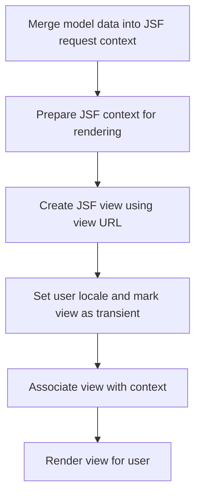

This document describes how model data is merged into the JSF request context and used to render a view for the user. The flow ensures that the user interface is generated with the most up-to-date data and is tailored to the user's locale, providing a seamless experience in the web application.

The main steps are:

- Merge model data into the JSF request context
- Prepare the JSF context for rendering
- Create the JSF view using the view URL
- Set user locale and mark the view as transient
- Associate the view with the context
- Render the view for the user



# Starting JSF View Rendering

```mermaid
%%{init: {"flowchart": {"defaultRenderer": "elk"}} }%%
flowchart TD
    node1["Merge model data into JSF request context"] --> node2["Prepare JSF context for rendering"]
    click node1 openCode "spring-faces/src/main/java/org/springframework/faces/mvc/JsfView.java:50:56"
    node2 --> node3{"Is JSF view created with view URL?"}
    click node2 openCode "spring-faces/src/main/java/org/springframework/faces/mvc/JsfView.java:58:63"
    node3 -->|"Yes"| node4["Trigger JSF lifecycle events"]
    click node3 openCode "spring-faces/src/main/java/org/springframework/faces/mvc/JsfView.java:63:64"
    node4 --> node5["Render view for user"]
    click node4 openCode "spring-faces/src/main/java/org/springframework/faces/mvc/JsfView.java:64:81"


subgraph node2 [populateRequestMap]
  sgmain_1_node0["Model data prepared"] --> sgmain_1_loop1
  click sgmain_1_node0 openCode "spring-faces/src/main/java/org/springframework/faces/mvc/JsfView.java:83:84"
  subgraph sgmain_1_loop1["For each entry in the model"]
  sgmain_1_node1["Add entry to request context"]
  click sgmain_1_node1 openCode "spring-faces/src/main/java/org/springframework/faces/mvc/JsfView.java:85:89"
  end
  sgmain_1_loop1 --> sgmain_1_node2["All model data is now available to the view"]
  click sgmain_1_node2 openCode "spring-faces/src/main/java/org/springframework/faces/mvc/JsfView.java:90:90"
end

subgraph node3 [entrySet]
  sgmain_2_node1["Request set of map entries"]
  click sgmain_2_node1 openCode "spring-binding/src/main/java/org/springframework/binding/collection/AbstractCachingMapDecorator.java:215:216"
  sgmain_2_node1 --> sgmain_2_node2{"Is synchronization required?"}
  click sgmain_2_node2 openCode "spring-binding/src/main/java/org/springframework/binding/collection/AbstractCachingMapDecorator.java:216:221"
  sgmain_2_node2 -->|"Yes"| sgmain_2_node3["Return copy of map entries"]
  click sgmain_2_node3 openCode "spring-binding/src/main/java/org/springframework/binding/collection/AbstractCachingMapDecorator.java:218:219"
  sgmain_2_node2 -->|"No"| sgmain_2_node3
end

%% Swimm:
%% %%{init: {"flowchart": {"defaultRenderer": "elk"}} }%%
%% flowchart TD
%%     node1["Merge model data into JSF request context"] --> node2["Prepare JSF context for rendering"]
%%     click node1 openCode "<SwmPath>[spring-faces/…/mvc/JsfView.java](spring-faces/src/main/java/org/springframework/faces/mvc/JsfView.java)</SwmPath>:50:56"
%%     node2 --> node3{"Is JSF view created with view URL?"}
%%     click node2 openCode "<SwmPath>[spring-faces/…/mvc/JsfView.java](spring-faces/src/main/java/org/springframework/faces/mvc/JsfView.java)</SwmPath>:58:63"
%%     node3 -->|"Yes"| node4["Trigger JSF lifecycle events"]
%%     click node3 openCode "<SwmPath>[spring-faces/…/mvc/JsfView.java](spring-faces/src/main/java/org/springframework/faces/mvc/JsfView.java)</SwmPath>:63:64"
%%     node4 --> node5["Render view for user"]
%%     click node4 openCode "<SwmPath>[spring-faces/…/mvc/JsfView.java](spring-faces/src/main/java/org/springframework/faces/mvc/JsfView.java)</SwmPath>:64:81"
%% 
%% 
%% subgraph node2 [<SwmToken path="spring-faces/src/main/java/org/springframework/faces/mvc/JsfView.java" pos="56:1:1" line-data="		populateRequestMap(facesContext, model);">`populateRequestMap`</SwmToken>]
%%   sgmain_1_node0["Model data prepared"] --> sgmain_1_loop1
%%   click sgmain_1_node0 openCode "<SwmPath>[spring-faces/…/mvc/JsfView.java](spring-faces/src/main/java/org/springframework/faces/mvc/JsfView.java)</SwmPath>:83:84"
%%   subgraph sgmain_1_loop1["For each entry in the model"]
%%   sgmain_1_node1["Add entry to request context"]
%%   click sgmain_1_node1 openCode "<SwmPath>[spring-faces/…/mvc/JsfView.java](spring-faces/src/main/java/org/springframework/faces/mvc/JsfView.java)</SwmPath>:85:89"
%%   end
%%   sgmain_1_loop1 --> sgmain_1_node2["All model data is now available to the view"]
%%   click sgmain_1_node2 openCode "<SwmPath>[spring-faces/…/mvc/JsfView.java](spring-faces/src/main/java/org/springframework/faces/mvc/JsfView.java)</SwmPath>:90:90"
%% end
%% 
%% subgraph node3 [<SwmToken path="spring-faces/src/main/java/org/springframework/faces/mvc/JsfView.java" pos="85:20:20" line-data="		for (Map.Entry&lt;String, Object&gt; entry : model.entrySet()) {">`entrySet`</SwmToken>]
%%   sgmain_2_node1["Request set of map entries"]
%%   click sgmain_2_node1 openCode "<SwmPath>[spring-binding/…/collection/AbstractCachingMapDecorator.java](spring-binding/src/main/java/org/springframework/binding/collection/AbstractCachingMapDecorator.java)</SwmPath>:215:216"
%%   sgmain_2_node1 --> sgmain_2_node2{"Is synchronization required?"}
%%   click sgmain_2_node2 openCode "<SwmPath>[spring-binding/…/collection/AbstractCachingMapDecorator.java](spring-binding/src/main/java/org/springframework/binding/collection/AbstractCachingMapDecorator.java)</SwmPath>:216:221"
%%   sgmain_2_node2 -->|"Yes"| sgmain_2_node3["Return copy of map entries"]
%%   click sgmain_2_node3 openCode "<SwmPath>[spring-binding/…/collection/AbstractCachingMapDecorator.java](spring-binding/src/main/java/org/springframework/binding/collection/AbstractCachingMapDecorator.java)</SwmPath>:218:219"
%%   sgmain_2_node2 -->|"No"| sgmain_2_node3
%% end
```



<SwmSnippet path="/spring-faces/src/main/java/org/springframework/faces/mvc/JsfView.java" line="50">

---

In <SwmToken path="spring-faces/src/main/java/org/springframework/faces/mvc/JsfView.java" pos="50:5:5" line-data="	protected void renderMergedOutputModel(">`renderMergedOutputModel`</SwmToken>, we kick off the rendering by setting up the <SwmToken path="spring-faces/src/main/java/org/springframework/faces/mvc/JsfView.java" pos="54:1:1" line-data="		FacesContext facesContext = facesContextHelper.getFacesContext(getServletContext(), request, response);">`FacesContext`</SwmToken> and immediately populating the JSF request map with model data. This makes sure the JSF layer has access to everything it needs for rendering, so next up we call <SwmToken path="spring-faces/src/main/java/org/springframework/faces/mvc/JsfView.java" pos="56:1:1" line-data="		populateRequestMap(facesContext, model);">`populateRequestMap`</SwmToken> to push the model into the JSF context.

```java
	protected void renderMergedOutputModel(
			Map<String, Object> model, HttpServletRequest request, HttpServletResponse response) throws Exception {

		FacesContextHelper facesContextHelper = new FacesContextHelper();
		FacesContext facesContext = facesContextHelper.getFacesContext(getServletContext(), request, response);

		populateRequestMap(facesContext, model);

```

---

</SwmSnippet>

## Injecting Model Data into JSF Context

<SwmSnippet path="/spring-faces/src/main/java/org/springframework/faces/mvc/JsfView.java" line="83">

---

<SwmToken path="spring-faces/src/main/java/org/springframework/faces/mvc/JsfView.java" pos="83:5:5" line-data="	private void populateRequestMap(FacesContext facesContext, Map&lt;String, Object&gt; model) {">`populateRequestMap`</SwmToken> loops through the model and puts each entry into the JSF request map one by one. This is done to avoid issues with JSF's map implementation, and next up, we rely on <SwmToken path="spring-faces/src/main/java/org/springframework/faces/mvc/JsfView.java" pos="85:20:20" line-data="		for (Map.Entry&lt;String, Object&gt; entry : model.entrySet()) {">`entrySet`</SwmToken> to get the model entries for this process.

```java
	private void populateRequestMap(FacesContext facesContext, Map<String, Object> model) {
		Map<String, Object> requestMap = facesContext.getExternalContext().getRequestMap();
		for (Map.Entry<String, Object> entry : model.entrySet()) {
			// JSF does not insist that putAll is implemented, hence we use individual put calls
			//noinspection UseBulkOperation
			requestMap.put(entry.getKey(), entry.getValue());
		}
	}
```

---

</SwmSnippet>

## Retrieving Cleaned Model Entries

<SwmSnippet path="/spring-binding/src/main/java/org/springframework/binding/collection/AbstractCachingMapDecorator.java" line="215">

---

<SwmToken path="spring-binding/src/main/java/org/springframework/binding/collection/AbstractCachingMapDecorator.java" pos="215:15:15" line-data="	public Set&lt;Map.Entry&lt;K, V&gt;&gt; entrySet() {">`entrySet`</SwmToken> checks if synchronization is needed and then delegates to <SwmToken path="spring-binding/src/main/java/org/springframework/binding/collection/AbstractCachingMapDecorator.java" pos="218:3:3" line-data="				return entryCopy();">`entryCopy`</SwmToken> to get a cleaned snapshot of the map entries, making sure we don't leak internal reference wrappers.

```java
	public Set<Map.Entry<K, V>> entrySet() {
		if (this.synchronize) {
			synchronized (this.targetMap) {
				return entryCopy();
			}
		}
		else {
			return entryCopy();
		}
	}
```

---

</SwmSnippet>

## Unwrapping and Filtering Map Entries

```mermaid
%%{init: {"flowchart": {"defaultRenderer": "elk"}} }%%
flowchart TD
  node1["Start copying map entries"]
  click node1 openCode "spring-binding/src/main/java/org/springframework/binding/collection/AbstractCachingMapDecorator.java:227:228"
  subgraph loop1["For each entry in the map"]
    node2{"Is value a reference?"}
    click node2 openCode "spring-binding/src/main/java/org/springframework/binding/collection/AbstractCachingMapDecorator.java:229:233"
    node2 -->|"Yes"| node3{"Is resolved value null (expired)?"}
    click node3 openCode "spring-binding/src/main/java/org/springframework/binding/collection/AbstractCachingMapDecorator.java:234:237"
    node2 -->|"No"| node4{"Is value a placeholder for null?"}
    click node4 openCode "spring-binding/src/main/java/org/springframework/binding/collection/AbstractCachingMapDecorator.java:239:239"
    node3 -->|"Yes"| node5["Skip expired entry"]
    click node5 openCode "spring-binding/src/main/java/org/springframework/binding/collection/AbstractCachingMapDecorator.java:235:236"
    node3 -->|"No"| node4
    node4 -->|"Yes"| node6["Add entry with null value"]
    click node6 openCode "spring-binding/src/main/java/org/springframework/binding/collection/AbstractCachingMapDecorator.java:239:239"
    node4 -->|"No"| node7["Add entry with actual value"]
    click node7 openCode "spring-binding/src/main/java/org/springframework/binding/collection/AbstractCachingMapDecorator.java:239:239"
  end
  loop1 --> node8["Return set of copied entries"]
  click node8 openCode "spring-binding/src/main/java/org/springframework/binding/collection/AbstractCachingMapDecorator.java:241:242"

%% Swimm:
%% %%{init: {"flowchart": {"defaultRenderer": "elk"}} }%%
%% flowchart TD
%%   node1["Start copying map entries"]
%%   click node1 openCode "<SwmPath>[spring-binding/…/collection/AbstractCachingMapDecorator.java](spring-binding/src/main/java/org/springframework/binding/collection/AbstractCachingMapDecorator.java)</SwmPath>:227:228"
%%   subgraph loop1["For each entry in the map"]
%%     node2{"Is value a reference?"}
%%     click node2 openCode "<SwmPath>[spring-binding/…/collection/AbstractCachingMapDecorator.java](spring-binding/src/main/java/org/springframework/binding/collection/AbstractCachingMapDecorator.java)</SwmPath>:229:233"
%%     node2 -->|"Yes"| node3{"Is resolved value null (expired)?"}
%%     click node3 openCode "<SwmPath>[spring-binding/…/collection/AbstractCachingMapDecorator.java](spring-binding/src/main/java/org/springframework/binding/collection/AbstractCachingMapDecorator.java)</SwmPath>:234:237"
%%     node2 -->|"No"| node4{"Is value a placeholder for null?"}
%%     click node4 openCode "<SwmPath>[spring-binding/…/collection/AbstractCachingMapDecorator.java](spring-binding/src/main/java/org/springframework/binding/collection/AbstractCachingMapDecorator.java)</SwmPath>:239:239"
%%     node3 -->|"Yes"| node5["Skip expired entry"]
%%     click node5 openCode "<SwmPath>[spring-binding/…/collection/AbstractCachingMapDecorator.java](spring-binding/src/main/java/org/springframework/binding/collection/AbstractCachingMapDecorator.java)</SwmPath>:235:236"
%%     node3 -->|"No"| node4
%%     node4 -->|"Yes"| node6["Add entry with null value"]
%%     click node6 openCode "<SwmPath>[spring-binding/…/collection/AbstractCachingMapDecorator.java](spring-binding/src/main/java/org/springframework/binding/collection/AbstractCachingMapDecorator.java)</SwmPath>:239:239"
%%     node4 -->|"No"| node7["Add entry with actual value"]
%%     click node7 openCode "<SwmPath>[spring-binding/…/collection/AbstractCachingMapDecorator.java](spring-binding/src/main/java/org/springframework/binding/collection/AbstractCachingMapDecorator.java)</SwmPath>:239:239"
%%   end
%%   loop1 --> node8["Return set of copied entries"]
%%   click node8 openCode "<SwmPath>[spring-binding/…/collection/AbstractCachingMapDecorator.java](spring-binding/src/main/java/org/springframework/binding/collection/AbstractCachingMapDecorator.java)</SwmPath>:241:242"
```



<SwmSnippet path="/spring-binding/src/main/java/org/springframework/binding/collection/AbstractCachingMapDecorator.java" line="227">

---

In <SwmToken path="spring-binding/src/main/java/org/springframework/binding/collection/AbstractCachingMapDecorator.java" pos="227:15:15" line-data="	private Set&lt;Map.Entry&lt;K, V&gt;&gt; entryCopy() {">`entryCopy`</SwmToken>, we walk through the target map, unwrap any Reference objects, drop entries with null references, swap out <SwmToken path="spring-binding/src/main/java/org/springframework/binding/collection/AbstractCachingMapDecorator.java" pos="239:16:16" line-data="			entries.put(entry.getKey(), value == NULL_VALUE ? null : (V) value);">`NULL_VALUE`</SwmToken> placeholders for real nulls, and build a new map with just the cleaned data.

```java
	private Set<Map.Entry<K, V>> entryCopy() {
		Map<K,V> entries = new LinkedHashMap<>();
		for (Iterator<Entry<K, Object>> it = this.targetMap.entrySet().iterator(); it.hasNext();) {
			Entry<K, Object> entry = it.next();
			Object value = entry.getValue();
			if (value instanceof Reference) {
				value = ((Reference) value).get();
				if (value == null) {
					it.remove();
					continue;
				}
			}
			entries.put(entry.getKey(), value == NULL_VALUE ? null : (V) value);
		}
```

---

</SwmSnippet>

<SwmSnippet path="/spring-binding/src/main/java/org/springframework/binding/collection/AbstractCachingMapDecorator.java" line="241">

---

We wrap up <SwmToken path="spring-binding/src/main/java/org/springframework/binding/collection/AbstractCachingMapDecorator.java" pos="218:3:3" line-data="				return entryCopy();">`entryCopy`</SwmToken> by returning the entry set from the cleaned map, giving downstream code a safe, ready-to-use snapshot of the entries.

```java
		return entries.entrySet();
	}
```

---

</SwmSnippet>

## Preparing and Creating the JSF View

```mermaid
%%{init: {"flowchart": {"defaultRenderer": "elk"}} }%%
flowchart TD
    node1["Notify listeners before view restoration"] --> node2["Initialize JSF view"]
    click node1 openCode "spring-faces/src/main/java/org/springframework/faces/mvc/JsfView.java:58:59"
    click node2 openCode "spring-faces/src/main/java/org/springframework/faces/mvc/JsfView.java:60:61"
    node2 --> node3["Create JSF view (using View URL)"]
    click node3 openCode "spring-faces/src/main/java/org/springframework/faces/mvc/JsfView.java:62:63"
    node3 --> node4{"Was view created?"}
    click node4 openCode "spring-faces/src/main/java/org/springframework/faces/mvc/JsfView.java:64:64"
    node4 -->|"Yes"| node5["Set user locale and mark view as transient"]
    click node5 openCode "spring-faces/src/main/java/org/springframework/faces/mvc/JsfView.java:65:66"
    node5 --> node6["Associate view with context"]
    click node6 openCode "spring-faces/src/main/java/org/springframework/faces/mvc/JsfView.java:68:68"
    node6 --> node7["Notify listeners after view restoration"]
    click node7 openCode "spring-faces/src/main/java/org/springframework/faces/mvc/JsfView.java:70:71"
    node7 --> node8["Render JSF view for user (using User locale)"]
    click node8 openCode "spring-faces/src/main/java/org/springframework/faces/mvc/JsfView.java:73:76"
    node8 --> node9["Release resources"]
    click node9 openCode "spring-faces/src/main/java/org/springframework/faces/mvc/JsfView.java:79:80"

%% Swimm:
%% %%{init: {"flowchart": {"defaultRenderer": "elk"}} }%%
%% flowchart TD
%%     node1["Notify listeners before view restoration"] --> node2["Initialize JSF view"]
%%     click node1 openCode "<SwmPath>[spring-faces/…/mvc/JsfView.java](spring-faces/src/main/java/org/springframework/faces/mvc/JsfView.java)</SwmPath>:58:59"
%%     click node2 openCode "<SwmPath>[spring-faces/…/mvc/JsfView.java](spring-faces/src/main/java/org/springframework/faces/mvc/JsfView.java)</SwmPath>:60:61"
%%     node2 --> node3["Create JSF view (using View URL)"]
%%     click node3 openCode "<SwmPath>[spring-faces/…/mvc/JsfView.java](spring-faces/src/main/java/org/springframework/faces/mvc/JsfView.java)</SwmPath>:62:63"
%%     node3 --> node4{"Was view created?"}
%%     click node4 openCode "<SwmPath>[spring-faces/…/mvc/JsfView.java](spring-faces/src/main/java/org/springframework/faces/mvc/JsfView.java)</SwmPath>:64:64"
%%     node4 -->|"Yes"| node5["Set user locale and mark view as transient"]
%%     click node5 openCode "<SwmPath>[spring-faces/…/mvc/JsfView.java](spring-faces/src/main/java/org/springframework/faces/mvc/JsfView.java)</SwmPath>:65:66"
%%     node5 --> node6["Associate view with context"]
%%     click node6 openCode "<SwmPath>[spring-faces/…/mvc/JsfView.java](spring-faces/src/main/java/org/springframework/faces/mvc/JsfView.java)</SwmPath>:68:68"
%%     node6 --> node7["Notify listeners after view restoration"]
%%     click node7 openCode "<SwmPath>[spring-faces/…/mvc/JsfView.java](spring-faces/src/main/java/org/springframework/faces/mvc/JsfView.java)</SwmPath>:70:71"
%%     node7 --> node8["Render JSF view for user (using User locale)"]
%%     click node8 openCode "<SwmPath>[spring-faces/…/mvc/JsfView.java](spring-faces/src/main/java/org/springframework/faces/mvc/JsfView.java)</SwmPath>:73:76"
%%     node8 --> node9["Release resources"]
%%     click node9 openCode "<SwmPath>[spring-faces/…/mvc/JsfView.java](spring-faces/src/main/java/org/springframework/faces/mvc/JsfView.java)</SwmPath>:79:80"
```



<SwmSnippet path="/spring-faces/src/main/java/org/springframework/faces/mvc/JsfView.java" line="58">

---

Back in <SwmToken path="spring-faces/src/main/java/org/springframework/faces/mvc/JsfView.java" pos="50:5:5" line-data="	protected void renderMergedOutputModel(">`renderMergedOutputModel`</SwmToken>, after pushing the model into the JSF context, we notify listeners, prep the view handler, and call <SwmToken path="spring-faces/src/main/java/org/springframework/faces/mvc/JsfView.java" pos="63:9:9" line-data="		UIViewRoot viewRoot = viewHandler.createView(facesContext, getUrl());">`createView`</SwmToken> to build the UI tree using the latest model data.

```java
		JsfUtils.notifyBeforeListeners(PhaseId.RESTORE_VIEW, this.facesLifecycle, facesContext);

		ViewHandler viewHandler = facesContext.getApplication().getViewHandler();
		viewHandler.initView(facesContext);

		UIViewRoot viewRoot = viewHandler.createView(facesContext, getUrl());
```

---

</SwmSnippet>

<SwmSnippet path="/spring-faces/src/main/java/org/springframework/faces/webflow/FlowViewHandler.java" line="70">

---

<SwmToken path="spring-faces/src/main/java/org/springframework/faces/webflow/FlowViewHandler.java" pos="70:5:5" line-data="	public UIViewRoot createView(FacesContext context, String viewId) {">`createView`</SwmToken> checks if we're in a flow request and, if so, resolves the <SwmToken path="spring-faces/src/main/java/org/springframework/faces/webflow/FlowViewHandler.java" pos="70:14:14" line-data="	public UIViewRoot createView(FacesContext context, String viewId) {">`viewId`</SwmToken> to the right resource path using the flow context, then delegates to the superclass to actually build the view.

```java
	public UIViewRoot createView(FacesContext context, String viewId) {
		String resourcePath = viewId;
		if (JsfUtils.isFlowRequest()) {
			resourcePath = resolveResourcePath(RequestContextHolder.getRequestContext(), viewId);
		}
		return super.createView(context, resourcePath);
	}
```

---

</SwmSnippet>

<SwmSnippet path="/spring-faces/src/main/java/org/springframework/faces/mvc/JsfView.java" line="64">

---

After getting the view root from <SwmToken path="spring-faces/src/main/java/org/springframework/faces/mvc/JsfView.java" pos="63:9:9" line-data="		UIViewRoot viewRoot = viewHandler.createView(facesContext, getUrl());">`createView`</SwmToken>, we set its locale, mark it transient, and assign it to the <SwmToken path="spring-faces/src/main/java/org/springframework/faces/mvc/JsfView.java" pos="54:1:1" line-data="		FacesContext facesContext = facesContextHelper.getFacesContext(getServletContext(), request, response);">`FacesContext`</SwmToken>. Then we trigger rendering, so the user gets the right UI for their flow and locale.

```java
		Assert.notNull(viewRoot, "A JSF view could not be created for " + getUrl());
		viewRoot.setLocale(RequestContextUtils.getLocale(request));
		viewRoot.setTransient(true);

		facesContext.setViewRoot(viewRoot);

		JsfUtils.notifyAfterListeners(PhaseId.RESTORE_VIEW, this.facesLifecycle, facesContext);

		facesContext.setViewRoot(viewRoot);
		facesContext.renderResponse();
		try {
			this.logger.debug("Asking faces lifecycle to render");
			this.facesLifecycle.render(facesContext);
		} finally {
			this.logger.debug("View rendering complete");
			facesContextHelper.releaseIfNecessary();
		}
	}
```

---

</SwmSnippet>

&nbsp;

*This is an auto-generated document by Swimm 🌊 and has not yet been verified by a human*

<SwmMeta version="3.0.0" repo-id="Z2l0aHViJTNBJTNBc3ByaW5nLXdlYmZsb3ctRGVtb0phdmElM0ElM0F1bWFsaW5nYXN3YW1p" repo-name="spring-webflow-DemoJava"><sup>Powered by [Swimm](https://app.swimm.io/)</sup></SwmMeta>
