This document describes how the active state is set in a flow session to guide user navigation. The process uses a state identifier to determine which state should be active, ensuring the application tracks user progress through the flow.

Main steps:

- Check if the flow execution has started
- Activate a new session or use the existing session
- Identify the state to set
- Update the session to reflect the new current state


# Where is this flow used?

This flow is used multiple times in the codebase as represented in the following diagram:

(Note - these are only some of the entry points of this flow)

```mermaid
graph TD;
      1c73c78761d3132d1edc497003ffb291e63e8bb1112185fb1e661d8364317fa9(spring-webflow/…/executor/FlowExecutorImpl.java::FlowExecutorImpl.launchExecution) --> ad0940814496327d2fe7cfd15b2ce41c4ff52d3db2055593b31ea36c78389802(spring-webflow/…/engine/Flow.java::Flow.start)

ad0940814496327d2fe7cfd15b2ce41c4ff52d3db2055593b31ea36c78389802(spring-webflow/…/engine/Flow.java::Flow.start) --> 42cccf5a2bf33817c34d7e4f4d5b623104d23018629de1e154dbb6054a5bb972(spring-webflow/…/engine/State.java::State.enter)

42cccf5a2bf33817c34d7e4f4d5b623104d23018629de1e154dbb6054a5bb972(spring-webflow/…/engine/State.java::State.enter) --> 62e3b92445e9c76139e742560324383956570a80db658c25ae1923e10af30b27(spring-webflow/…/impl/FlowExecutionImpl.java::FlowExecutionImpl.setCurrentState)

93022e9685a762f25440d8082bbfcc93791490d52b2887e47df563f02f1921d6(spring-webflow/…/impl/RequestControlContextImpl.java::RequestControlContextImpl.start) --> aabafbae9789e7846b53f7789211bbba1c2cc67ed752f2dfdb4d29b61f0179fb(spring-webflow/…/impl/FlowExecutionImpl.java::FlowExecutionImpl.start)

aabafbae9789e7846b53f7789211bbba1c2cc67ed752f2dfdb4d29b61f0179fb(spring-webflow/…/impl/FlowExecutionImpl.java::FlowExecutionImpl.start) --> ad0940814496327d2fe7cfd15b2ce41c4ff52d3db2055593b31ea36c78389802(spring-webflow/…/engine/Flow.java::Flow.start)

9ad61adf845b722b228f10f49b164afdc5110e518dd954506fc9c70bd8c3fa92(spring-webflow/…/engine/SubflowState.java::SubflowState.doEnter) --> ad0940814496327d2fe7cfd15b2ce41c4ff52d3db2055593b31ea36c78389802(spring-webflow/…/engine/Flow.java::Flow.start)

0840ad549b1db35b1f78be0ed9d914099338dff2a31d59c137772aed7b70c737(spring-webflow/…/impl/RequestControlContextImpl.java::RequestControlContextImpl.execute) --> 442b198157371f9ff06f1d07296dc7eb33d4dcb3298b2e7f84e5a04b19cbc38f(spring-webflow/…/impl/FlowExecutionImpl.java::FlowExecutionImpl.execute)

442b198157371f9ff06f1d07296dc7eb33d4dcb3298b2e7f84e5a04b19cbc38f(spring-webflow/…/impl/FlowExecutionImpl.java::FlowExecutionImpl.execute) --> 8e20d1d5bada9e7e9443e99ecace0fa2cd5a0098a6550cfc260bdf4c58207fc7(spring-webflow/…/engine/Transition.java::Transition.execute)

8e20d1d5bada9e7e9443e99ecace0fa2cd5a0098a6550cfc260bdf4c58207fc7(spring-webflow/…/engine/Transition.java::Transition.execute) --> 42cccf5a2bf33817c34d7e4f4d5b623104d23018629de1e154dbb6054a5bb972(spring-webflow/…/engine/State.java::State.enter)

521a684d4d64b52443e4b387f4e2a28a093353f608ad25b0f30e277d362922ff(spring-webflow/…/engine/DecisionState.java::DecisionState.doEnter) --> 8e20d1d5bada9e7e9443e99ecace0fa2cd5a0098a6550cfc260bdf4c58207fc7(spring-webflow/…/engine/Transition.java::Transition.execute)


classDef mainFlowStyle color:#000000,fill:#7CB9F4
classDef rootsStyle color:#000000,fill:#00FFF4
classDef Style1 color:#000000,fill:#00FFAA
classDef Style2 color:#000000,fill:#FFFF00
classDef Style3 color:#000000,fill:#AA7CB9

%% Swimm:
%% graph TD;
%%       1c73c78761d3132d1edc497003ffb291e63e8bb1112185fb1e661d8364317fa9(<SwmPath>[spring-webflow/…/executor/FlowExecutorImpl.java](spring-webflow/src/main/java/org/springframework/webflow/executor/FlowExecutorImpl.java)</SwmPath>::FlowExecutorImpl.launchExecution) --> ad0940814496327d2fe7cfd15b2ce41c4ff52d3db2055593b31ea36c78389802(<SwmPath>[spring-webflow/…/engine/Flow.java](spring-webflow/src/main/java/org/springframework/webflow/engine/Flow.java)</SwmPath>::Flow.start)
%% 
%% ad0940814496327d2fe7cfd15b2ce41c4ff52d3db2055593b31ea36c78389802(<SwmPath>[spring-webflow/…/engine/Flow.java](spring-webflow/src/main/java/org/springframework/webflow/engine/Flow.java)</SwmPath>::Flow.start) --> 42cccf5a2bf33817c34d7e4f4d5b623104d23018629de1e154dbb6054a5bb972(<SwmPath>[spring-webflow/…/engine/State.java](spring-webflow/src/main/java/org/springframework/webflow/engine/State.java)</SwmPath>::State.enter)
%% 
%% 42cccf5a2bf33817c34d7e4f4d5b623104d23018629de1e154dbb6054a5bb972(<SwmPath>[spring-webflow/…/engine/State.java](spring-webflow/src/main/java/org/springframework/webflow/engine/State.java)</SwmPath>::State.enter) --> 62e3b92445e9c76139e742560324383956570a80db658c25ae1923e10af30b27(<SwmPath>[spring-webflow/…/impl/FlowExecutionImpl.java](spring-webflow/src/main/java/org/springframework/webflow/engine/impl/FlowExecutionImpl.java)</SwmPath>::FlowExecutionImpl.setCurrentState)
%% 
%% 93022e9685a762f25440d8082bbfcc93791490d52b2887e47df563f02f1921d6(<SwmPath>[spring-webflow/…/impl/RequestControlContextImpl.java](spring-webflow/src/main/java/org/springframework/webflow/engine/impl/RequestControlContextImpl.java)</SwmPath>::RequestControlContextImpl.start) --> aabafbae9789e7846b53f7789211bbba1c2cc67ed752f2dfdb4d29b61f0179fb(<SwmPath>[spring-webflow/…/impl/FlowExecutionImpl.java](spring-webflow/src/main/java/org/springframework/webflow/engine/impl/FlowExecutionImpl.java)</SwmPath>::FlowExecutionImpl.start)
%% 
%% aabafbae9789e7846b53f7789211bbba1c2cc67ed752f2dfdb4d29b61f0179fb(<SwmPath>[spring-webflow/…/impl/FlowExecutionImpl.java](spring-webflow/src/main/java/org/springframework/webflow/engine/impl/FlowExecutionImpl.java)</SwmPath>::FlowExecutionImpl.start) --> ad0940814496327d2fe7cfd15b2ce41c4ff52d3db2055593b31ea36c78389802(<SwmPath>[spring-webflow/…/engine/Flow.java](spring-webflow/src/main/java/org/springframework/webflow/engine/Flow.java)</SwmPath>::Flow.start)
%% 
%% 9ad61adf845b722b228f10f49b164afdc5110e518dd954506fc9c70bd8c3fa92(<SwmPath>[spring-webflow/…/engine/SubflowState.java](spring-webflow/src/main/java/org/springframework/webflow/engine/SubflowState.java)</SwmPath>::SubflowState.doEnter) --> ad0940814496327d2fe7cfd15b2ce41c4ff52d3db2055593b31ea36c78389802(<SwmPath>[spring-webflow/…/engine/Flow.java](spring-webflow/src/main/java/org/springframework/webflow/engine/Flow.java)</SwmPath>::Flow.start)
%% 
%% 0840ad549b1db35b1f78be0ed9d914099338dff2a31d59c137772aed7b70c737(<SwmPath>[spring-webflow/…/impl/RequestControlContextImpl.java](spring-webflow/src/main/java/org/springframework/webflow/engine/impl/RequestControlContextImpl.java)</SwmPath>::RequestControlContextImpl.execute) --> 442b198157371f9ff06f1d07296dc7eb33d4dcb3298b2e7f84e5a04b19cbc38f(<SwmPath>[spring-webflow/…/impl/FlowExecutionImpl.java](spring-webflow/src/main/java/org/springframework/webflow/engine/impl/FlowExecutionImpl.java)</SwmPath>::FlowExecutionImpl.execute)
%% 
%% 442b198157371f9ff06f1d07296dc7eb33d4dcb3298b2e7f84e5a04b19cbc38f(<SwmPath>[spring-webflow/…/impl/FlowExecutionImpl.java](spring-webflow/src/main/java/org/springframework/webflow/engine/impl/FlowExecutionImpl.java)</SwmPath>::FlowExecutionImpl.execute) --> 8e20d1d5bada9e7e9443e99ecace0fa2cd5a0098a6550cfc260bdf4c58207fc7(<SwmPath>[spring-webflow/…/engine/Transition.java](spring-webflow/src/main/java/org/springframework/webflow/engine/Transition.java)</SwmPath>::Transition.execute)
%% 
%% 8e20d1d5bada9e7e9443e99ecace0fa2cd5a0098a6550cfc260bdf4c58207fc7(<SwmPath>[spring-webflow/…/engine/Transition.java](spring-webflow/src/main/java/org/springframework/webflow/engine/Transition.java)</SwmPath>::Transition.execute) --> 42cccf5a2bf33817c34d7e4f4d5b623104d23018629de1e154dbb6054a5bb972(<SwmPath>[spring-webflow/…/engine/State.java](spring-webflow/src/main/java/org/springframework/webflow/engine/State.java)</SwmPath>::State.enter)
%% 
%% 521a684d4d64b52443e4b387f4e2a28a093353f608ad25b0f30e277d362922ff(<SwmPath>[spring-webflow/…/engine/DecisionState.java](spring-webflow/src/main/java/org/springframework/webflow/engine/DecisionState.java)</SwmPath>::DecisionState.doEnter) --> 8e20d1d5bada9e7e9443e99ecace0fa2cd5a0098a6550cfc260bdf4c58207fc7(<SwmPath>[spring-webflow/…/engine/Transition.java](spring-webflow/src/main/java/org/springframework/webflow/engine/Transition.java)</SwmPath>::Transition.execute)
%% 
%% 
%% classDef mainFlowStyle color:#000000,fill:#7CB9F4
%% classDef rootsStyle color:#000000,fill:#00FFF4
%% classDef Style1 color:#000000,fill:#00FFAA
%% classDef Style2 color:#000000,fill:#FFFF00
%% classDef Style3 color:#000000,fill:#AA7CB9
```



# Setting the Active State in the Flow Session


<SwmSnippet path="/spring-webflow/src/main/java/org/springframework/webflow/engine/impl/FlowExecutionImpl.java" line="289">

---

SetCurrentState kicks off the flow by checking if the execution hasn't started yet. If so, it activates a new session and marks the flow as active; otherwise, it grabs the current session. Then, it fetches the State object for the given <SwmToken path="spring-webflow/src/main/java/org/springframework/webflow/engine/impl/FlowExecutionImpl.java" pos="289:9:9" line-data="	public void setCurrentState(String stateId) {">`stateId`</SwmToken> and sets it as the current state in the session. It assumes the <SwmToken path="spring-webflow/src/main/java/org/springframework/webflow/engine/impl/FlowExecutionImpl.java" pos="289:9:9" line-data="	public void setCurrentState(String stateId) {">`stateId`</SwmToken> is valid, so if it's not, things will break.

```java
	public void setCurrentState(String stateId) {
		FlowSessionImpl session;
		if (status == FlowExecutionStatus.NOT_STARTED) {
			session = activateSession(flow);
			status = FlowExecutionStatus.ACTIVE;
		} else {
			session = getActiveSessionInternal();
		}
		State state = session.getFlow().getStateInstance(stateId);
		session.setCurrentState(state);
	}
```

---

</SwmSnippet>

&nbsp;

*This is an auto-generated document by Swimm 🌊 and has not yet been verified by a human*

<SwmMeta version="3.0.0" repo-id="Z2l0aHViJTNBJTNBc3ByaW5nLXdlYmZsb3ctRGVtb0phdmElM0ElM0F1bWFsaW5nYXN3YW1p" repo-name="spring-webflow-DemoJava"><sup>Powered by [Swimm](https://app.swimm.io/)</sup></SwmMeta>
