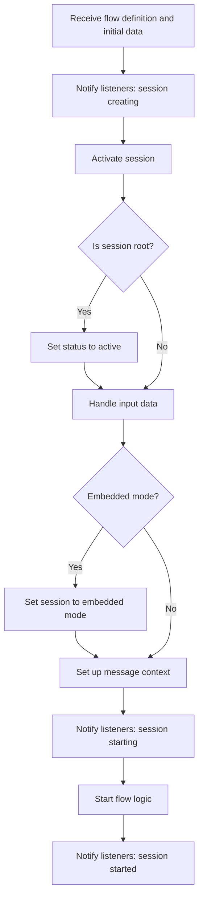

This document describes how a new guided navigation session is started. The system receives the flow definition and initial data, prepares the session, and configures the environment so the flow is ready for user interaction. The result is an active session that can process navigation and user actions.

The main steps are:

- Notify listeners that a session is being created
- Activate the session for the flow
- Set session status to active if it is the root session
- Handle input data for the flow
- Configure embedded mode if required
- Set up the message context for the flow
- Notify listeners that the session is starting
- Start the flow logic
- Notify listeners that the session has started



# Starting a New Flow Execution

```mermaid
%%{init: {"flowchart": {"defaultRenderer": "elk"}} }%%
flowchart TD
  node1["Start flow execution"]
  click node1 openCode "spring-webflow/src/main/java/org/springframework/webflow/engine/impl/RequestControlContextImpl.java:233:235"
  node1 --> node2["Notify listeners: session creating"]
  click node2 openCode "spring-webflow/src/main/java/org/springframework/webflow/engine/impl/FlowExecutionImpl.java:354:354"
  node2 --> node3["Activate session"]
  click node3 openCode "spring-webflow/src/main/java/org/springframework/webflow/engine/impl/FlowExecutionImpl.java:355:355"
  node3 --> node4{"Is session root?"}
  click node4 openCode "spring-webflow/src/main/java/org/springframework/webflow/engine/impl/FlowExecutionImpl.java:356:358"
  node4 -->|"Yes"| node5["Set status to ACTIVE"]
  click node5 openCode "spring-webflow/src/main/java/org/springframework/webflow/engine/impl/FlowExecutionImpl.java:357:358"
  node4 -->|"No"| node6
  node5 --> node6["Handle input"]
  node4 -->|"No"| node6["Handle input"]
  click node6 openCode "spring-webflow/src/main/java/org/springframework/webflow/engine/impl/FlowExecutionImpl.java:359:361"
  node6 --> node7{"Embedded mode?"}
  click node7 openCode "spring-webflow/src/main/java/org/springframework/webflow/engine/impl/FlowExecutionImpl.java:362:364"
  node7 -->|"Yes"| node8["Set session to embedded mode"]
  click node8 openCode "spring-webflow/src/main/java/org/springframework/webflow/engine/impl/FlowExecutionImpl.java:363:364"
  node7 -->|"No"| node9["Set up message context"]
  node8 --> node9["Set up message context"]
  click node9 openCode "spring-webflow/src/main/java/org/springframework/webflow/engine/impl/FlowExecutionImpl.java:365:366"
  node9 --> node10["Notify listeners: session starting"]
  click node10 openCode "spring-webflow/src/main/java/org/springframework/webflow/engine/impl/FlowExecutionImpl.java:367:367"
  node10 --> node11["Start flow logic"]
  click node11 openCode "spring-webflow/src/main/java/org/springframework/webflow/engine/impl/FlowExecutionImpl.java:368:368"
  node11 --> node12["Notify listeners: session started"]
  click node12 openCode "spring-webflow/src/main/java/org/springframework/webflow/engine/impl/FlowExecutionImpl.java:369:369"

%% Swimm:
%% %%{init: {"flowchart": {"defaultRenderer": "elk"}} }%%
%% flowchart TD
%%   node1["Start flow execution"]
%%   click node1 openCode "<SwmPath>[spring-webflow/…/impl/RequestControlContextImpl.java](spring-webflow/src/main/java/org/springframework/webflow/engine/impl/RequestControlContextImpl.java)</SwmPath>:233:235"
%%   node1 --> node2["Notify listeners: session creating"]
%%   click node2 openCode "<SwmPath>[spring-webflow/…/impl/FlowExecutionImpl.java](spring-webflow/src/main/java/org/springframework/webflow/engine/impl/FlowExecutionImpl.java)</SwmPath>:354:354"
%%   node2 --> node3["Activate session"]
%%   click node3 openCode "<SwmPath>[spring-webflow/…/impl/FlowExecutionImpl.java](spring-webflow/src/main/java/org/springframework/webflow/engine/impl/FlowExecutionImpl.java)</SwmPath>:355:355"
%%   node3 --> node4{"Is session root?"}
%%   click node4 openCode "<SwmPath>[spring-webflow/…/impl/FlowExecutionImpl.java](spring-webflow/src/main/java/org/springframework/webflow/engine/impl/FlowExecutionImpl.java)</SwmPath>:356:358"
%%   node4 -->|"Yes"| node5["Set status to ACTIVE"]
%%   click node5 openCode "<SwmPath>[spring-webflow/…/impl/FlowExecutionImpl.java](spring-webflow/src/main/java/org/springframework/webflow/engine/impl/FlowExecutionImpl.java)</SwmPath>:357:358"
%%   node4 -->|"No"| node6
%%   node5 --> node6["Handle input"]
%%   node4 -->|"No"| node6["Handle input"]
%%   click node6 openCode "<SwmPath>[spring-webflow/…/impl/FlowExecutionImpl.java](spring-webflow/src/main/java/org/springframework/webflow/engine/impl/FlowExecutionImpl.java)</SwmPath>:359:361"
%%   node6 --> node7{"Embedded mode?"}
%%   click node7 openCode "<SwmPath>[spring-webflow/…/impl/FlowExecutionImpl.java](spring-webflow/src/main/java/org/springframework/webflow/engine/impl/FlowExecutionImpl.java)</SwmPath>:362:364"
%%   node7 -->|"Yes"| node8["Set session to embedded mode"]
%%   click node8 openCode "<SwmPath>[spring-webflow/…/impl/FlowExecutionImpl.java](spring-webflow/src/main/java/org/springframework/webflow/engine/impl/FlowExecutionImpl.java)</SwmPath>:363:364"
%%   node7 -->|"No"| node9["Set up message context"]
%%   node8 --> node9["Set up message context"]
%%   click node9 openCode "<SwmPath>[spring-webflow/…/impl/FlowExecutionImpl.java](spring-webflow/src/main/java/org/springframework/webflow/engine/impl/FlowExecutionImpl.java)</SwmPath>:365:366"
%%   node9 --> node10["Notify listeners: session starting"]
%%   click node10 openCode "<SwmPath>[spring-webflow/…/impl/FlowExecutionImpl.java](spring-webflow/src/main/java/org/springframework/webflow/engine/impl/FlowExecutionImpl.java)</SwmPath>:367:367"
%%   node10 --> node11["Start flow logic"]
%%   click node11 openCode "<SwmPath>[spring-webflow/…/impl/FlowExecutionImpl.java](spring-webflow/src/main/java/org/springframework/webflow/engine/impl/FlowExecutionImpl.java)</SwmPath>:368:368"
%%   node11 --> node12["Notify listeners: session started"]
%%   click node12 openCode "<SwmPath>[spring-webflow/…/impl/FlowExecutionImpl.java](spring-webflow/src/main/java/org/springframework/webflow/engine/impl/FlowExecutionImpl.java)</SwmPath>:369:369"
```



<SwmSnippet path="/spring-webflow/src/main/java/org/springframework/webflow/engine/impl/RequestControlContextImpl.java" line="233">

---

RequestControlContextImpl.start kicks off the flow by passing the flow and input map to FlowExecutionImpl.start. It doesn't do any setup itself—just hands off control so the execution logic can take over.

```java
	public void start(Flow flow, MutableAttributeMap<?> input) throws FlowExecutionException {
		flowExecution.start(flow, input, this);
	}
```

---

</SwmSnippet>

<SwmSnippet path="/spring-webflow/src/main/java/org/springframework/webflow/engine/impl/FlowExecutionImpl.java" line="353">

---

FlowExecutionImpl.start sets up the session, fires lifecycle events, configures messaging, handles embedded mode, and kicks off the flow.

```java
	void start(Flow flow, MutableAttributeMap<?> input, RequestControlContext context) {
		listeners.fireSessionCreating(context, flow);
		FlowSessionImpl session = activateSession(flow);
		if (session.isRoot()) {
			status = FlowExecutionStatus.ACTIVE;
		}
		if (input == null) {
			input = new LocalAttributeMap<>();
		}
		if (hasEmbeddedModeAttribute(input)) {
			session.setEmbeddedMode();
		}
		StateManageableMessageContext messageContext = (StateManageableMessageContext) context.getMessageContext();
		messageContext.setMessageSource(flow.getApplicationContext());
		listeners.fireSessionStarting(context, session, input);
		flow.start(context, input);
		listeners.fireSessionStarted(context, session);
	}
```

---

</SwmSnippet>

&nbsp;

*This is an auto-generated document by Swimm 🌊 and has not yet been verified by a human*

<SwmMeta version="3.0.0" repo-id="Z2l0aHViJTNBJTNBc3ByaW5nLXdlYmZsb3ctRGVtb0phdmElM0ElM0F1bWFsaW5nYXN3YW1p" repo-name="spring-webflow-DemoJava"><sup>Powered by [Swimm](https://app.swimm.io/)</sup></SwmMeta>
