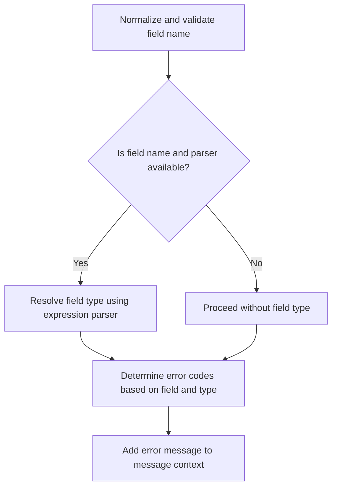

This document describes how validation errors are recorded for fields or objects during data binding. The flow supports both field-specific and object-level errors, resolving the field's type when possible to determine the most accurate error codes. The resulting error message is added to the message context, providing users with meaningful feedback about invalid input.

Main steps:

- Normalize and validate the field name
- Resolve the field's type if possible
- Determine error codes based on the field and its type
- Add the error message to the context



# Starting error rejection and field type resolution

```mermaid
%%{init: {"flowchart": {"defaultRenderer": "elk"}} }%%
flowchart TD
  node1["Check if field name is provided and valid"]
  click node1 openCode "spring-binding/src/main/java/org/springframework/binding/message/MessageContextErrors.java:81:84"
  node1 --> node2{"Is field name non-empty and parser available?"}
  click node2 openCode "spring-binding/src/main/java/org/springframework/binding/message/MessageContextErrors.java:84:89"
  node2 -->|"Yes"| node3["Resolve error codes for field using its type"]
  click node3 openCode "spring-binding/src/main/java/org/springframework/binding/expression/el/ELExpressionParser.java:87:101"
  node2 -->|"No"| node4["Resolve error codes for object"]
  click node4 openCode "spring-binding/src/main/java/org/springframework/binding/message/MessageContextErrors.java:90:99"
  node3 --> node5["Record error message"]
  click node5 openCode "spring-binding/src/main/java/org/springframework/binding/message/MessageContextErrors.java:90:99"
  node4 --> node5

%% Swimm:
%% %%{init: {"flowchart": {"defaultRenderer": "elk"}} }%%
%% flowchart TD
%%   node1["Check if field name is provided and valid"]
%%   click node1 openCode "<SwmPath>[spring-binding/…/message/MessageContextErrors.java](spring-binding/src/main/java/org/springframework/binding/message/MessageContextErrors.java)</SwmPath>:81:84"
%%   node1 --> node2{"Is field name non-empty and parser available?"}
%%   click node2 openCode "<SwmPath>[spring-binding/…/message/MessageContextErrors.java](spring-binding/src/main/java/org/springframework/binding/message/MessageContextErrors.java)</SwmPath>:84:89"
%%   node2 -->|"Yes"| node3["Resolve error codes for field using its type"]
%%   click node3 openCode "<SwmPath>[spring-binding/…/el/ELExpressionParser.java](spring-binding/src/main/java/org/springframework/binding/expression/el/ELExpressionParser.java)</SwmPath>:87:101"
%%   node2 -->|"No"| node4["Resolve error codes for object"]
%%   click node4 openCode "<SwmPath>[spring-binding/…/message/MessageContextErrors.java](spring-binding/src/main/java/org/springframework/binding/message/MessageContextErrors.java)</SwmPath>:90:99"
%%   node3 --> node5["Record error message"]
%%   click node5 openCode "<SwmPath>[spring-binding/…/message/MessageContextErrors.java](spring-binding/src/main/java/org/springframework/binding/message/MessageContextErrors.java)</SwmPath>:90:99"
%%   node4 --> node5
```



<SwmSnippet path="/spring-binding/src/main/java/org/springframework/binding/message/MessageContextErrors.java" line="81">

---

In <SwmToken path="spring-binding/src/main/java/org/springframework/binding/message/MessageContextErrors.java" pos="81:5:5" line-data="	public void rejectValue(String field, String errorCode, Object[] errorArgs, String defaultMessage) {">`rejectValue`</SwmToken>, we kick off error rejection by normalizing the field name and checking if we have a non-empty field and an expression parser. If so, we prep the parser context and parse the field expression to figure out the field's type. This type info is needed for downstream error code resolution, so we call ELExpressionParser.parseExpression next to get it.

```java
	public void rejectValue(String field, String errorCode, Object[] errorArgs, String defaultMessage) {
		field = fixedField(field);
		Class<?> fieldType;
		if (StringUtils.hasLength(field) && (expressionParser != null)) {
			FluentParserContext parserContext = new FluentParserContext().evaluate(boundObject.getClass());
			fieldType = expressionParser.parseExpression(field, parserContext).getValueType(boundObject);
		} else {
			fieldType = null;
		}
```

---

</SwmSnippet>

## Parsing the field expression with context-aware logic

```mermaid
%%{init: {"flowchart": {"defaultRenderer": "elk"}} }%%
flowchart TD
    node1["Receive expression string and context"]
    click node1 openCode "spring-binding/src/main/java/org/springframework/binding/expression/el/ELExpressionParser.java:87:88"
    node1 --> node2{"Is expression string provided?"}
    click node2 openCode "spring-binding/src/main/java/org/springframework/binding/expression/el/ELExpressionParser.java:88:88"
    node2 -->|"No"| node11["Error: Expression string required"]
    click node11 openCode "spring-binding/src/main/java/org/springframework/binding/expression/el/ELExpressionParser.java:88:88"
    node2 -->|"Yes"| node3{"Is context provided?"}
    click node3 openCode "spring-binding/src/main/java/org/springframework/binding/expression/el/ELExpressionParser.java:89:91"
    node3 -->|"No"| node4["Use default context"]
    click node4 openCode "spring-binding/src/main/java/org/springframework/binding/expression/el/ELExpressionParser.java:90:91"
    node3 -->|"Yes"| node5["Proceed with provided context"]
    click node5 openCode "spring-binding/src/main/java/org/springframework/binding/expression/el/ELExpressionParser.java:91:92"
    node4 --> node6{"Is context a template?"}
    node5 --> node6
    click node6 openCode "spring-binding/src/main/java/org/springframework/binding/expression/el/ELExpressionParser.java:92:94"
    node6 -->|"Yes"| node7["Parse as template expression"]
    click node7 openCode "spring-binding/src/main/java/org/springframework/binding/expression/el/ELExpressionParser.java:93:94"
    node6 -->|"No"| node8["Assert valid expression string"]
    click node8 openCode "spring-binding/src/main/java/org/springframework/binding/expression/el/ELExpressionParser.java:95:96"
    node8 --> node9["Wrap expression string with '#{...}'"]
    click node9 openCode "spring-binding/src/main/java/org/springframework/binding/expression/el/ELExpressionParser.java:97:97"
    node9 --> node10["Parse as standard expression"]
    click node10 openCode "spring-binding/src/main/java/org/springframework/binding/expression/el/ELExpressionParser.java:97:98"
    node7 --> node12["Return parsed Expression"]
    node10 --> node12
    click node12 openCode "spring-binding/src/main/java/org/springframework/binding/expression/el/ELExpressionParser.java:93:98"

%% Swimm:
%% %%{init: {"flowchart": {"defaultRenderer": "elk"}} }%%
%% flowchart TD
%%     node1["Receive expression string and context"]
%%     click node1 openCode "<SwmPath>[spring-binding/…/el/ELExpressionParser.java](spring-binding/src/main/java/org/springframework/binding/expression/el/ELExpressionParser.java)</SwmPath>:87:88"
%%     node1 --> node2{"Is expression string provided?"}
%%     click node2 openCode "<SwmPath>[spring-binding/…/el/ELExpressionParser.java](spring-binding/src/main/java/org/springframework/binding/expression/el/ELExpressionParser.java)</SwmPath>:88:88"
%%     node2 -->|"No"| node11["Error: Expression string required"]
%%     click node11 openCode "<SwmPath>[spring-binding/…/el/ELExpressionParser.java](spring-binding/src/main/java/org/springframework/binding/expression/el/ELExpressionParser.java)</SwmPath>:88:88"
%%     node2 -->|"Yes"| node3{"Is context provided?"}
%%     click node3 openCode "<SwmPath>[spring-binding/…/el/ELExpressionParser.java](spring-binding/src/main/java/org/springframework/binding/expression/el/ELExpressionParser.java)</SwmPath>:89:91"
%%     node3 -->|"No"| node4["Use default context"]
%%     click node4 openCode "<SwmPath>[spring-binding/…/el/ELExpressionParser.java](spring-binding/src/main/java/org/springframework/binding/expression/el/ELExpressionParser.java)</SwmPath>:90:91"
%%     node3 -->|"Yes"| node5["Proceed with provided context"]
%%     click node5 openCode "<SwmPath>[spring-binding/…/el/ELExpressionParser.java](spring-binding/src/main/java/org/springframework/binding/expression/el/ELExpressionParser.java)</SwmPath>:91:92"
%%     node4 --> node6{"Is context a template?"}
%%     node5 --> node6
%%     click node6 openCode "<SwmPath>[spring-binding/…/el/ELExpressionParser.java](spring-binding/src/main/java/org/springframework/binding/expression/el/ELExpressionParser.java)</SwmPath>:92:94"
%%     node6 -->|"Yes"| node7["Parse as template expression"]
%%     click node7 openCode "<SwmPath>[spring-binding/…/el/ELExpressionParser.java](spring-binding/src/main/java/org/springframework/binding/expression/el/ELExpressionParser.java)</SwmPath>:93:94"
%%     node6 -->|"No"| node8["Assert valid expression string"]
%%     click node8 openCode "<SwmPath>[spring-binding/…/el/ELExpressionParser.java](spring-binding/src/main/java/org/springframework/binding/expression/el/ELExpressionParser.java)</SwmPath>:95:96"
%%     node8 --> node9["Wrap expression string with '#{...}'"]
%%     click node9 openCode "<SwmPath>[spring-binding/…/el/ELExpressionParser.java](spring-binding/src/main/java/org/springframework/binding/expression/el/ELExpressionParser.java)</SwmPath>:97:97"
%%     node9 --> node10["Parse as standard expression"]
%%     click node10 openCode "<SwmPath>[spring-binding/…/el/ELExpressionParser.java](spring-binding/src/main/java/org/springframework/binding/expression/el/ELExpressionParser.java)</SwmPath>:97:98"
%%     node7 --> node12["Return parsed Expression"]
%%     node10 --> node12
%%     click node12 openCode "<SwmPath>[spring-binding/…/el/ELExpressionParser.java](spring-binding/src/main/java/org/springframework/binding/expression/el/ELExpressionParser.java)</SwmPath>:93:98"
```



<SwmSnippet path="/spring-binding/src/main/java/org/springframework/binding/expression/el/ELExpressionParser.java" line="87">

---

<SwmToken path="spring-binding/src/main/java/org/springframework/binding/expression/el/ELExpressionParser.java" pos="87:5:5" line-data="	public Expression parseExpression(String expressionString, ParserContext context) throws ParserException {">`parseExpression`</SwmToken> checks if the context is a template. If not, it wraps the field expression with '#{' and '}' so the parser knows it's a SpEL expression. It also makes sure the string isn't already wrapped. Then it hands off to <SwmToken path="spring-binding/src/main/java/org/springframework/binding/expression/el/ELExpressionParser.java" pos="93:3:3" line-data="			return parseExpressionInternal(expressionString, context, true);">`parseExpressionInternal`</SwmToken> to actually parse it.

```java
	public Expression parseExpression(String expressionString, ParserContext context) throws ParserException {
		Assert.notNull(expressionString, "The expression string to parse is required");
		if (context == null) {
			context = NullParserContext.INSTANCE;
		}
		if (context.isTemplate()) {
			return parseExpressionInternal(expressionString, context, true);
		} else {
			assertNotDelimited(expressionString);
			assertHasText(expressionString);
			return parseExpressionInternal("#{" + expressionString + "}", context, false);
		}
	}
```

---

</SwmSnippet>

## Building the parsed expression and context

```mermaid
%%{init: {"flowchart": {"defaultRenderer": "elk"}} }%%
flowchart TD
    node1["Receive expression string and context"] --> node2{"Is expression string provided?"}
    click node1 openCode "spring-binding/src/main/java/org/springframework/binding/expression/el/ELExpressionParser.java:101:103"
    node2 -->|"No"| node6["Return error: Expression required"]
    click node2 openCode "spring-binding/src/main/java/org/springframework/binding/expression/el/ELExpressionParser.java:103:103"
    node2 -->|"Yes"| node3["Parse expression and prepare evaluation context"]
    click node3 openCode "spring-binding/src/main/java/org/springframework/binding/expression/el/ELExpressionParser.java:104:107"
    node3 --> node4{"Parsing or context error?"}
    click node4 openCode "spring-binding/src/main/java/org/springframework/binding/expression/el/ELExpressionParser.java:108:110"
    node4 -->|"Yes"| node5["Return error: Parsing failed"]
    click node5 openCode "spring-binding/src/main/java/org/springframework/binding/expression/el/ELExpressionParser.java:109:110"
    node4 -->|"No"| node6["Return internal Expression object"]
    click node6 openCode "spring-binding/src/main/java/org/springframework/binding/expression/el/ELExpressionParser.java:107:107"

%% Swimm:
%% %%{init: {"flowchart": {"defaultRenderer": "elk"}} }%%
%% flowchart TD
%%     node1["Receive expression string and context"] --> node2{"Is expression string provided?"}
%%     click node1 openCode "<SwmPath>[spring-binding/…/el/ELExpressionParser.java](spring-binding/src/main/java/org/springframework/binding/expression/el/ELExpressionParser.java)</SwmPath>:101:103"
%%     node2 -->|"No"| node6["Return error: Expression required"]
%%     click node2 openCode "<SwmPath>[spring-binding/…/el/ELExpressionParser.java](spring-binding/src/main/java/org/springframework/binding/expression/el/ELExpressionParser.java)</SwmPath>:103:103"
%%     node2 -->|"Yes"| node3["Parse expression and prepare evaluation context"]
%%     click node3 openCode "<SwmPath>[spring-binding/…/el/ELExpressionParser.java](spring-binding/src/main/java/org/springframework/binding/expression/el/ELExpressionParser.java)</SwmPath>:104:107"
%%     node3 --> node4{"Parsing or context error?"}
%%     click node4 openCode "<SwmPath>[spring-binding/…/el/ELExpressionParser.java](spring-binding/src/main/java/org/springframework/binding/expression/el/ELExpressionParser.java)</SwmPath>:108:110"
%%     node4 -->|"Yes"| node5["Return error: Parsing failed"]
%%     click node5 openCode "<SwmPath>[spring-binding/…/el/ELExpressionParser.java](spring-binding/src/main/java/org/springframework/binding/expression/el/ELExpressionParser.java)</SwmPath>:109:110"
%%     node4 -->|"No"| node6["Return internal Expression object"]
%%     click node6 openCode "<SwmPath>[spring-binding/…/el/ELExpressionParser.java](spring-binding/src/main/java/org/springframework/binding/expression/el/ELExpressionParser.java)</SwmPath>:107:107"
```



<SwmSnippet path="/spring-binding/src/main/java/org/springframework/binding/expression/el/ELExpressionParser.java" line="101">

---

<SwmToken path="spring-binding/src/main/java/org/springframework/binding/expression/el/ELExpressionParser.java" pos="101:5:5" line-data="	private Expression parseExpressionInternal(String expressionString, ParserContext context, boolean template)">`parseExpressionInternal`</SwmToken> takes the wrapped expression string and context, parses it into a <SwmToken path="spring-binding/src/main/java/org/springframework/binding/expression/el/ELExpressionParser.java" pos="105:1:1" line-data="			ValueExpression expression = parseValueExpression(expressionString, context);">`ValueExpression`</SwmToken>, then builds an <SwmToken path="spring-binding/src/main/java/org/springframework/binding/expression/el/ELExpressionParser.java" pos="107:5:5" line-data="			return new ELExpression(contextFactory, expression);">`ELExpression`</SwmToken> with the right context factory. We call <SwmToken path="spring-binding/src/main/java/org/springframework/binding/expression/el/ELExpressionParser.java" pos="105:7:7" line-data="			ValueExpression expression = parseValueExpression(expressionString, context);">`parseValueExpression`</SwmToken> next to get the parsed <SwmToken path="spring-binding/src/main/java/org/springframework/binding/expression/el/ELExpressionParser.java" pos="105:1:1" line-data="			ValueExpression expression = parseValueExpression(expressionString, context);">`ValueExpression`</SwmToken> needed for this.

```java
	private Expression parseExpressionInternal(String expressionString, ParserContext context, boolean template)
			throws ParserException {
		Assert.notNull(expressionString, "The expression string to parse is required");
		try {
			ValueExpression expression = parseValueExpression(expressionString, context);
			ELContextFactory contextFactory = getContextFactory(context.getEvaluationContextType(), expressionString);
			return new ELExpression(contextFactory, expression);
		} catch (ELException e) {
			throw new ParserException(expressionString, e);
		}
	}
```

---

</SwmSnippet>

<SwmSnippet path="/spring-binding/src/main/java/org/springframework/binding/expression/el/ELExpressionParser.java" line="113">

---

<SwmToken path="spring-binding/src/main/java/org/springframework/binding/expression/el/ELExpressionParser.java" pos="113:5:5" line-data="	private ValueExpression parseValueExpression(String expressionString, ParserContext context) throws ELException {">`parseValueExpression`</SwmToken> sets up a custom <SwmToken path="spring-binding/src/main/java/org/springframework/binding/expression/el/ELExpressionParser.java" pos="21:6:6" line-data="import jakarta.el.ELContext;">`ELContext`</SwmToken>, maps variables from the parser context, creates the <SwmToken path="spring-binding/src/main/java/org/springframework/binding/expression/el/ELExpressionParser.java" pos="113:3:3" line-data="	private ValueExpression parseValueExpression(String expressionString, ParserContext context) throws ELException {">`ValueExpression`</SwmToken>, and then wraps it in a <SwmToken path="spring-binding/src/main/java/org/springframework/binding/expression/el/ELExpressionParser.java" pos="117:5:5" line-data="		return new BindingValueExpression(expression, getExpectedType(context), conversionService, context.isTemplate());">`BindingValueExpression`</SwmToken>. This wrapping adds type conversion and template support, which is needed for proper evaluation.

```java
	private ValueExpression parseValueExpression(String expressionString, ParserContext context) throws ELException {
		ParserELContext elContext = new ParserELContext();
		elContext.mapVariables(context.getExpressionVariables(), expressionFactory);
		ValueExpression expression = expressionFactory.createValueExpression(elContext, expressionString, Object.class);
		return new BindingValueExpression(expression, getExpectedType(context), conversionService, context.isTemplate());
	}
```

---

</SwmSnippet>

## Resolving error codes and adding the error message

<SwmSnippet path="/spring-binding/src/main/java/org/springframework/binding/message/MessageContextErrors.java" line="90">

---

Back in MessageContextErrors.rejectValue, now that we've got the field type from the expression parser, we use it to resolve message codes for the error. Then we build and add the error message to the context, using all the info we've gathered.

```java
		String[] messageCodes;
		if (StringUtils.hasLength(field)) {
			messageCodes = bindingErrorMessageCodesResolver
					.resolveMessageCodes(errorCode, objectName, field, fieldType);
		} else {
			messageCodes = bindingErrorMessageCodesResolver.resolveMessageCodes(errorCode, objectName);
		}
		messageContext.addMessage(new MessageBuilder().error().source(field).codes(messageCodes).args(errorArgs)
				.defaultText(defaultMessage).build());
	}
```

---

</SwmSnippet>

&nbsp;

*This is an auto-generated document by Swimm 🌊 and has not yet been verified by a human*

<SwmMeta version="3.0.0" repo-id="Z2l0aHViJTNBJTNBc3ByaW5nLXdlYmZsb3ctRGVtb0phdmElM0ElM0F1bWFsaW5nYXN3YW1p" repo-name="spring-webflow-DemoJava"><sup>Powered by [Swimm](https://app.swimm.io/)</sup></SwmMeta>
